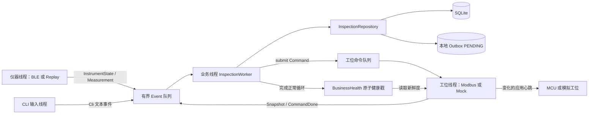
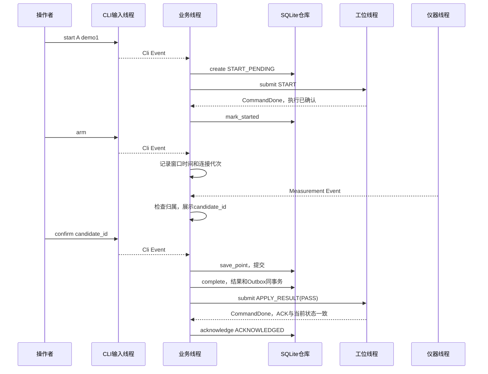

# BLE_Linux 工程“保姆级”阅读指南：从基础语法到完整项目

> 面向读者：只了解 C++ 基础语法，没有完整项目阅读经验。
>
> 编写依据：2026-10-03 工作区中的实际源码、配置、SQL、测试和工具。本文讲解当前实现；计划书用于解释背景，不把计划中的功能写成已经实现。
>
> 工程根目录：`/home/ubuntu/桌面/BLE_Linux`。正文中的短路径均相对于这个根目录，源码入口链接使用当前工作区的绝对路径。工程移动后，可以按短路径找到相同文件。行号是本次阅读时的位置，后续修改可能使行号变化。

这份指南的目标不是让你背出全部代码，而是让你最终能回答：程序如何启动，测量如何进入业务，人工如何确认点位，结果如何保存并发送给工位，出错后如何处理，以及这些动作分别发生在哪个线程。

建议每次读一个小节，同时打开对应源码。遇到还不熟悉的语法，先用第 3 章查表；遇到跨文件调用，先沿第 5 章的路线走。第一轮不要一遇到库函数就跳进第三方库内部。

## 目录

- [1. 从业务场景理解这个项目](#chapter-1)
- [2. 目录地图与架构全貌](#chapter-2)
- [3. 阅读本工程需要的 C++ 知识](#chapter-3)
- [4. 线程、数据所有权与生命周期](#chapter-4)
- [5. 逐个文件的推荐阅读顺序](#chapter-5)
- [6. 数据模型、配置与基础设施](#chapter-6)
- [7. 入口、CLI 与对象装配](#chapter-7)
- [8. 核心业务状态机逐函数精读](#chapter-8)
- [9. SQLite 与持久化逐函数精读](#chapter-9)
- [10. 仪器适配与厂商帧解析](#chapter-10)
- [11. 工位通信、ACK 与心跳](#chapter-11)
- [12. 真实 BLE / BlueZ 接入](#chapter-12)
- [13. 云接口、构建与部署](#chapter-13)
- [14. Python 工具与测试文件](#chapter-14)
- [15. 配置、文档及生成文件的作用](#chapter-15)
- [16. 把所有模块串起来的调用链](#chapter-16)
- [17. 实际运行、日志与数据库观察练习](#chapter-17)
- [18. 易错理解、查找方法与学习自检](#chapter-18)

<a id="chapter-1"></a>
## 1. 从业务场景理解这个项目

### 1.1 用一个具体例子理解它

假设有一件涂层工件，需要测 5 个位置，要求每个位置厚度都在 100～200 μm，基材必须是 FE。

操作者输入工件编号和产品型号。程序检查仪器在线、工件到位、工位健康等条件，建立检测任务，并告诉工位“开始检测”。工位确认以后，操作者逐点开启采集窗口、产生测量、确认候选。5 个点都确认以后，程序计算 PASS 或 FAIL，保存结果和待传事件，再告诉工位执行对应结果。

这里的 100～200 μm 是演示配置，不是生产标准。FE 表示铁基材，NFE 表示非铁基材；代码把它们作为材料模式字符串比较。

可以先记住下面这条业务线：

```text
工件到位 → 安全同步及人工复位 → 输入编号/型号 → START 获得确认
→ 第1点 arm → 新测量成为候选 → confirm 保存第1点
→ 第2点 arm → 新测量成为候选 → confirm 保存第2点
→ ……达到要求点数 → 判定并保存 → APPLY_RESULT 获得确认
→ 工件离开 → 准备下一件
```

### 1.2 三个角色分别做什么

| 角色 | 可以理解为 | 当前职责 |
|---|---|---|
| Linux 服务 | 现场的检测协调员 | 接收厚度、管理任务、人工确认、判定、SQLite 保存、向工位下达命令 |
| 测厚仪 | 提供测量值的设备 | 通过 BLE 通知发送厂商格式的字节数据 |
| MCU 工位 | 管理现场输入输出的执行者 | 提供到位、按钮、状态等信息，执行 START/PASS/FAIL/ABORT 等命令 |

当前目录只包含 Linux 服务和软件模拟工具，没有 STM32 固件。Python 模拟器是“扮演工位的程序”，不是 MCU 源码。

### 1.3 六个必须分清的名词

| 名词 | 源码表示 | 含义与例子 |
|---|---|---|
| 产品规则 | `Rule` | 型号 demo5 对应 5 点、FE、100～200 μm |
| 检测任务 | `Task` | 工件 A 的这一次检测，有独立检测编号 |
| 测量/候选 | `Measurement`、`candidate_id` | 仪器传来一条值；满足窗口条件后可供人工选择 |
| 确认点 | `Point` | 操作者明确确认的一条候选，占据第 1、2……点 |
| 工位快照 | `Snapshot` | 一次读取的工位状态、到位、输出、ACK 等信息 |
| 工位命令 | `Command` | 一条完整的现场请求，含 epoch、token、seq、opcode、argument |

**收到 10 条测量，不等于确认了 10 个点。** 同一个采集窗口可能产生多条候选，只有 `confirm` 选中的候选成为一个确认点。保存一个确认点后，要重新 `arm` 才能采集下一点。

**同一个厚度出现两次，不代表重复垃圾数据。** 两个不同窗口里确认的 150 μm 可以是两个合法点，代码不会按厚度数值去重。

### 1.4 质量、现场执行与云上传是三条不同的记录

| 问题 | 看什么 | 典型状态 |
|---|---|---|
| 工件质量判断是什么？ | `inspection.result` | PASS / FAIL；中止任务没有质量结论 |
| 工位到底执行了吗？ | `actuation_log.status` | PENDING / ACKNOWLEDGED / FAILED / UNKNOWN |
| 云平台接受记录了吗？ | `outbox.state` | 当前实现保持 PENDING |

例如：数据库已经保存 PASS，但 APPLY_RESULT 的 ACK 丢失，现场执行记录为 UNKNOWN。程序不能因此删除 PASS，也不能声称工位已经放行。

ABORTED 是“这次检测未能完成”，FAIL 是“按规则完成检测但不合格”。仪器断连、工件移除、测量超时都可能导致中止，不能直接伪装为质量 FAIL。

### 1.5 当前实现边界

已存在：C++17 服务、真实 SQLite、真实 libmodbus 主站路径、BlueZ BLE 接入代码、回放仪器、内存工位、PTY 工位模拟器、单工位单仪器的 1～5 点确认流程、软件测试和长稳脚本。

未包含/未完成：MCU 固件、真实 OneNET 上传、云端接受确认、实际物理点位定位。真实 BLE、RS485、电气波形、GPIO、ARM 平台的验收需要独立证据。

阅读时不要从目录名 `cloud` 推断“已经上传”，也不要从保留了 BLE 源码推断“本工程已完成新的实机验证”。

<a id="chapter-2"></a>
## 2. 目录地图与架构全貌

### 2.1 有用的目录树

```text
BLE_Linux/
├── README.md                         根目录入口说明
├── 01_整体项目计划说明书.md             背景、职责与共同协议计划
├── 02_Linux具体实施计划书.md            Linux 侧实施计划
├── 03_MCU具体实施计划书.md              MCU 侧实施计划（不是固件）
├── .gitignore                        忽略构建、运行数据等
└── coating_inspection_host/
    ├── CMakeLists.txt                实际构建清单
    ├── README.md                     构建、操作和验证说明
    ├── .clang-format                代码格式规则
    ├── app/main.cpp                 可执行程序入口
    ├── include/inspection/           本工程公开类型与接口
    │   ├── types.hpp                 规则/测量/确认点/任务/阶段
    │   ├── config.hpp                配置结构与读取声明
    │   ├── events.hpp                跨线程事件
    │   ├── support.hpp               队列/时钟/日志/健康戳
    │   ├── worker.hpp                业务线程与候选展示接口
    │   ├── repository.hpp            数据库存储接口
    │   ├── instrument.hpp            仪器接口及工厂
    │   ├── protocol.hpp              工位协议类型
    │   ├── workstation.hpp           工位接口及工厂
    │   ├── cli.hpp                   输入循环与参数切分
    │   ├── cloud.hpp                 云发布预留接口
    │   └── schema.hpp.in             生成 SQL 头文件的模板
    ├── src/
    │   ├── support/config.cpp        读取与校验 YAML
    │   ├── support/runtime.cpp       时钟/日志/UUID/质量判定
    │   ├── domain/worker.cpp         核心检测状态机
    │   ├── persistence/repository.cpp SQLite 实现
    │   ├── instrument/instrument.cpp BLE/回放适配
    │   ├── workstation/protocol.cpp  寄存器编解码及确认判断
    │   ├── workstation/workstation.cpp 通信线程及两种 Transport
    │   ├── cli/cli.cpp               从 stdin 收集完整输入行
    │   ├── cli/commands.cpp          业务线程中执行终端命令
    │   └── cloud/cloud.cpp           禁用云后端
    ├── vendor/thickness/
    │   ├── include/thickness/{protocol,bluez_reader}.hpp
    │   ├── src/{protocol,bluez_reader}.cpp
    │   ├── PROVENANCE.md             上游来源和本项目修改
    │   └── UPSTREAM_README.md         上游文档
    ├── config/
    │   ├── demo.yaml                 回放 + 内存工位
    │   ├── hardware.yaml             BLE + Modbus 硬件配置模板
    │   ├── replay.jsonl              合成仪器回放
    │   └── migrations/001_init.sql   数据库初始结构
    ├── tools/
    │   ├── workstation_sim.py        PTY 工位模拟器
    │   ├── process_harness.py        共享子进程测试工具
    │   ├── demo.py                   自动演示
    │   └── soak.py                   持续负载与资源观察
    ├── tests/
    │   ├── unit.cpp                  C++ 单元测试
    │   ├── simulator_contract.py     Python 模拟器协议测试
    │   └── integration.py            服务进程集成测试
    ├── deploy/inspection.service.example systemd 模板
    ├── docs/{ARCHITECTURE,PROTOCOL,VERIFICATION}.md
    ├── build-system/、build-sanitize/等   构建产物
    ├── reports/                     演示和长稳输出
    └── data/（运行时可能创建）          默认数据库目录
```

`build*/` 中虽然有 `.cpp`，例如 CMake 编译器探测源文件，也不是业务源代码。第一轮只看上面列出的手写文件，不需要读几百份生成文件。

### 2.2 头文件、源文件、模块的关系

- `.hpp` 大多说明“有哪些类型、类、函数，别人如何使用”。
- `.cpp` 大多说明“这些函数内部如何完成工作”。
- 一个模块可以对应一组 `.hpp`、`.cpp`，并不一定是一个文件。
- 模板通常需要在使用处看到完整定义，所以 `BoundedQueue<T>` 的实现直接写在 `support.hpp`。
- 很短的成员函数也直接写在头文件中，例如 `Snapshot::present()`。

例如 `repository.hpp` 声明 `save_point()`，`repository.cpp` 定义 `InspectionRepository::save_point()`。读前者看接口和限制，读后者看 SQL 和事务。

### 2.3 模块职责表

| 模块 | 输入 | 输出 | 最值得抓住的职责 |
|---|---|---|---|
| app | 配置路径、信号 | 对象、线程、退出状态 | 组装并管理生命周期 |
| support | 配置、系统时间、事件 | 配置对象、日志、队列服务 | 提供通用基础能力 |
| instrument | BLE 通知/回放字节 | 仪器状态、测量事件 | 接收、解析和复制数据 |
| workstation | 命令、工位寄存器 | 快照、命令完成事件 | 独占串口、确认、重试、心跳 |
| domain | 所有业务事件 | 状态变化、存储调用、工位命令 | 唯一管理活动检测任务 |
| persistence | 任务、确认点、命令 | SQLite 记录、查询 JSON | 保证业务保存顺序与事务 |
| cli | 终端文本 | Cli 事件/业务操作 | 收集输入并分发操作 |
| cloud | 内部待传事件（接口设计） | 当前为 NotConfigured | 留出未来适配边界 |
| tools/tests | 场景、仿真控制 | 演示/测试/资源报告 | 验证服务行为 |

### 2.4 架构图



即使你的 Markdown 阅读器不支持 Mermaid，也可以按这个文字版理解：三个事件生产者把消息投进同一队列，业务线程逐条处理；业务线程产生的工位命令走另一条队列返回工位线程。

<a id="chapter-3"></a>
## 3. 阅读本工程需要的 C++ 知识

这一章不是完整 C++ 教材，只解释源码中会实际遇到的写法。先能把语法翻译成人话，再去理解设计原因。

### 3.1 命名空间与同名类型

```cpp
namespace inspection {
struct Measurement { /* ... */ };
}
```

`inspection::Measurement` 表示“inspection 命名空间里的测量类型”。厂商库也有 `thickness::Measurement`，两者不是同一个类型。

厂商类型关注厚度、材料、组名；业务类型额外增加候选编号、接收时间、连接代次和仪器身份。`InstrumentEvents::measurement()` 正是在两种类型之间做转换。

`namespace { ... }` 是匿名命名空间，通常表示这个 `.cpp` 内部使用的辅助类型或函数。例如内部 `Transport` 不作为对外接口暴露。

### 3.2 struct、class、成员函数、访问控制

`Rule`、`Task` 等 `struct` 主要用来装数据；`InspectionWorker`、`InspectionRepository` 等 `class` 主要管理行为和资源。语言上的核心区别是默认访问权限：struct 默认 public，class 默认 private。

```cpp
class InspectionWorker {
public:
    void start();
private:
    void run();
    std::optional<Task> task_;
};
```

外部可以调用 `start()`，不能直接调用 `run()` 或随便改 `task_`。这帮助维护“只有业务线程可以改变任务”的规则。

源码中的 `_` 后缀，例如 `cfg_`、`thread_`，是成员变量命名习惯，不是 C++ 语法要求。

### 3.3 `::`、`.`、`->`、`*`、`&`

| 写法 | 阅读方式 |
|---|---|
| `InspectionWorker::arm()` | InspectionWorker 类的 arm 成员函数定义 |
| `task.rule` | 对象 task 中的 rule 成员 |
| `repo_->save_point(...)` | 通过指针访问仓库对象的方法 |
| `*instrument` | 取智能指针所指向的对象 |
| `const Task& t` | 不复制任务，通过只读引用查看 |
| `BusinessHealth& health_` | 引用外部已经存在的健康对象 |
| `std::uint16_t& high` | high 是可写引用，函数可以修改调用方变量 |

同一个 `&` 在不同位置意义不同。参数类型里的 `&` 是引用；lambda 的 `[&]` 是按引用捕获；表达式里的 `inputs & 1U` 是按位与。

### 3.4 const 不只是一个“常量修饰词”

- `const IClock&`：调用者不能通过这个引用修改时钟接口对象。
- `const auto& m = e.measurement;`：给测量起只读别名，避免复制。
- `status() const`：这个成员函数承诺不修改对象的普通成员。
- `mutable std::mutex mutex_`：即使函数是 const，也允许锁互斥量。

`CandidateDisplay::current() const` 要读取候选编号，仍需锁；所以它的 mutex 被声明为 mutable。这并不意味着候选字符串本身可以任意修改。

### 3.5 构造、析构与初始化列表

```cpp
InspectionWorker::InspectionWorker(Config cfg, const IClock& clock, /* ... */)
    : cfg_(std::move(cfg)), clock_(clock) /* ... */ {
}
```

这是构造函数。冒号后的部分先初始化成员，再执行大括号中的函数体。引用成员必须在初始化阶段绑定对象。

`~InspectionWorker()` 是析构函数，在对象生命周期结束时执行；当前实现会请求停止并 join。

成员初始化的实际顺序按类中声明顺序，不按冒号后书写顺序。现在先理解这个原则，不必急着研究复杂构造顺序。

### 3.6 智能指针、所有权与生命周期

`std::unique_ptr<T>` 可以理解为“由一个拥有者负责清理的对象指针”。拥有者销毁时，指向的对象也会销毁；不能随便复制两个拥有者。

```cpp
auto instrument = make_instrument(cfg, clock, sink);
```

工厂返回 `std::unique_ptr<IInstrument>`。main 拥有仪器对象，worker 只通过引用使用它。main 必须确保 worker 停止之前，仪器和工位对象仍然活着。

`std::make_unique<ReplayInstrument>(...)` 创建对象并交给 unique_ptr 管理。`repo_.reset()` 释放仓库对象，进而关闭 SQLite 连接。

### 3.7 虚函数、接口与多态

```cpp
class IInstrument {
public:
    virtual ~IInstrument() = default;
    virtual void start() = 0;
};
```

`= 0` 表示纯虚函数：接口要求具体实现提供这个动作。`BleInstrument` 和 `ReplayInstrument` 都实现 `start()`；worker 不需要关心具体是哪一种。

`override` 让编译器检查“确实覆盖了基类接口”。`final` 表示不允许继续从这个类派生。虚析构函数保证通过基类指针释放派生对象时，派生类资源也能得到清理。

工厂函数根据配置选择具体实现，这就是本工程切换硬件与仿真的主要机制。

### 3.8 auto、容器与 optional

| 写法 | 本工程用处 | 常用操作 |
|---|---|---|
| `auto` | 让编译器推导变量类型 | 类型仍然固定，不是动态语言 |
| `std::vector<Point>` | 保存已确认点，按顺序排列 | `push_back`、`size` |
| `std::deque<Event>` | 队列，从头取、从尾放 | `front`、`pop_front`、`push_back` |
| `std::map<std::string, Rule>` | 按产品编号找规则 | `find`、`end`、`emplace` |
| `std::map<std::string, Measurement>` | 按候选编号找候选 | `find(id)` |
| `std::array<uint16_t, 22>` | 固定 22 个快照寄存器 | `data()`、下标访问 |
| `std::optional<Task>` | 当前可能有任务，也可能没有 | `if(task_)`、`task_->...`、`reset()` |

`map.find(key)` 返回迭代器。`it == map.end()` 表示没找到；找到以后 `it->first` 是键，`it->second` 是值。

`task_ && task_->state == ...` 使用短路求值：如果没有任务，右侧就不执行，避免访问不存在的对象。

### 3.9 std::move 与值传递

`std::move(x)` 的作用是允许把 x 的资源转移出去；它本身不启动线程，也不一定立刻完成搬移。移动后仍可析构 x，但不应假定里面还保留原始数据。

事件队列的 `push(T value)` 按值接收拥有数据的对象，然后把它移动进队列。业务线程取到的 `Event` 有自己的字符串等数据，不保存 BLE 回调的临时裸指针。

### 3.10 lambda 与回调

```cpp
auto sink = [&](Event e) {
    return queue.push(std::move(e));
};
```

lambda 是可以传给别人调用的小函数。`[&]` 表示引用外部变量，例如 queue；`[this]` 表示捕获当前对象，随后可以访问它的成员。

```cpp
thread_ = std::thread([this] { run(); });
```

这里是创建线程，线程执行 lambda，lambda 再执行 `run()`。

**lambda 本身不意味着异步。** `sink(e)` 是在调用它的当前线程执行；是 queue 把数据交给业务线程，不是 sink 自动换线程。

`std::function<bool(Event)>` 表示“能够接收 Event 并返回 bool 的可调用对象”。`EventSink` 是它的别名。

### 3.11 RAII：为什么很多资源没有手工清理分支

RAII 可以翻译成：把资源放进对象，构造时获得，析构时释放。

本工程三个典型例子：

1. `std::lock_guard` 进入作用域加锁，离开作用域自动解锁。
2. `Statement` 构造时准备 SQL，析构时 `sqlite3_finalize`。
3. `Transaction` 如果没成功 commit，析构时自动 ROLLBACK。

函数中途 `throw` 时，已构造的局部对象也会按规则析构，因此不需要每个错误分支都写 rollback 和 unlock。

### 3.12 异常：throw 与 catch

`throw StorageError(...)` 会离开当前正常执行路径，一层层寻找匹配的 catch。`e.what()` 取得错误说明。

初学时给函数标两种出口：正常返回、抛异常。数据库函数返回成功意味着相应操作已经完成；失败不能靠打印一条“成功”日志掩盖。

注意 catch 范围由大括号决定，不由注释决定。`commands.cpp` 的 `cli_words(e.text)` 位于局部 try **之前**，引号格式错误若从这里抛出，会进入 `run()` 外层事件处理异常路径。本文第 8、18 章会再次提示这个实际细节。

### 3.13 线程同步：mutex、atomic、condition_variable

- mutex：多人访问同一复杂对象时，一次只允许一个线程操作。
- lock_guard：短作用域的自动锁。
- unique_lock：支持条件变量等待时临时释放锁。
- atomic：用来安全读写一个跨线程标志或数值，不等于整个业务对象都线程安全。
- condition_variable：队列空时让消费者睡眠，生产者放入数据以后叫醒消费者。
- join：等待线程结束，结束后才能安全释放线程使用的对象。

`wait_for(lock, wait, predicate)` 等待时会释放 mutex，被唤醒后重新持锁并检查条件。否则生产者永远拿不到锁，无法把数据放进来。

### 3.14 时间、单位与整数类型

| 类型/字段 | 含义 |
|---|---|
| `std::uint8_t` | 8 位无符号整数，常表示字节 |
| `std::uint16_t` | 16 位无符号整数，常表示寄存器 |
| `std::uint32_t` | 32 位无符号整数，epoch/token/seq 等 |
| `std::int64_t` | 64 位有符号整数，时间和业务厚度 |
| `std::size_t` | 容器大小、数组索引常用类型 |
| `static_cast<T>(x)` | 明确转换为类型 T |
| `constexpr` | 可在编译期确定的值/表达式 |

厚度保存单位 `milli_um` 是 **千分之一微米**，不是毫米：150 μm = 150000 milli_um，99.999 μm = 99999 milli_um。

`steady_clock` 的 `mono_ms` 用来比较先后和超时；`system_clock` 的 `wall_ms` 用来记录日历时间。单调时间不是 Unix 时间，也不能跨重启比较。

### 3.15 位运算、大小端与常见写法

```cpp
return (inputs & 1U) != 0; // 检查 bit0，也就是到位
return (uint32_t(high) << 16U) | low; // 合并两个16位寄存器
```

`<<` 左移，`>>` 右移，`|` 按位或，`&` 按位与，`^` 按位异或。`U` 后缀表示无符号整数常量。

本项目里有三个不同层次：仪器厚度字节按小端拼接；工位 32 位数使用高字在前；Modbus RTU 帧尾 CRC16 低字节在前。不能把三个规则混成一个“大端/小端结论”。

### 3.16 不需要第一轮掌握的内容

可以暂时跳过 GVariant 类型签名每个字符的含义、第三方库内部、复杂模板机制、标准库实现、操作系统底层蓝牙栈。只要明确“调用方传什么、被调用方返回什么、失败时怎么办”，就能先读懂主线。

<a id="chapter-4"></a>
## 4. 线程、数据所有权与生命周期

### 4.1 服务有几条线程？

从本项目显式创建的线程看，正常运行是 **主线程 + 4 条工作线程，共 5 条**。仪器在 BLE 与 Replay 中二选一，不是同时创建两条。

| 线程 | 创建位置 | 主要执行位置 | 拥有/管理的数据 |
|---|---|---|---|
| 主线程 | 操作系统进入 main | `app/main.cpp` | 总体对象生命周期、信号管道、停止协调 |
| 业务线程 | `InspectionWorker::start()` | `worker.cpp::run()` 及其调用函数 | `task_`、`phase_`、候选集合、仓库连接、业务命令跟踪 |
| 仪器线程 | 具体仪器的 `start()` | Replay 的 `run()` 或 BluezReader 的 `run()` | 仪器解析状态、连接代次、通知转测量 |
| 工位线程 | `WorkstationWorker::start()` | `workstation.cpp::run()` | Transport、串口、pending 命令、ACK、重试调度 |
| CLI 输入线程 | main 中的 `std::thread input` | `cli_loop()` | 输入行缓冲，读取 stdin |

这是应用层的线程职责模型。GLib/GIO 等底层库可能另有辅助线程；`/proc/PID/status` 的 Threads 数值不保证恰好是 5。Python 演示/测试也会创建额外进程与日志读取线程，不计入 C++ 服务的这 5 个角色。

### 4.2 文件名不决定执行线程

这是全工程最重要的阅读原则之一。

`cli_loop()` 位于 `cli.cpp`，在 CLI 输入线程运行；`InspectionWorker::cli()` 位于 `commands.cpp`，在业务线程运行。它们都属于 CLI 相关代码，但不在同一条线程。

`repo_->save_point()` 是普通同步函数调用。调用它的是业务线程，执行 SQL 的也是业务线程，没有额外“数据库线程”。

`instrument.test_control()` 由业务线程调用时，把请求放进仪器控制队列；真正的 `apply()` 再由仪器线程执行。工位测试控制也采用相似方式。

### 4.3 哪些数据共享，哪些不共享？

| 对象 | 谁写 | 谁读 | 保护方式 |
|---|---|---|---|
| Event 队列 | 仪器/工位/CLI | 业务线程 | 队列内部 mutex、condition_variable |
| BusinessHealth | 业务线程，停止时主线程也会禁用 | 工位线程 | atomic |
| CandidateDisplay | 业务线程 publish/clear | 工位线程投递快照时读取 | mutex |
| 工位 commands_/controls_ 队列      | 业务线程提交 | 工位线程取出 | 工位 mutex |
| Replay controls_ 队列 | 业务线程提交 | 仪器线程取出 | Replay mutex |
| worker 的 task_/phase_/candidates_ | 业务线程 | 业务线程 | 单线程所有权，无需给每次访问加锁 |
| SQLite 连接 | 业务线程创建/使用/释放 | 同一业务线程 | 单线程所有权，连接使用 NOMUTEX |
| 日志 stdout | 多个线程可能调用 log | 终端/脚本 | log 内部统一 mutex |

“worker 对外接口有限”不代表所有成员都用 atomic。大部分业务数据通过唯一线程访问保证一致性，atomic 只用于 finished、failed、stop 等跨线程状态。

### 4.4 两条队列不能混淆

第一条：`BoundedQueue<Event>`，进入业务线程，默认容量 128，由配置控制。

第二条：`WorkstationWorker::commands_`，进入工位线程，等待队列最多 8 条；工位线程另有一个局部 `pending` 保存当前等待确认的命令。

此外还有回放/Mock 测试控制队列，各有自身限制；worker 当前窗口候选集合上限 128。几个“128”不是同一份缓冲区，也不都由 `queue_capacity` 控制。

### 4.5 为什么队列满时另设 overflow 标志？

假设 Event 队列已经满了，再向它投递“队列满了”事件也会失败。所以 `push()` 直接设置独立的 atomic `overflow_`。

业务循环用 `take_overflow()` 读取并清除标志，然后进入 `fatal()`。项目选择让溢出成为可见故障，避免丢失业务数据以后继续生成可信质量结论。

`sim overflow` 直接触发业务故障路径；它不是把真实队列逐条塞满。真正的队列满行为还可以在 `unit.cpp::test_queue_clock()` 中观察。

### 4.6 候选展示与按钮绑定

工位 ACTION 按钮没有携带候选编号；程序需要把它关联到当时展示的候选。

1. 业务线程调用 `CandidateDisplay::publish()`。
2. 同一把锁中，先打印 candidate 日志，再更新 `current_`。
3. 工位线程投递 Snapshot 时，main 定义的 sink 读取 `display.current()`。
4. 把编号放入该 Event 的 `bound_candidate`。
5. 业务线程处理这个快照中的 ACTION 时，执行 `confirm(e.bound_candidate)`。

这样，队列中后来到达的新测量不会把已经绑定的按钮事件改成确认另一条候选。

准确理解这个保证：编号绑定发生在 **快照投递时**，不是 MCU 检测到按键的物理瞬间。轮询延迟仍然存在；程序也不能证明探头位于哪个空间点。CLI 的 `confirm 编号` 则明确选择当前窗口里指定的候选。

### 4.7 启动与退出的对象关系

main 创建 clock、queue、health、display，然后创建 instrument、workstation，再创建引用这些对象的 worker。`sink` 捕获 queue/display 的引用，因此这些对象必须活得足够久。

启动调用顺序：worker → instrument → workstation → CLI 输入线程。调用先后不等于线程调度先后；业务通过事件和状态检查协调，不靠假定“某线程一定先跑完”。

正常停止顺序：请求 worker 停止 → worker join → 禁用健康 → instrument stop/join → workstation stop/join → 唤醒并 join CLI → close Event 队列 → 关闭管道。

worker 停止期间还需要工位线程活着，以便处理 ABORT 及其有限期限内的确认；因此不能一上来就先销毁工位。

<a id="chapter-5"></a>
## 5. 逐个文件的推荐阅读顺序

### 5.1 用四轮阅读降低难度

**第一轮：看见整体。** 只了解业务、目录、数据结构和 main。暂时把蓝牙、串口和数据库函数当成已有工具。

**第二轮：读通正常流程。** 按 start → arm → measurement → confirm → complete → APPLY_RESULT 走一遍。遇到被调用函数再打开对应实现。

**第三轮：理解可靠性。** 看事务、ACK、连接代次、超时、心跳、中止、启动恢复。

**第四轮：补全设备和测试。** 阅读厂商解析器、BlueZ、PTY 模拟器、测试场景和部署。

不要把“从 main 开始，一遇到函数就无限向下钻”作为唯一读法。main 适合先看地图；worker 才是业务主线。

### 5.2 可以逐项打勾的文件路线

以下 47 项覆盖本次盘点的全部 52 个手写代码、配置、构建、部署和说明文件（不含本文及运行生成物）。每一步都有明确目标。

| 顺序 | 文件 | 本轮要回答的问题 | 详解位置 |
|---|---|---|---|
| 1 | `README.md` | 工程在哪？实施边界是什么？ | 第15章 |
| 2 | `coating_inspection_host/README.md` | 如何构建、运行、操作？ | 第15、17章 |
| 3 | `01_整体项目计划说明书.md` | Linux、仪器、MCU 的角色为何如此设计？ | 第15章 |
| 4 | `coating_inspection_host/config/demo.yaml` | 一次演示的规则和后端是什么？ | 第6、15章 |
| 5 | `coating_inspection_host/include/inspection/types.hpp` | 数据实体及两种业务状态是什么？ | 第6章 |
| 6 | `coating_inspection_host/include/inspection/protocol.hpp` | 工位快照和命令包含什么？ | 第11章 |
| 7 | `coating_inspection_host/include/inspection/config.hpp` | 全部启动参数保存在哪里？ | 第6章 |
| 8 | `coating_inspection_host/include/inspection/events.hpp` | 线程之间传什么？ | 第6章 |
| 9 | `coating_inspection_host/include/inspection/support.hpp` | 事件队列、时钟、健康戳如何工作？ | 第6章 |
| 10 | `coating_inspection_host/src/support/runtime.cpp` | 判定规则和日志如何实现？ | 第6章 |
| 11 | `coating_inspection_host/include/inspection/instrument.hpp` | 业务能对仪器做哪些操作？ | 第10章 |
| 12 | `coating_inspection_host/include/inspection/workstation.hpp` | 业务怎样异步提交工位命令？ | 第11章 |
| 13 | `coating_inspection_host/include/inspection/cloud.hpp` | 云预留接口的契约是什么？ | 第13章 |
| 14 | `coating_inspection_host/include/inspection/repository.hpp` | 保存任务/点/完成结果的接口是什么？ | 第9章 |
| 15 | `coating_inspection_host/include/inspection/worker.hpp` | 核心对象有哪些成员和操作？ | 第8章 |
| 16 | `coating_inspection_host/include/inspection/cli.hpp` | CLI 输入层公开哪些函数？ | 第7章 |
| 17 | `coating_inspection_host/app/main.cpp` | 对象和线程如何装配？ | 第7章 |
| 18 | `coating_inspection_host/src/cli/cli.cpp` | 一行文本如何变成 Cli 事件？ | 第7章 |
| 19 | `coating_inspection_host/src/cli/commands.cpp` | start/arm/confirm 如何映射到业务函数？ | 第7章 |
| 20 | `coating_inspection_host/src/domain/worker.cpp` | 检测流程与状态机如何运行？ | 第8章（可分3次） |
| 21 | `coating_inspection_host/config/migrations/001_init.sql` | 哪些数据持久保存，约束是什么？ | 第9章 |
| 22 | `coating_inspection_host/include/inspection/schema.hpp.in` | SQL 如何进入程序？ | 第9、13章 |
| 23 | `coating_inspection_host/src/persistence/repository.cpp` | 点和结果如何可靠保存？ | 第9章 |
| 24 | `coating_inspection_host/src/support/config.cpp` | 配置合法性和相对路径如何处理？ | 第6章 |
| 25 | `coating_inspection_host/src/workstation/protocol.cpp` | 9/22 个寄存器怎样编码、校验？ | 第11章 |
| 26 | `coating_inspection_host/docs/PROTOCOL.md` | 代码与工位约定如何对应？ | 第11、15章 |
| 27 | `coating_inspection_host/src/workstation/workstation.cpp` | 串口、重试、心跳如何调度？ | 第11章（可分3次） |
| 28 | `coating_inspection_host/src/instrument/instrument.cpp` | 仪器事件和连接代次如何形成？ | 第10章 |
| 29 | `coating_inspection_host/config/replay.jsonl` | 合成输入如何进入同一解析路径？ | 第10、15章 |
| 30 | `coating_inspection_host/vendor/thickness/include/thickness/protocol.hpp` | 厂商解析器的输入输出是什么？ | 第10章 |
| 31 | `coating_inspection_host/vendor/thickness/src/protocol.cpp` | 分片、连续帧、CRC、负数如何解析？ | 第10章 |
| 32 | `coating_inspection_host/vendor/thickness/include/thickness/bluez_reader.hpp` | BLE 读取器配置与回调是什么？ | 第12章 |
| 33 | `coating_inspection_host/vendor/thickness/src/bluez_reader.cpp` | BlueZ 怎样发现、连接和订阅？ | 第12章 |
| 34 | `coating_inspection_host/vendor/thickness/PROVENANCE.md` | 上游固定版本和本项目扩展是什么？ | 第15章 |
| 35 | `coating_inspection_host/vendor/thickness/UPSTREAM_README.md` | 原始设备协议的背景是什么？ | 第15章 |
| 36 | `coating_inspection_host/src/cloud/cloud.cpp` | 禁用云后端实际返回什么？ | 第13章 |
| 37 | `coating_inspection_host/tests/unit.cpp` | 小模块的边界行为如何证明？ | 第14章 |
| 38 | `coating_inspection_host/tools/workstation_sim.py` | 模拟工位如何扮演 RTU 从站？ | 第14章 |
| 39 | `coating_inspection_host/tests/simulator_contract.py` | 模拟器自身是否符合契约？ | 第14章 |
| 40 | `coating_inspection_host/tools/process_harness.py` | 如何自动驱动进程与等待日志？ | 第14章 |
| 41 | `coating_inspection_host/tools/demo.py` | 完整5点流程如何脚本化？ | 第14章 |
| 42 | `coating_inspection_host/tests/integration.py` | 31个流程/故障场景如何组织？ | 第14章 |
| 43 | `coating_inspection_host/tools/soak.py` | 持续负载和一致性如何检查？ | 第14章 |
| 44 | `coating_inspection_host/CMakeLists.txt` | 哪些目标、依赖、测试被构建？ | 第13章 |
| 45 | `coating_inspection_host/config/hardware.yaml` + `coating_inspection_host/deploy/inspection.service.example` | 怎样选择真实后端和部署？ | 第13、15章 |
| 46 | `coating_inspection_host/docs/ARCHITECTURE.md` + `coating_inspection_host/docs/VERIFICATION.md` | 架构及已有验证证据是什么？ | 第15章 |
| 47 | `02_Linux具体实施计划书.md` + `03_MCU具体实施计划书.md` + `.gitignore` + `coating_inspection_host/.clang-format` | 实施目标、另一侧约定、仓库规则是什么？ | 第15章 |

说明：表格最后几步把用途相近的文件放在一行，全部文件都在正文有解释。“47项”是阅读步骤数，不是文件总数。

### 5.3 每个文件统一采用的阅读动作

1. 看 include：它依赖了哪些模块？
2. 看类型/类：它持有哪些数据或资源？
3. 看公开函数：别人通过什么入口使用它？
4. 看主函数路径：输入、前置条件、动作、输出是什么？
5. 看异常/失败分支：失败会返回 false、抛异常还是投递事件？
6. 标出线程：它在哪个线程执行，有没有共享数据？
7. 用一句话写下“这个文件负责什么”。

第一轮能完成第 7 步就算有进展，不要求每行都读懂。

<a id="chapter-6"></a>
## 6. 数据模型、配置与基础设施

### 6.1 `types.hpp`：先把业务数据看成几张表格

源码：[types.hpp](/home/ubuntu/桌面/BLE_Linux/coating_inspection_host/include/inspection/types.hpp)。本文件定义业务数据，不接触设备句柄或 SQL。

#### Rule：一次检测的判定依据

| 字段 | 意义 |
|---|---|
| product_id | 产品型号，不是工件编号 |
| version | 规则版本 |
| substrate | 要求 FE 或 NFE |
| required_points | 要求确认几个点，1～5 |
| min_milli_um / max_milli_um | 整数形式的阈值，包含边界 |

创建任务时复制规则，并保存 JSON 快照。即使以后配置改变，旧检测仍能说明自己按哪一版规则判断。

#### Measurement：从仪器值到可追溯候选

`thickness_milli_um`、`substrate`、`group` 是测量内容。`candidate_id` 是本机 UUID，`instrument_id` 来自仪器配置。`wall_ms` 和 `mono_ms` 记录接收时间，`generation` 区分连接周期，`local_sequence` 是运行内诊断序号。

不要把 group 当成工件身份，也不要把 local_sequence 当成仪器认证的物理测量编号。每条解析成功的测量都会分配新的本机候选 UUID。

#### Point：把一个候选正式纳入任务

`index` 从 1 开始；`value` 是完整 Measurement 副本；`confirmed_ms` 是人工确认时间。候选接收时间与确认时间可以不同。

#### Task：一次完整检测

`id` 是检测编号；`workpiece` 是人工工件编号；复检同一工件会创建新 id。`rule` 是规则副本，`token` 用于工位关联，`points` 只存已确认点。

`result` 在未完成时为空；中止不填 FAIL。`started_ms` 是创建任务记录时采样的时间，不是 MCU START ACK 到达的时间。

#### TaskState 与 InspectionPhase

`TaskState` 只有 StartPending / Inspecting / Completed / Aborted，用于任务持久化生命周期。

`InspectionPhase` 还包括 WaitArm / WaitNewMeasurement / WaitConfirm 等，用于内存中的细分操作步骤。两者不同，第 8 章会给完整对照。

文件末尾只声明 `phase_name()` 和 `passes()`，它们的实现放在 `runtime.cpp`。

阅读自检：能否用 Task → vector<Point> → Measurement 画出“任务包含确认点，确认点包含测量”的关系？

### 6.2 `config.hpp`：启动参数集中存储

源码：[config.hpp](/home/ubuntu/桌面/BLE_Linux/coating_inspection_host/include/inspection/config.hpp)。核心 `Config` 是配置数据包；`load_config(path)` 是读取入口。

重要默认值：poll 100 ms、heartbeat 200 ms、health 500 ms、单次 Modbus 响应 150 ms、业务 ACK 1000 ms、最多重传 2 次、点窗口 30000 ms、SQLite 锁等待 100 ms、最低空间 64 MB、Event 队列 128。

这些参数控制不同层次，不能统一叫“超时”：

| 参数成员 | 作用 |
|---|---|
| response_ms | 一次串口事务的响应等待 |
| command_ms | 一条业务命令总体 ACK 期限 |
| measurement_ms | arm 后本点采集/确认窗口期限 |
| health_ms | 业务健康戳和工位快照的新鲜度判断 |
| database_busy_ms | SQLite 写锁最多等待多久 |

`rules` 按产品编号保存 Rule。配置在启动时读取，不存在运行中自动热加载逻辑。

### 6.3 `config.cpp`：读取只是第一步，校验才决定能否启动

源码：[config.cpp](/home/ubuntu/桌面/BLE_Linux/coating_inspection_host/src/support/config.cpp:27)。执行在线程启动之前的 main 中。

三个函数按顺序读：

1. `field<T>()`：从 YAML 映射取字段，缺失使用默认值；段落类型不是映射就拒绝。
2. `thickness()`：把 μm 转成 milli_um，检查有限数值、允许范围和精度。阈值必须能表达为千分之一微米整数，不能静默舍入。
3. `load_config()`：读 YAML → 填 Config → 校验后端和时限 → 构造规则 → 解析路径。

关键校验包括：只允许 ble/replay、mock/modbus、cloud.disabled；规则点数 1～5，FE/NFE，最小值不大于最大值；队列容量 1～65536；从站地址 1～247；parity 必须 even。

时限约束例如 `response_ms <= health_ms`、`health_ms >= heartbeat_ms * 2`、`database_busy_ms <= health_ms`，体现“不能让某次等待毫无边界地拖垮业务健康”。

路径重点：数据库和回放文件的相对路径以 **配置文件目录** 为基准。例如 demo.yaml 中 `../data/inspection.db` 指向 coating_inspection_host/data，而不是你终端当前目录。串口路径不通过这段 resolve 转换；硬件配置通常给绝对设备路径。

可以用 demo.yaml 对照每个 `field()`，把“YAML 键 → Config 成员 → 使用位置”连起来。不要假定所有未知 YAML 键都会被拒绝，代码主要检查已读取字段。

### 6.4 `events.hpp`：跨线程消息信封

源码：[events.hpp](/home/ubuntu/桌面/BLE_Linux/coating_inspection_host/include/inspection/events.hpp)。`EventKind` 表示信封里是哪种消息。

| kind | 主要字段 | 生产者 | 业务处理入口 |
|---|---|---|---|
| InstrumentState | online、generation | 仪器线程 | handle 的状态分支 |
| Measurement | measurement | 仪器线程 | handle 的测量分支 |
| Snapshot | snapshot、bound_candidate | 工位线程，经 sink 补编号 | snapshot() |
| CommandDone | command、success、detail、snapshot | 工位线程 | command_done() |
| Cli | text | 输入线程 | cli() |
| Stop | kind 本身 | 可用的停止事件接口 | 设置 stop_requested |

当前 main 的信号退出和 quit 主要使用停止标志，没有必须发送 Stop Event 的正常流程。类型里有一个事件种类，不代表每条运行路径一定使用它。

Event 不是 `std::variant`；它把几种载荷字段放在一个结构中，靠 kind 判断哪些字段有效。看到 Event 中其他字段默认值，不要把它们当成本条事件的业务数据。

### 6.5 `support.hpp`：全工程的小工具箱

源码：[support.hpp](/home/ubuntu/桌面/BLE_Linux/coating_inspection_host/include/inspection/support.hpp)。本文件有时钟接口、日志/UUID 声明、队列完整实现及 BusinessHealth。

#### IClock / SystemClock / ManualClock

IClock 提供 mono_ms 与 wall_ms。SystemClock 使用真实时间；ManualClock 返回可以手动修改的成员，方便测试时间变化，不意味着当前所有线程集成测试都用模拟时钟。

#### BoundedQueue<T> 逐函数阅读

| 函数 | 动作 | 重要细节 |
|---|---|---|
| 构造函数 | 设置容量 | 不自动开启线程 |
| push(value) | 加锁，检查关闭/满载，再移动入队 | 满载置 overflow 并返回 false |
| pop(result, wait) | 等待数据/关闭/溢出，再取队头 | 等待有时限；空时返回 false |
| take_overflow() | exchange(false) | 读出旧标志并清除 |
| close() | 设置 closed，唤醒等待者 | 禁止新写入，已有项仍可读 |

`pop` 的 result 是引用输出参数；真正的返回值只是“有没有拿到数据”。队列按入队次序消费，不自动按测量时间排序；多生产者的调度顺序不可预测，所以测量归属仍要检查时间和代次。

#### BusinessHealth

`last_loop_ms` 初值 -1，表示还没有正常循环证据；`enabled` 决定是否允许继续心跳。只有业务线程正常完成循环后推进时间戳，工位线程不能替它更新。

### 6.6 `runtime.cpp`：短小却决定关键行为

源码：[runtime.cpp](/home/ubuntu/桌面/BLE_Linux/coating_inspection_host/src/support/runtime.cpp)。建议先读 passes，再读时钟、UUID、日志和阶段名称。

| 函数 | 用途 | 易忽视处 |
|---|---|---|
| SystemClock::mono_ms | steady_clock 毫秒 | 用于窗口、期限、健康 |
| SystemClock::wall_ms | system_clock Unix 毫秒 | 用于历史时间 |
| uuid | GLib 生成 UUID，复制字符串并 g_free | 本机随机标识，不是设备测量编号 |
| time_quality | 检查 timesyncd 标志文件 | 无证据标 UNVERIFIED，不是主动同步系统时间 |
| log | 加锁，补 event/message/wall_ms，输出一行 JSON | std::endl 会刷新输出；stdout 堵塞可能阻塞调用线程 |
| phase_name | enum 转稳定显示字符串 | 未知值抛逻辑异常 |
| passes | 点数相等且每点材料/厚度满足规则 | 上下界包含，没有平均值判定 |

`passes()` 可以手工翻译为：

```text
如果已确认点数不等于要求点数：不通过。
逐点检查：材料必须相同，厚度不能小于下限，不能大于上限。
任何一点不满足：不通过。
全部满足：通过。
```

例如 5 点为 150、150、150、150、250，结果 FAIL，即使平均值在阈值内也不会通过。这个函数检查质量，不负责候选去重或确认点顺序；这些限制在业务和数据库层完成。

<a id="chapter-7"></a>
## 7. 入口、CLI 与对象装配

### 7.1 `app/main.cpp`：负责搭积木，不负责判定质量

源码：[main.cpp](/home/ubuntu/桌面/BLE_Linux/coating_inspection_host/app/main.cpp:24)。先整体读 main，再回头看顶部的信号函数。

可以划成七段：

1. 检查命令行必须为 `inspection_service --config 路径`，参数不匹配返回 2。
2. `load_config()`，创建非阻塞 self-pipe，注册 SIGTERM/SIGINT。
3. 创建 clock、Event 队列、健康戳和候选展示对象。
4. 定义 sink，创建具体仪器和工位，再构造 worker。
5. 启动四条工作线程。
6. 主线程 poll，检查 interrupted 或 worker.finished()。
7. 按第 4 章的顺序停止，返回 0 或 1。

`using namespace inspection;` 让本函数可以直接写 Config 等名字。`argc` 是参数个数，`argv` 是参数字符串数组。

#### sink 是最关键的装配点

```cpp
auto sink = [&](Event e) {
    if (e.kind == EventKind::Snapshot)
        e.bound_candidate = display.current();
    return queue.push(std::move(e));
};
```

仪器、工位和 CLI 都得到同一个 sink。它负责把 Event 投递到统一队列；对工位快照多做一步“固定当前已展示候选编号”。

这个 lambda 在生产者线程执行。读到它之后再看 `make_instrument` 和 `make_workstation`，就知道模块间怎样连接起来。

#### self-pipe 是什么？

pipe 创建一对文件描述符：`stop_pipe[0]` 用于读，`stop_pipe[1]` 用于写。信号到来时，handler 只设置 `sig_atomic_t` 标志并向管道写一个字节，让 poll 醒来。

handler 不调用 SQLite、日志、join 等复杂操作；停止工作由主线程执行。`O_NONBLOCK` 避免管道满时信号处理函数等待，`O_CLOEXEC` 避免描述符泄漏给后来 exec 的程序。保存/恢复 errno 避免打乱被信号打断的代码所看到的错误值。

stdin 关闭只会结束 CLI 输入线程，不会自动结束服务。这让 systemd 没有终端输入时仍能运行。

#### 返回值与故障状态

0 表示正常停止；1 表示启动失败或 worker 标记失败；2 表示调用参数错误。某些 fatal 会保持服务在故障状态等待退出，并非一打印 fatal 就立即结束进程。`worker.failed()` 影响最终退出码，`worker.finished()` 才表示业务线程已完成。

### 7.2 `cli.hpp`：输入层的函数契约

源码：[cli.hpp](/home/ubuntu/桌面/BLE_Linux/coating_inspection_host/include/inspection/cli.hpp)。只有两个核心声明：

- `cli_words(line)`：把一行命令切为字符串参数数组，支持双引号。
- `cli_loop(input_fd, stop_fd, sink, stopping)`：读输入，接受停止管道和停止判断回调。

它不声明“创建任务”，因为业务合法性不属于输入线程。

### 7.3 `cli.cpp`：收集输入，不执行检测操作

源码：[cli.cpp](/home/ubuntu/桌面/BLE_Linux/coating_inspection_host/src/cli/cli.cpp)。

`cli_words()` 用 istringstream 和 `std::quoted` 切分参数。例如：

```text
start "编号 A" demo1
→ ["start", "编号 A", "demo1"]
```

`cli_loop()` 用 poll 同时等待 stdin 和停止管道，read 最多 512 字节。它逐字节积累 line，忽略 `\r`，碰到 `\n` 就构造 Cli Event，把完整文本投出去。

一行超过 4096 字节时，打印 cli_error 并结束输入线程。它不会直接停止整个服务；读取到 EOF 也不会自动生成 quit。

**阅读细节：**虽然头文件注释概括为“输入模块切分参数并投递”，当前实现的输入线程只收集整行；实际调用 `cli_words()` 在业务线程的 `InspectionWorker::cli()` 中。

### 7.4 `commands.cpp`：命令执行仍然属于业务线程

源码：[commands.cpp](/home/ubuntu/桌面/BLE_Linux/coating_inspection_host/src/cli/commands.cpp:9)。这是 InspectionWorker 的成员函数定义，虽然文件位于 cli 目录，仍能访问 worker 的私有成员。

| 输入命令 | 主要调用 | 条件/结果 |
|---|---|---|
| status | status() | 输出当前 phase、连接、确认点数、待传数 |
| start 工件 产品 | begin() | 检查完整开始条件，创建任务并提交 START |
| arm | arm() | 开启当前点窗口 |
| confirm 编号 | confirm() | 保存当前窗口指定候选 |
| cancel | abort("operator_cancel") | 中止活动任务 |
| reset | synchronize() 或 issue(ResetFault) | 可能先重新安全同步，成功后需要再次 reset |
| query [编号] | repo_->query() | 按检测编号/工件编号或全部查询 |
| outbox | repo_->outbox() | 读取本地内部事件 |
| export 路径 | ofstream + outbox().dump(2) | 输出 JSON，不执行上传 |
| quit | 设置 stop_requested | 业务循环结束并协调正常停止 |
| help | log() | 显示常用命令 |

`reset` 不是取消当前检测；正在检测时前置条件会拒绝。`cancel` 不是清除数据库；已确认点会保留。

#### 测试命令的实现边界

必须 `testing.allow_controls=true` 才能通过 CLI 使用 sim：

| 子命令 | 实际作用 |
|---|---|
| sim present 1 / 0 | 只向内存 Mock 工位提交到位控制 |
| sim button action / reset | 只向内存 Mock 提交按钮事件 |
| sim mcu_reset | 只重置内存 Mock |
| sim measure 150 FE | 回放后端合成厂商帧，仍经过 CRC 与解析 |
| sim connection 0 / 1 | 请求回放仪器连接状态变化 |
| sim raw "BB 02 ..." | 请求回放后端解析字节 |
| sim stall 2500 | 业务线程实际暂停，验证业务健康与心跳保护 |
| sim overflow | 直接调用 fatal 的溢出故障路径 |
| sim file_limit | 给当前进程设置不可恢复的文件大小限制，触发真实写错误 |

Modbus 后端的到位/按钮/MCU 复位控制需要发送到独立 Python 模拟器的 stdin；不能把它和服务 CLI 混用。

#### 异常处理要看范围

局部 try 内，StorageError 和 JSON 序列化异常调用 fatal；多数普通操作错误打印 cli_error。

但 `cli_words(e.text)` 在这个 try 之前，格式错误可能从外层事件 catch 进入 fatal；不要断言“所有命令语法错误都只打印 cli_error”。另外注释中的意图和具体异常类型也不总是一一对应，例如普通 runtime_error 通常会被本函数当作 CLI 错误处理。

阅读自检：终端输入 start 后，是谁创建 Task？答案应是业务线程中的 begin，输入线程只投递文本。

<a id="chapter-8"></a>
## 8. 核心业务状态机逐函数精读

源码：[worker.hpp](/home/ubuntu/桌面/BLE_Linux/coating_inspection_host/include/inspection/worker.hpp)、[worker.cpp](/home/ubuntu/桌面/BLE_Linux/coating_inspection_host/src/domain/worker.cpp)。这两个文件是第二轮阅读的中心。

### 8.1 `worker.hpp`：从成员变量认识业务对象

本文件定义 CandidateDisplay 和 InspectionWorker，后者是业务状态的唯一所有者。

| 成员组 | 具体成员 | 可以理解为 |
|---|---|---|
| 外部服务 | cfg_、clock_、queue_、health_、display_、instrument_、workstation_ | 做业务时可使用的工具 |
| 业务资源 | repo_、cloud_、thread_ | 本线程仓库、禁用云对象及线程 |
| 当前任务 | task_、phase_ | 正在处理谁，走到哪一步 |
| 当前窗口 | candidates_、window_ms_、window_deadline_、window_generation_ | 本点可确认数据及时间/连接边界 |
| 仪器状态 | instrument_online_、generation_ | 仪器是否可用及当前连接代次 |
| 工位状态 | snapshot_、link_online_、synchronized_、resync_requested_ | 最新现场证据及同步状态 |
| 命令身份 | epoch_、sequence_、commands_ | 当前主站周期及待完成命令 |
| 按钮去重 | last_event_、event_seen_ | 避免重复处理保持中的按钮 |
| 运行标识 | run_id_、quality_ | 本次进程与时间可信标记 |
| 故障/停止 | fatal_、stop_requested_、failed_、finished_ | 业务故障和线程生命周期 |

`commands_` 是业务侧跟踪表；它不是工位线程的等待队列。它们通过 CommandDone 事件保持关联。

### 8.2 三套状态必须分开理解

| 体系 | 定义位置 | 描述什么 |
|---|---|---|
| TaskState | types.hpp | 数据库任务生命周期，4种 |
| InspectionPhase | types.hpp | Linux 内存业务步骤，11种 |
| McuState | protocol.hpp | 现场工位状态，6种 |

举例：TaskState=Inspecting 时，InspectionPhase 可能是 WaitArm、WaitNewMeasurement 或 WaitConfirm；工位应为 McuState::Inspecting。

TaskState=Completed 时，如果 APPLY_RESULT 超时，Linux phase 可以变为 Fault，但数据库仍保留 Completed/PASS。三个状态没有一对一恒等关系。

### 8.3 阶段表：比先看复杂分支更容易

| phase | 含义 | 典型下一步 |
|---|---|---|
| IDLE | 空闲 | 工件到位、满足条件后 start |
| READY | 人工复位后已到位的显示阶段 | start |
| START_PENDING | 任务已保存，等待工位 START ACK | 成功后 WAIT_ARM；失败中止 |
| WAIT_ARM | 任务已开始，当前点尚未开启 | arm / ACTION |
| WAIT_NEW_MEASUREMENT | 窗口开启，等待新的合法测量 | 产生候选后 WAIT_CONFIRM |
| WAIT_CONFIRM | 窗口内至少有一个候选 | confirm / ACTION |
| FINALIZING | 最后一点已保存，进行最终事务 | COMPLETED 或异常故障 |
| COMPLETED | 本地质量结果完成 | 等现场执行确认及工件离开 |
| ABORTED | 任务中止，确认点保留 | 根据工位/故障状态复位再新建 |
| FAULT | 同步后等待复位、执行异常或系统故障等 | 查看 fatal/日志，满足条件后处理 |

注意两处实际行为：

- 到位变化并不总是直接改 Linux phase；例如 Idle 时工件到位后，MCU 为 Ready，但 phase 仍可能显示 IDLE，begin 主要看 MCU 状态和完整条件。
- fatal 先设置 phase=Fault，然后若有活动任务调用 abort，abort 会把 phase 改为 Aborted。判断终止性故障要看 `fatal_` 和健康 enabled，不能只看 phase 的字符串。

### 8.4 第一段：CandidateDisplay（第8行起）

`publish(task, measurement)` 在锁内输出候选信息并更新 current；`current()` 返回编号副本；`clear()` 清空。

它不是候选存储仓库，只共享“最后展示的编号”。完整候选在 worker.candidates_ 内，只有业务线程访问。

### 8.5 生命周期和辅助函数（第26行起）

| 函数 | 职责 |
|---|---|
| 构造函数 | 保存配置并绑定外部对象引用，不创建 SQLite 连接 |
| 析构函数 | request_stop + join |
| start | 创建线程执行 run |
| request_stop | 设置原子停止标志 |
| join | 若线程可 join，就等待结束 |
| active | task 存在且状态为 StartPending 或 Inspecting |
| disk_ok | 查数据库父目录可用空间是否达到阈值 |
| usable_snapshot | 在线、协议版本正确、快照年龄不超 health_ms |

Completed 的 task_ 仍可存在，但 active() 是 false。读 `if (active())` 时，不要翻译成“只要有 task 对象”。

### 8.6 `run()`：整个业务线程的骨架

入口：[worker.cpp:58](/home/ubuntu/桌面/BLE_Linux/coating_inspection_host/src/domain/worker.cpp:58)。建议先用伪代码阅读：

```text
在业务线程创建数据库仓库
recover 未完成记录 → 做真实写探测 → 检查剩余空间
生成 run_id 和时间可信标记
如允许测试，安装事务崩溃钩子
打印 service_ready
循环直到停止请求：
    检查队列是否曾溢出
    最多等待20ms，取一个 Event 并 handle
    检查活动任务的工位快照是否过期
    检查当前点窗口是否超时
    每秒检查存储空间
    没有 fatal 时，更新业务健康戳
shutdown
在本线程释放 repo
设置 finished
```

为何 SQLite 在 run 中创建？因为连接必须由业务线程独占，main 不能创建以后随意跨线程使用。

为何不是每次取到事件就更新健康？更新位置在正常循环末尾，处理卡住、数据库等待、stdout 阻塞时都不能持续宣称业务有进展。

`handle()` 的异常由局部 catch 转为 fatal；启动/循环外围/退出异常还有外层 catch，关闭健康并记录 startup_or_shutdown_error。故障后业务循环仍可能接受查询与 quit，直到 stop 请求结束。

### 8.7 `handle()`：按事件类型分发

入口：[worker.cpp:113](/home/ubuntu/桌面/BLE_Linux/coating_inspection_host/src/domain/worker.cpp:113)。先看 switch，再看各分支。

InstrumentState：活动任务遇到离线或连接代次变化就 abort，再更新仪器在线状态和 generation。

Measurement：一条值要被纳入当前窗口，必须满足：

1. 不是 fatal，存在活动任务，TaskState=Inspecting。
2. phase 是 WaitNewMeasurement 或 WaitConfirm。
3. 接收时刻 `m.mono_ms > window_ms_`，不是窗口前或同一毫秒的数据。
4. 连接代次与窗口记录一致。
5. 材料是 FE 或 NFE。

不满足时记录 measurement_ignored。满足时加入候选 map，phase=WaitConfirm，调用 display.publish。

厚度不在规则内并不会让测量在此被丢弃；它仍可成为合法候选，确认后参与 FAIL 判定。材料 NFE 对 FE 规则同样是质量不合格；“空/未知材料”则不能成为这里的有效候选。

候选集合已有 128 项时，下一条测量触发 fatal，而不是无限增长。新测量不会自动延期窗口；30 秒窗口同时覆盖等测量与等确认。

**期限阅读细节：**窗口超时在 run 的 handle 之后检查，confirm 本身没有额外比较 window_deadline。不要把实现描述成“每个候选/确认入口都先严格校验截止时刻”；当前循环先处理已取出的事件再做期限检查。

### 8.8 `begin()`：先可靠保存，再等待现场开始

入口：[worker.cpp:282](/home/ubuntu/桌面/BLE_Linux/coating_inspection_host/src/domain/worker.cpp:282)。

前置条件：没有 fatal/活动任务/待完成命令，已同步，快照可用，MCU Ready、工件到位、健康非零、仪器在线。随后检查工件编号、产品规则、磁盘空间及数据库可写。

成功路径：

```text
生成 inspection_id
→ 复制产品 Rule
→ 数据库分配非零 session_token
→ 记录 started_ms
→ repo.create，提交 START_PENDING
→ 保存内存 task_，phase=StartPending
→ 清空旧候选
→ task_created 日志
→ issue(START)
```

为什么 task_created 不等于 inspection_started？前者表示身份和规则已保存，后者必须等工位业务 ACK。

`workpiece.size() <= 128` 按字符串字节数计算，UTF-8 中文可能占多个字节；不是 128 个汉字。编号不能包含回车、换行、制表符。

### 8.9 `arm()`：给当前点建立时间与连接边界

入口：[worker.cpp:311](/home/ubuntu/桌面/BLE_Linux/coating_inspection_host/src/domain/worker.cpp:311)。仅在 WaitArm、任务已 START、仪器在线、快照可用、工件到位时允许。

清候选/显示 → 保存单调开启时间 → 保存当前 generation → 设置固定 deadline → phase=WaitNewMeasurement → window_armed。

下一点编号由 `task_->points.size()+1` 推导，不是由仪器通知次数推导。arm 不向工位发送新命令，也不自动触发仪器进行物理测量；它在 Linux 侧开启业务窗口。

### 8.10 `confirm()`：本项目最值得逐行精读的函数

入口：[worker.cpp:327](/home/ubuntu/桌面/BLE_Linux/coating_inspection_host/src/domain/worker.cpp:327)。按八步理解：

1. 检查当前允许确认，快照可用且工件仍在。
2. 在当前 candidates_ 查指定 id，找不到就拒绝。
3. 建 Point：index=已保存点数+1，复制候选，记录确认时间。
4. `repo_->save_point()` **先提交数据库**。
5. 数据库成功后才向 task.points 加一点，清候选/显示并打印 point_saved。
6. 点数不足，返回 WaitArm。
7. 点数达到要求，phase=Finalizing，passes 计算结果，repo.complete 重新核对并提交。
8. task=Completed，打印 inspection_completed，issue(APPLY_RESULT)。

这一函数体现两个顺序：**存储成功以后才推进内存点数；结果完成以后才请求现场输出。**

最后一个确认点事务与完成结果事务是两个事务。若点已保存、complete 失败，点不会被抹掉；重启会中止未完成任务并保留它。

CLI 可以确认当前窗口任何已经展示且仍在 map 里的候选，不要求总是最新一条。一个窗口里确认后 map 清空，重复 confirm 不会多保存一个点。

### 8.11 `snapshot()`：工位证据如何约束业务

入口：[worker.cpp:156](/home/ubuntu/桌面/BLE_Linux/coating_inspection_host/src/domain/worker.cpp:156)。这段分支较多，按下面顺序读，第一轮先不纠结每个布尔组合。

1. 保存 previous，用新快照覆盖 snapshot_。
2. 工位离线：取消同步证据，活动任务中止，清展示。
3. 协议版本不等于 0x0200：fatal，禁止继续健康心跳。
4. 初次上线或检测到 MCU 重启：活动任务中止，请求新安全同步。
5. 活动 Inspecting 任务必须仍到位、token 相同、MCU Inspecting、health 非零，否则中止。
6. 新出现的外部 Fault（排除本机主动 ABORT 的 fault=5）需要新 epoch 和人工复位。
7. 已完成任务在 MCU Idle 且工件离开时，清内存 task，进入 Idle。
8. 新按钮事件按 event_sequence 去重，转换为 arm/confirm/reset，再提交 ACK_INPUT_EVENT。

重启判断使用 uptime 的无符号差值、大于半区间的倒退、Boot 状态变化和 ACK epoch 变化。正常 32 位 uptime 回绕不直接被当成重启。

ACTION 在 WaitArm 表示开启窗口，在 WaitConfirm 表示确认 bound_candidate，其他步骤拒绝。RESET 按钮先 ACK 按钮，再在允许条件下提交 RESET_FAULT；不静默取消正在检测的任务。

### 8.12 `synchronize()` 与 `issue()`：业务如何产生完整命令

入口：[worker.cpp:247](/home/ubuntu/桌面/BLE_Linux/coating_inspection_host/src/domain/worker.cpp:247)。

synchronize：如果还有待完成命令就暂不操作；从数据库 allocate 新 host_epoch，sequence 清零，按钮去重记录清零，phase=Fault，issue(SYNC_SAFE)。

issue：生成 sequence，填 epoch/opcode/argument/token → `record_command` 保存 PENDING → 在业务 commands_ 中跟踪 → `workstation.submit()` 非阻塞入队。

SYNC_SAFE 和 RESET_FAULT token=0；其他命令使用当前任务 token 或无任务时的 0。一个 epoch 内 seq 单调增加，重传由工位线程使用原 Command，不重新调用 issue 分配新 seq。

如果命令队列提交失败，现场记录改 FAILED，删除业务跟踪项并抛异常。序号耗尽也有处理，不允许简单回绕复用旧序号。

### 8.13 `command_done()`：现场确认如何反向推进业务

入口：[worker.cpp:370](/home/ubuntu/桌面/BLE_Linux/coating_inspection_host/src/domain/worker.cpp:370)。

先拒绝旧 epoch 回调，移除业务跟踪命令，再根据 success/detail 保存 ACKNOWLEDGED、UNKNOWN 或 FAILED。当前 UNKNOWN 的分类依据包含 timeout/unknown 的 detail 文本。

| 命令完成事件 | 成功后动作 | 失败后重要动作 |
|---|---|---|
| SYNC_SAFE | synchronized=true，phase=Fault，提示人工 reset | synchronized=false，等待重试条件 |
| RESET_FAULT | 按到位进入 Ready/Idle，清已中止 task | 记录失败，不当作已经复位 |
| START | repo.mark_started，Task=Inspecting，WaitArm | abort(start_rejected_or_timeout) |
| APPLY_RESULT | 现场记录确认，质量已先完成 | phase=Fault，保留质量结果，尝试 ABORT |
| ACK_INPUT_EVENT / ABORT | 保存现场确认记录 | 保存未确认记录 |

注意不是所有失败分支都调用 fatal；现场执行失败和不可恢复存储故障的处理不同。重新同步请求要等旧命令跟踪清空，避免同时推进不同 epoch。

### 8.14 `abort()`、`fatal()` 与 `shutdown()`

abort：[worker.cpp:357](/home/ubuntu/桌面/BLE_Linux/coating_inspection_host/src/domain/worker.cpp:357)。只处理中止活动任务：repo.abort → Task=Aborted、phase=Aborted → 清候选 → 打印中止 → 若工位协议可用，issue(ABORT)。不会覆盖已完成 PASS/FAIL。

fatal：[worker.cpp:443](/home/ubuntu/桌面/BLE_Linux/coating_inspection_host/src/domain/worker.cpp:443)。设置不可恢复故障、failed、禁用健康、清展示，尝试 abort。若数据库无法写中止，输出 abort_persist_failed，留待重启 recover。

shutdown：[worker.cpp:459](/home/ubuntu/桌面/BLE_Linux/coating_inspection_host/src/domain/worker.cpp:459)。先关闭健康，活动任务中止；如果任务已完成且工位在线，也请求 ABORT 撤销现场输出。继续在 command_ms 上限内消费 CommandDone 并保存确认，最后 service_stopped。

shutdown 不再推进健康，也不继续正常处理测量/CLI。SIGKILL 不会执行这里，现场撤销要由 MCU 自身的应用心跳超时保护完成。

### 8.15 `status()` 与日志阅读

status 显示 phase、仪器连接、generation、工位在线、MCU state、outputs、到位、同步、fatal、任务编号、确认点数、cloud_status、pending_events。

调试时优先看这些字段组合，再看中文 message。例如 phase=Completed + outputs=0 可能只是结果命令尚未完成，不能只看一个字段就宣布错误。

完成本章后应能独立口述：begin 保存任务，START ACK 才允许 arm，合法新测量进入候选，confirm 保存点，最后一点触发 complete，随后 APPLY_RESULT 等现场确认。

<a id="chapter-9"></a>
## 9. SQLite 与持久化逐函数精读

### 9.1 `repository.hpp`：先理解存储契约

源码：[repository.hpp](/home/ubuntu/桌面/BLE_Linux/coating_inspection_host/include/inspection/repository.hpp)。定义 StorageError 和 InspectionRepository。

`StorageError` 继承 runtime_error，便于业务区分数据库失败与普通操作错误。仓库禁止复制，防止两个对象意外管理同一个 sqlite3 连接。

公开接口大致分为：启动恢复、标识分配、任务创建/开始、点保存、最终完成、中止、命令记录/确认、历史/Outbox 查询、写探测。`checkpoint` 是测试钩子，不是上传回调。

### 9.2 `001_init.sql`：四类业务表加一个元数据表

源码：[001_init.sql](/home/ubuntu/桌面/BLE_Linux/coating_inspection_host/config/migrations/001_init.sql)。先看表名，再看主键/外键，再看 CHECK/UNIQUE。

| 表 | 记录什么 | 关键约束 |
|---|---|---|
| metadata | 持久化计数器和写探测值 | key 主键 |
| inspection | 每次检测身份、规则快照、状态、结果与时间 | inspection_id 主键；任务状态/结果/点数 CHECK |
| measurement | 已人工确认的点 | 主键(inspection_id, point_index)；同任务 candidate_id 唯一 |
| outbox | 完成检测的内部待传事件 | event_id 主键；同任务同事件类型唯一 |
| actuation_log | 工位命令及确认结果 | (host_epoch, command_seq) 唯一 |

`measurement` 表不是所有仪器通知的原始日志；只有 confirm 保存的点。没有保存未确认候选的历史表。

外键要求点/事件关联的任务存在。状态 CHECK 防止写入随意字符串；复合主键防止覆盖同一个点；UNIQUE 防止同任务重复使用同候选。点必须连续的业务约束还由 save_point 检查，不是只靠 point_index BETWEEN 1 AND 5。

`rule_snapshot`、`payload` 是 TEXT 字段，里面保存 JSON 字符串。SQL 的 NULL 表示没有质量结果等；仓库 query 当前会把某些 NULL 文本读取为空字符串。

两个索引分别支持按工件查询、按待传状态查询。`PRAGMA user_version=1` 记录结构版本。

### 9.3 `schema.hpp.in`：SQL 嵌入模板

源码：[schema.hpp.in](/home/ubuntu/桌面/BLE_Linux/coating_inspection_host/include/inspection/schema.hpp.in)。它只有很少几行，关键是：

```cpp
inline constexpr const char* schema_v1 = R"SQL(@SCHEMA_SQL@)SQL";
```

`R"SQL(...)SQL"` 是原始字符串字面量，不需要把 SQL 中每个引号和换行转义。CMake 用实际 SQL 替换 `@SCHEMA_SQL@`，生成构建目录中的 `generated/inspection/schema.hpp`。

因此运行时初始化数据库不需要重新读取外部 sql 文件。改 SQL 以后需要重新配置/构建，不能只修改运行机上的 sql 就期待旧二进制自动变更。

### 9.4 `repository.cpp` 的阅读顺序

源码：[repository.cpp](/home/ubuntu/桌面/BLE_Linux/coating_inspection_host/src/persistence/repository.cpp)。建议按：Statement → Transaction → 构造函数 → create/save_point/complete → recover → 其余函数。

#### Statement（第10行起）

把 sqlite3_stmt* 包成自动清理对象：prepare → bind 参数 → step → 读取列 → finalize。

| 方法 | 用处 |
|---|---|
| text(index, value) / integer(index, value) | 绑定 SQL 的 `?` 占位参数 |
| row() | step 返回一行时 true，执行结束 false，其他结果抛 StorageError |
| done() | 用于不应返回记录的语句 |
| text(index) / integer(index) const | 读取当前行某列 |
| 析构 | finalize，释放语句资源 |

绑定参数索引从 **1** 开始，读取列索引从 **0** 开始。初学者容易把这两套下标混淆。

SQL 通过参数绑定传入工件编号，避免把用户文本直接拼进 SQL。`SQLITE_TRANSIENT` 让 SQLite 复制文本，不依赖调用方字符串随后继续存活。

#### Transaction（第54行起）

构造执行 `BEGIN IMMEDIATE`，提前获得写事务所需锁；commit 成功后标 committed=true；否则析构 ROLLBACK。

事务可以看成“一组动作整体生效”。最终结果更新和 Outbox 插入要么都成功，要么都不生效，避免“显示已完成却没有待传事件”。

有些单语句更新没有显式 Transaction 包装，例如 mark_started、abort、record_command。它们依赖 SQLite 单语句自动事务；不要说仓库每个函数都使用了显式多语句事务。

### 9.5 构造与析构：连接及数据库参数

入口：[repository.cpp:84](/home/ubuntu/桌面/BLE_Linux/coating_inspection_host/src/persistence/repository.cpp:84)。

创建目录（非只读、非 :memory:）→ open → 设置 busy timeout 和 foreign_keys → 检查 user_version → 写连接设置 WAL/FULL → 如果 version=0，事务执行 schema_v1。

`SQLITE_OPEN_NOMUTEX` 对应连接由一个线程独占的设计，不可把这个连接给多线程随意使用。Python 验证脚本查询数据库使用自己的连接。

WAL 让修改先记入预写日志；FULL 选择更严格的同步策略。它们提升保存可靠性，但软件崩溃测试不能代替真实断电实验。

数据库版本高于 1 时拒绝降级写入，避免旧程序误写新结构。只读构造不初始化数据库。析构关闭连接；构造中出错也会关闭已打开的句柄再抛出。

### 9.6 任务与确认点函数

| 函数 | 关键动作 | 成功后的含义 |
|---|---|---|
| allocate(kind) | 初始化并读取 metadata，递增并提交 | 获得不重复的 epoch 或 token；耗尽抛错 |
| create(task, quality, run) | 保存身份和完整规则 JSON，初始 START_PENDING | 检测任务已可靠建立 |
| mark_started(id) | 只从 START_PENDING 改 INSPECTING，检查变化行数 | START 已确认，任务允许检测 |
| save_point(id, p) | 检查任务正在检测、index=已有点数+1、不超过要求点数，再插入并提交 | 该确认点保存成功 |
| abort(id, reason, now) | 只更新尚未完成的任务 | 保留确认点，不覆盖完成质量结果 |

allocate 允许分配出“以后没有实际用上的号码”，这是正常的；可靠性要求避免复用，不要求连续无缺口。

### 9.7 `complete()`：最终事务为什么要重新读取数据库

入口：[repository.cpp:218](/home/ubuntu/桌面/BLE_Linux/coating_inspection_host/src/persistence/repository.cpp:218)。

1. BEGIN IMMEDIATE。
2. 查询 task.id 对应的 INSPECTING 记录，读创建时 rule_snapshot。
3. 从 measurement 表按 point_index 顺序读确认点。
4. 检查点序连续、点数达到要求，逐点核对厚度和材料。
5. 算出 result，与传入 Task.result 对照；不一致就拒绝。
6. 更新 inspection=COMPLETED 和结果/结束时间。
7. 生成稳定 event_id，构造内部 JSON payload。
8. 插入 Outbox，默认 PENDING、attempt_count=0。
9. 测试钩子 before_final_commit → commit → after_final_commit。

它不只信任内存 `task.points`，因为最终结果必须能由实际提交的确认点与创建时规则解释。

payload 包含 schema_version、event_id、inspection_id、工位/工件/产品、规则、结果、确认点、开始/完成时间和时间质量。它是内部业务事件，不是已经转换好的 OneNET 请求。

两个崩溃边界：

| 崩溃位置 | 重启后应看到什么 |
|---|---|
| 最后点已保存，但最终 commit 前退出 | 确认点保留；没有完成事件；任务由 recover 中止 |
| 最终 commit 后、发现场命令前退出 | 完成结果与 Outbox 保留；不会自动重放旧 PASS 输出 |

### 9.8 命令记录与恢复

record_command 在提交到工位前写 PENDING，关联 epoch/seq。没有任务的安全同步可以使用 NULL inspection_id。

acknowledge 只改现场执行记录，不改 inspection.result。UNKNOWN 表示“无法确认执行情况”，不是“肯定没执行”。

recover 在启动时用一个短事务：

- START_PENDING / INSPECTING 改 ABORTED，reason=service_restart。
- PENDING 现场命令改 UNKNOWN。
- 为未来云适配保留的 WAIT_REPLY / RETRY_WAIT 改回 PENDING，清 request_id。

它不会续接旧采集窗口，不会删除确认点，不会重新发送旧 APPLY_RESULT。

### 9.9 查询、Outbox 与可写探测

query(key)：空 key 查全部；否则按检测编号或工件编号查，返回任务、确认点和工位命令的独立 JSON。多次检测同一工件可能返回多条记录。

outbox()：返回全部内部事件及状态，不只 PENDING；当前禁用上传时它们自然保持 PENDING。

pending_count()：统计 state 不等于 PLATFORM_ACCEPTED 的条数，为未来状态机留边界。

writable_probe()：真实写 metadata 并提交，能发现锁/介质错误；不仅检查文件权限。

阅读自检：如果 point_saved 已出现而 complete 失败，哪张表有记录？measurement 有点；inspection 尚未正常完成；outbox 不应凭空出现完成事件。

<a id="chapter-10"></a>
## 10. 仪器适配与厂商帧解析

### 10.1 `instrument.hpp`：业务只依赖统一仪器接口

源码：[instrument.hpp](/home/ubuntu/桌面/BLE_Linux/coating_inspection_host/include/inspection/instrument.hpp)。

`EventSink` 是事件投递回调。`IInstrument` 提供 start、stop、test_control；`make_instrument()` 根据配置返回 BLE 或 Replay 后端。

没有“把最新厚度取出来”的共享变量接口。仪器主动投递事件，业务检查事件是否属于当前窗口。

### 10.2 `instrument.cpp`：先看类分层，再看函数

源码：[instrument.cpp](/home/ubuntu/桌面/BLE_Linux/coating_inspection_host/src/instrument/instrument.cpp)。内部主要有 InstrumentEvents、BleInstrument、ReplayInstrument 三个类。

| 类/函数 | 职责 |
|---|---|
| bytes(hex) | 把空格分隔十六进制文本变字节，检查单字节范围及通知大小 |
| hex_string(data, size) | 用于可选原始通知日志 |
| InstrumentEvents | 给厂商测量补业务身份、时间、代次，再投 Event |
| BleInstrument | 把 BluezReader 回调接入 InstrumentEvents，并拥有仪器线程 |
| ReplayInstrument | 读 JSONL、调度回放和测试控制，并拥有仪器线程 |
| make_instrument | 根据 type 选择具体实现 |

#### InstrumentEvents::connection()

清本适配器解析器的半帧，更新在线状态；每次 online=true 增加 generation，再投 InstrumentState。generation 隔离连接周期，不是检测任务编号。

#### notification()

按配置输出原始字节日志；在线时立即记录收到通知的 wall/mono 时间。不是等业务线程消费时才取时间，否则排队的旧测量可能被误认为新值。

当一帧被拆成多次通知时，解析成功用的是完成解析那次通知入口记录的时间；这是接收证据，不是仪器内部物理采样时刻。

#### measurement()

接收 `thickness::Measurement`，生成 `inspection::Measurement`：复制整数厚度/组名，归一化材料，分配 candidate_id，记录仪器身份、时间、generation、local_sequence，然后投 Event。

这里分配了候选编号，但能否显示为当前点候选仍要由 worker.handle 判断。离线或不属于窗口的值不会直接变成确认点。

#### feed() 与 diagnostic()

feed 用于回放：notification 记录时间 → parser.feed → 每条解析结果转 measurement → 错误计数诊断。diagnostic 同时报告本次与累计 CRC/格式错误。

### 10.3 BLE 与 Replay 的解析路径区别

BLE 路径在 BluezReader 内部已经调用厂商 FrameParser，随后通过 measurement 回调进入 InstrumentEvents；不会再调用适配器 feed 解析同一帧。

Replay 路径使用 InstrumentEvents 内的 FrameParser。两者使用同一份厂商解析算法，但不是同一个 parser 对象。BLE 断连时清的是 BluezReader 内部解析器，Replay 连接变化时清的是适配器解析器。

把“共享算法”理解成“共享一份源码”，不要理解为“两个线程共用同一个解析器”。

### 10.4 BleInstrument：用回调连接上下两层

构造函数设置 ReaderConfig.device，安装五类回调：notification、measurement、state、diagnostic、error。

ReaderState::connected 后业务在线；reconnecting/stopped 后业务离线。这里的 connected 是连接并成功订阅通知后的状态，不只是“系统里发现了设备”。

start 创建线程执行 reader.run；stop 请求停止再 join。test_control 返回 false，不接受模拟厚度。

### 10.5 ReplayInstrument：仿真也经过厂商字节格式

构造：打开 replay_file → 逐行跳过空行和 `#` 注释 → JSON 解析 → 初步检查 hex 与 delay_ms → 保存 items。没有有效条目就拒绝。

test_control 只是加锁入 controls_，上限 128。run 在仪器线程中依次处理控制与到期回放项；next 按 delay_ms 或默认 interval_ms 调度，loop 决定是否重复。

apply 三类输入：

1. connection：切换连接状态。
2. hex：直接把提供字节送给流式解析器。
3. milli_um：构造一帧完整厂商实时测量数据，再计算 CRC8 并 feed。

合成帧为 26 字节：头 0xBB、命令 2、声明长度 24、厚度整数、材料、Synthetic 组名、CRC。负数使用符号位+幅值编码，不直接把负 int32 的内存字节塞进去。

run 捕获回放异常后打印 replay_error 并报告离线。stop 设置停止状态、唤醒 condition_variable、join；因此不会为了回放项的长延迟一直 sleep 到期才退出。

### 10.6 厂商 `protocol.hpp`：输入与输出契约

源码：[厂商 protocol.hpp](/home/ubuntu/桌面/BLE_Linux/coating_inspection_host/vendor/thickness/include/thickness/protocol.hpp)。

- MaterialType：nfe、fe、empty、unknown。
- Measurement：保留原 double micrometers，同时增加业务使用的 int64 milli_um。
- ParseReport：可能包含 0/1/多条测量，以及 CRC/协议错误数量。
- FrameParser：支持任意分片 feed 和 reset，内部 buffer_ 保留未完成帧。
- crc8/material_type/material_name：校验及材料映射工具。

`feed()` 是流式解析接口，不保证“一次调用等于一帧”。通知分片、一次通知多帧、前导噪声都是它要处理的情况。

### 10.7 厂商 `protocol.cpp`：按“组帧 → 校验 → 解字段”读

源码：[厂商 protocol.cpp](/home/ubuntu/桌面/BLE_Linux/coating_inspection_host/vendor/thickness/src/protocol.cpp:57)。

feed 的核心循环：

```text
把新字节追加到 buffer
寻找 0xBB 帧头，丢弃前导噪声
不足4字节：等下次输入
读取小端声明长度，范围3～4096
非法长度：计数，移除一个字节，重新寻找
计算完整帧长度 = declared_size + 2
数据不够：保留半帧，等下次输入
检查 CRC8
CRC失败：计数，移除一个字节，重新寻找
CMD=0x02 且声明长度=24：parse_realtime
移除已经消费的整帧，继续解析下一帧
```

为什么长度 24，实际帧 26？声明长度包括 CMD(1)+SIZE(2)+DATA(21)，帧头和尾 CRC 各再加 1。

| 26字节实时帧索引 | 含义 |
|---|---|
| 0 | 0xBB |
| 1 | CMD=0x02 |
| 2～3 | SIZE 小端，24 |
| 4～7 | 厚度原始32位，小端 |
| 8 | 材料代码 |
| 9～24 | 16字节组名 |
| 25 | CRC8 |

CRC8 覆盖从 CMD 开始的 declared_size 字节，生成多项式 0x07，初值 0。它与 Modbus 的 CRC16 无关。

parse_realtime 把 4～7 字节组合成 uint32，最高位表示负号，低 31 位是幅值。组名遇 `\0` 截断并去除尾部空格。最终同时生成 double 和有符号整数。

解析 CRC 正确不代表质量合格；FrameParser 负责格式可信，passes 负责规则合格。

阅读自检：把一帧拆成前 10 字节和剩余 16 字节，两次 feed 后为何只有第二次返回一条测量？答案是 buffer 保留半帧，直到完整长度和 CRC 都满足。

<a id="chapter-11"></a>
## 11. 工位通信、ACK 与心跳

### 11.1 `protocol.hpp`：先了解协议数据，不必先懂串口

源码：[工位 protocol.hpp](/home/ubuntu/桌面/BLE_Linux/coating_inspection_host/include/inspection/protocol.hpp)。

常量：协议版本 0x0200、快照 22 个寄存器、心跳地址 0x0100、命令地址 0x0110。

McuState 从 0 到 5：Boot、Idle、Ready、Inspecting、Completed、Fault。

Command：epoch 区分主站同步周期，token 区分任务，sequence 区分命令，opcode 表示动作，argument 表示参数。

Snapshot：保存到位/输出、状态、健康、心跳、uptime、活动 token、ACK 身份与状态、按钮事件、版本等；mono_ms 是本机收到快照的时间。

`present()` 用 inputs bit0 判断到位，不能从 inputs 的瞬时 ACTION 位推断新按钮；程序使用 event_sequence/event_code。

### 11.2 命令表

| 编码 | 枚举 | 行为 | 参数/身份 |
|---|---|---|---|
| 1 | SyncSafe | 安全同步，撤销旧状态和输出 | 新 epoch，token=0 |
| 2 | Start | 开始任务 | 非零任务 token |
| 3 | ApplyResult | 应用最终质量结果 | argument=1 PASS / 2 FAIL |
| 4 | AckInput | 确认已处理保持中的按钮事件 | argument=事件序号 |
| 5 | ResetFault | 人工复位故障 | token=0 |
| 6 | Abort | 中止/撤销任务输出 | 当前任务 token |

这里的 ACK_INPUT_EVENT 与“确认厚度候选”不是同一个确认。前者告诉 MCU 按钮事件已经处理，后者是业务 Point 的建立。

### 11.3 `protocol.cpp`：9个命令寄存器与22个快照寄存器

源码：[工位 protocol.cpp](/home/ubuntu/桌面/BLE_Linux/coating_inspection_host/src/workstation/protocol.cpp)。

joined(high, low) 合并 uint32；split(value, high, low) 拆两个 uint16。encode 固定生成 9 项：

```text
[epoch高, epoch低, token高, token低, seq高, seq低, opcode, arg高, arg低]
```

decode 把 22 项映射成 Snapshot，MCU state 超过 5 抛异常。下面表格可直接对照下标：

| 寄存器地址/数组索引 | 字段 |
|---|---|
| 0 | state |
| 1 / 2 / 3 / 4 / 5 | inputs / outputs / fault / health / heartbeat |
| 6～7 | uptime |
| 8～9 | token |
| 10～11 / 12 | ack_sequence / ack_status |
| 13～14 / 15 | event_sequence / event_code |
| 16 / 17～18 / 19 | reset_reason / errors / version |
| 20～21 | ack_epoch |

### 11.4 `command_satisfied()`：写响应不是业务成功

入口：[protocol.cpp:46](/home/ubuntu/桌面/BLE_Linux/coating_inspection_host/src/workstation/protocol.cpp:46)。

先检查在线、版本、ACK epoch、ACK seq、ACK_STATUS=1，再检查当前状态：

| 命令 | 当前快照还必须满足 |
|---|---|
| SYNC_SAFE | Fault、token=0、outputs=4 |
| START | Inspecting、token匹配、到位、outputs=0 |
| APPLY_RESULT | Completed、token匹配、到位、outputs与结果一致 |
| RESET_FAULT | Ready 或 Idle、token=0、outputs=0 |
| ABORT | Fault、token=0、outputs=4 |
| ACK_INPUT_EVENT | event_code=0 |

输出逻辑位：1=PASS、2=FAIL、4=FAULT。它们是 bits，代码此处比较完整输出值。

如果 MCU 曾经执行 PASS，后来心跳超时进入 Fault，重复旧命令可能仍返回原 ACK_STATUS=1。当前状态检查会阻止 Linux 把这个旧 ACK 当成“现在仍在 PASS”。

`command_satisfied` 没有自行重新验证所有发送参数的合法性；本机命令构造与 MCU 的参数检查是其他边界。不要把它当成任意外部 Command 的全能验证器。

### 11.5 `workstation.hpp`：业务提交必须非阻塞

源码：[workstation.hpp](/home/ubuntu/桌面/BLE_Linux/coating_inspection_host/include/inspection/workstation.hpp)。IWorkstation 提供 start、stop、submit、test_control；工厂 make_workstation 生成 WorkstationWorker。

submit(Command) 的 bool 只表示“成功进入等待队列”，不表示串口已经发送，不表示 MCU 已执行。最终结果通过 EventKind::CommandDone 返回。

### 11.6 `workstation.cpp`：把大文件拆成三层

源码：[workstation.cpp](/home/ubuntu/桌面/BLE_Linux/coating_inspection_host/src/workstation/workstation.cpp)。

```text
业务层 IWorkstation
    ↓ WorkstationWorker：线程、命令队列、轮询、心跳、重试、完成事件
    ↓ Transport 接口：connect/close/read/heartbeat/command/control
    ├── ModbusTransport：真实 libmodbus 串口
    └── MockTransport：进程内工位模型
```

Transport 是 `.cpp` 内部接口，业务不会直接接触它。WorkstationWorker 对两种 Transport 采用相同命令处理逻辑。

### 11.7 ModbusTransport：如何调用 libmodbus

入口：[workstation.cpp:25](/home/ubuntu/桌面/BLE_Linux/coating_inspection_host/src/workstation/workstation.cpp:25)。

| 函数 | 关键动作 |
|---|---|
| connect | 先 close，再 new_rtu(设备, baud, 'E', 8, 1)，设置从站与响应期限，再 connect |
| close | modbus_close + modbus_free，清 ctx 指针 |
| read | FC04 从地址0读取22项，decode 成 Snapshot |
| heartbeat | FC06 写地址0x0100的一项值 |
| command | encode，再 FC10 从0x0110一次写9项 |
| guard | 检查 ctx 并等待上次事务结束后的1750μs间隔 |
| finished | 记录事务结束时刻 |
| fail | 使用 modbus_strerror(errno) 抛异常 |

它没有自己实现 RTU 字节拼帧和 CRC16，真实服务依赖 libmodbus；Python 模拟器才独立实现 CRC16 和请求解析。

构造时只保存配置，不打开设备。串口操作由工位线程执行；析构 close 作为最终清理兜底。

保留 1750μs 间隔不等于完成了真实总线 t1.5/t3.5、方向引脚或电气验收，硬件部分需要另测。

### 11.8 MockTransport：进程内的工位模型

入口：[workstation.cpp:95](/home/ubuntu/桌面/BLE_Linux/coating_inspection_host/src/workstation/workstation.cpp:95)。

read 返回当前状态副本；heartbeat 只有值变化才刷新主机健康时刻；command 按 opcode 修改模拟状态并保存 ACK；control 修改到位、按钮和 MCU 复位。

fresh 允许健康年龄不超过 1500 ms；tick 在 epoch 已存在且健康过期时切 Fault，撤销 token/PASS，打开 outputs=4。

command 包含幂等：相同 epoch/seq 和相同内容返回原执行状态，不重复执行；同身份但不同内容拒绝。旧 epoch 或旧 seq 也拒绝。

初始状态是 Fault，outputs=4、fault=6，而不是直接 Ready。因此无硬件演示也必须经历安全同步与人工复位。

Mock 与 PTY 模拟器是两个独立实现，不要假定所有边界完全相同。例如 Python 模型对 RESET 的当前 Fault 状态等检查更明确。正式设备接入以共同协议和 MCU 实现/验证为准。

### 11.9 WorkstationWorker 的接口方法

入口：[workstation.cpp:272](/home/ubuntu/桌面/BLE_Linux/coating_inspection_host/src/workstation/workstation.cpp:272)。

start 创建线程；stop 置 atomic 并 join；submit 加锁入命令队列，停止或等待项达到8条则拒绝；test_control 仅 Mock 支持，入控制队列。

done 把 Command、success、detail、Snapshot 复制为 CommandDone；publish 给快照补 mono_ms，再投 Snapshot Event。

### 11.10 `run()`：工位线程调度逐步拆解

入口：[workstation.cpp:326](/home/ubuntu/桌面/BLE_Linux/coating_inspection_host/src/workstation/workstation.cpp:326)。局部 pending 表示当前只等待一条命令业务确认。

每轮主要做：

1. 未连接且达到 next_connect，尝试 Transport.connect。
2. 锁内取走测试控制；没有 pending 时取一条排队命令，设置总 deadline、next_retry、transmissions。
3. 执行控制请求。
4. 若快照在线/版本正确/健康 enabled 且业务戳新鲜，优先写变化心跳。
5. 重新取时间，期限已过则报告 business_ack_timeout。
6. 允许重传且到时，用相同 Command 发送；更新次数和下一次重试时间。
7. 到轮询时限读取快照，发布事件。
8. ACK epoch/seq 匹配、status 非零、证据时间在期限内时，调用 command_satisfied 判定并 done。
9. 短暂停5ms，继续。

默认 retries=2 的含义是 **首次发送 + 最多2次重传，共最多3次**；期限内也可能因通信耗时而达不到3次。重试间隔约 command_ms/(retries+1)，不是每次重试再等待完整1000ms。

单次串口响应超时和整个业务 ACK 超时不同。写寄存器成功以后，仍需后续快照证明 MCU 已按状态机执行。

### 11.11 通信异常与 UNKNOWN

串口事务异常时：关闭通道 → 发布离线快照 → 若 pending 存在，报告 transport_unknown → 清理尚未发送的等待命令并报告离线 → 按1/2/4/8/10秒退避重连。

为什么 UNKNOWN？可能命令已经执行，只是写响应丢了。程序不能认定“失败=没执行”，也不偷偷换一个新 seq 再执行相同业务。

连接成功会重置 reconnect 计数；反复连上后又失败不一定表现为不断升级退避。分析日志要按具体状态走。

### 11.12 应用心跳完整因果链

```text
业务线程完成正常循环
→ 更新 last_loop_ms
→ 工位线程看到年龄 <= health_ms（默认500ms）
→ 每 heartbeat_ms（默认200ms）写递增16位心跳
→ MCU/模型看到不同值，刷新主机健康时刻
→ 超过自身期限（模型1500ms）未见变化，撤销输出并 Fault
```

串口通信仍能工作不代表业务还能正常处理；所以心跳不能由通信线程无条件自由刷新。

health_ms 和模型1500ms不是同一个超时。前者决定 Linux 何时停止推进心跳，后者决定现场何时进入保护。stdout 阻塞和 `sim stall` 都可能使业务戳变旧。

<a id="chapter-12"></a>
## 12. 真实 BLE / BlueZ 接入

### 12.1 先理解几个外部概念

BlueZ 是 Linux 蓝牙软件栈；D-Bus 是进程间通信机制，本程序通过它调用系统 org.bluez 服务；GATT 服务/特征是 BLE 的数据组织方式；Notify 表示设备主动通知新数据；GLib 主循环负责分发事件和定时器。

业务不直接读蓝牙网卡字节，而是订阅 BlueZ 的 PropertiesChanged，在特征 Value 变化时取出通知数组。

### 12.2 `bluez_reader.hpp`：配置、回调与 Pimpl

源码：[bluez_reader.hpp](/home/ubuntu/桌面/BLE_Linux/coating_inspection_host/vendor/thickness/include/thickness/bluez_reader.hpp)。

ReaderConfig：device 可匹配 Name/Alias/MAC；服务 UUID FFE0，通知特征 FFE1；退避1/2/4/8/10秒；D-Bus 调用默认5000ms、连接15000ms、服务等待配置10000ms；退出可断开自己建立的连接。

ReaderCallbacks：notification 原始数据、measurement 解析测量、state 连接状态、error 错误说明、diagnostic 结构化错误计数。

回调在调用 BluezReader::run 的仪器线程串行运行。通知裸指针只在回调期间有效，不能存进跨线程 Event。

BluezReader 外部只提供 run 与 request_stop。内部 `class Impl; unique_ptr<Impl>` 是 Pimpl：头文件把复杂实现隐藏起来。删除拷贝和移动，避免 GLib 回调指向对象后对象地址改变。

### 12.3 `bluez_reader.cpp`：推荐按行为阅读

源码：[bluez_reader.cpp](/home/ubuntu/桌面/BLE_Linux/coating_inspection_host/vendor/thickness/src/bluez_reader.cpp)。不要先逐字符翻译 GVariant 类型签名，先看行为。

| 部分/函数 | 作用 | 阅读重点 |
|---|---|---|
| 顶部常量、lowercase | 集中接口名，匹配大小写无关 | org.bluez、Adapter1、Device1、GattService1、GattCharacteristic1 |
| ManagedObject / 内部 Snapshot | 临时 BlueZ 对象信息 | 与 inspection::Snapshot 完全不同 |
| Impl::run（第57行） | 连接系统D-Bus、订阅、创建主循环/定时器 | 一个实例只允许运行一次 |
| retry_static / stop_check_static | C风格定时回调 | user_data 转回 Impl*，检查停止标志 |
| properties_changed_static | C回调桥接与异常兜底 | 防止异常穿过GLib回调边界 |
| properties_changed（第121行） | 处理通知与断连 | Value→parser；断连清半帧/重连 |
| snapshot（第185行） | GetManagedObjects，查适配器/设备/服务/特征 | 多轮遍历各自负责找一层对象 |
| call_no_args（第306行） | 有时限的同步D-Bus方法调用 | Connect、StartNotify等共享辅助入口 |
| try_connect（第327行） | 检查适配器→发现→连接→服务解析→通知订阅 | connected只在StartNotify成功以后 |
| disconnect_owned_device | 只断开自己拥有的连接 | 不随意断开预先存在的连接 |
| schedule_retry（第429行） | 有界退避定时重试 | 只注册一次有效重试源 |
| emit_* / report_gerror | 保护应用回调、转换并释放GError | noexcept并不能代替内部catch，代码显式兜底 |
| cleanup（第505行） | 移除定时器、StopNotify、断开、取消订阅、释放loop/bus | cleaned_up避免重复清理 |
| 文件末尾外层方法 | 转发到Impl、设置atomic停止 | 外部类保持简洁 |

### 12.4 通知路径逐步跟踪

```text
PropertiesChanged 信号
→ 检查 object_path 是当前特征、interface 是 GattCharacteristic1
→ 取 Value 字节数组
→ emit_notification（适配层在这里记接收时间）
→ parser.feed
→ diagnostic 错误计数
→ 对每条测量 emit_measurement
→ InstrumentEvents.measurement 复制业务数据
→ Event 队列
```

GVariant 是 GLib 的动态类型值容器；g_variant_unref 表示释放引用。读取数组返回的指针不能超过该值的生命周期，因此要在回调里完成解析/复制。

### 12.5 连接流程与停止限制

try_connect 先读对象快照，没适配器/未上电就报错重试；没设备时启动发现；找到设备后若未连接则调用 Connect；轮询等待 ServicesResolved 和特征路径；StartNotify 成功后报告 connected。

GLib 主循环在本工程仪器线程运行，BluezReader 自身不额外调用 std::thread。同步 D-Bus 调用期间，停止标志不能魔法般打断所有等待，所以 BLE stop/join 可能比 Replay 慢。

services_timeout_ms 在实现中用于推导轮询次数，期间每次 snapshot 又有独立 D-Bus 期限，因此不应把配置10000ms解释成整个服务解析过程绝对不会超过10秒的总截止时间。

第一轮阅读目标：能说清“连接并订阅 → 属性变化 → 字节解析 → 应用回调”；第二轮才研究每个 GVariant 签名和所有资源释放。

<a id="chapter-13"></a>
## 13. 云接口、构建与部署

### 13.1 `cloud.hpp`：先设计确认语义，再接入平台

源码：[cloud.hpp](/home/ubuntu/桌面/BLE_Linux/coating_inspection_host/include/inspection/cloud.hpp)。

ICloudPublisher 设计了 status、publish、stop。publish 接收内部 JSON、request_id 和回复回调；PublishSubmission 表示 Submitted、NotConfigured 或 Failed。

CloudReply 包含 event_id、request_id、error、platform_accepted。event_id 对同一业务事件保持稳定；request_id 用于区分一次发送尝试。

提交请求成功与平台接受成功是不同动作，未来不能看到 publish 返回 Submitted 就把 Outbox 标为 PLATFORM_ACCEPTED。

DisabledCloudPublisher::status 返回 NOT_CONFIGURED；stop 没有实际工作。worker 当前直接持有 DisabledCloudPublisher，并没有通用云后端工厂或上传调度线程。

### 13.2 `cloud.cpp`：只有禁用实现

源码：[cloud.cpp](/home/ubuntu/桌面/BLE_Linux/coating_inspection_host/src/cloud/cloud.cpp)。publish 返回 NotConfigured，不调用回复回调，不修改数据库尝试次数。

当前正常检测完成后只插入 Outbox；没有线程在后台定时调用 publish 上传。计划书中的 MQTT/OneNET 验收不是本文件已经实现的功能。

### 13.3 `CMakeLists.txt`：从哪些源码生成哪些目标

源码：[CMakeLists.txt](/home/ubuntu/桌面/BLE_Linux/coating_inspection_host/CMakeLists.txt)。CMake 是构建配置语言，不是 C++。

可以按五段阅读：

1. 项目和语言：coating_inspection、C++17、关闭编译器扩展。
2. 查找依赖：Threads、SQLite3、yaml-cpp、nlohmann_json、PkgConfig/GIO、modbus 头文件和库。
3. 两个厂商库：thickness_protocol 与 thickness_bluez。
4. SQL 模板生成、inspection 库、inspection_service 可执行程序。
5. sanitizer、CTest、安装规则。

| 构建目标 | 来源 | 作用 |
|---|---|---|
| thickness_protocol | 厂商 protocol.cpp | 纯字节解析算法库 |
| thickness_bluez | 厂商 bluez_reader.cpp | BlueZ 设备接入库 |
| inspection | src 中各模块 | 项目主体实现库 |
| inspection_service | app/main.cpp | 正式服务可执行程序 |
| inspection_tests | tests/unit.cpp | C++ 单元测试可执行程序 |

理解 include 与 link：include path 让编译器找到头文件，link library 让链接器找到函数实现。`.hpp` 找到不等于库实现已经链接成功。

PUBLIC 大致表示本目标和依赖它的使用者都需要这项信息；PRIVATE 表示本目标内部使用。例如 generated 头目录是 inspection 内部构建依赖。

`target_compile_options` 启用 Wall/Wextra/Wpedantic/Wconversion/Wshadow。编译告警能发现可疑写法，不等于全部运行问题都能静态发现。

INSPECTION_SANITIZE 开启 AddressSanitizer 和 UndefinedBehaviorSanitizer，检查内存与未定义行为；它不是线程竞争检查器。

CTest 只有 3 个入口：unit、simulator_contract、integration。integration 内部再展开 31 个场景，所以“3项测试入口”和“31个进程场景”不矛盾。

安装规则把服务放到 bin，把 config 目录放到 share/coating-inspection/config。systemd 模板仍需要人工调整实际配置路径，并非 cmake install 自动安装服务文件。

### 13.4 `inspection.service.example`：部署模板

源码：[inspection.service.example](/home/ubuntu/桌面/BLE_Linux/coating_inspection_host/deploy/inspection.service.example)。它是 systemd 配置文本，不是程序源码。

| 字段 | 含义 |
|---|---|
| After/Wants=bluetooth.service | 建立与蓝牙服务的启动关系 |
| Type=simple | 直接管理前台服务进程 |
| User=CHANGE_ME | 必须换成实际用户 |
| SupplementaryGroups=dialout | 给予串口组权限，具体环境仍需核对 |
| ExecStart | 服务可执行文件和绝对配置路径 |
| Restart=on-failure / RestartSec=3 | 非正常退出后重启 |
| TimeoutStopSec=30 | 允许正常停止的等待时间 |
| StandardOutput/StandardError=journal | 日志交给 journald |

Restart=on-failure 不能保证“业务 fatal 但进程仍活着”时立刻重启；systemd 主要观察进程退出。业务内部故障状态仍需从日志和 status 理解。

本次代码阅读不需要安装服务，前台和隔离演示已足够。模板中的路径、用户、数据/串口权限必须结合真实部署调整。

<a id="chapter-14"></a>
## 14. Python 工具与测试文件

这些 Python 文件既是验证工具，也是可执行的使用示例。你可以不熟悉全部 Python 语法，先把函数调用当成“自动输入命令并检查结果”。

### 14.1 `unit.cpp`：短模块的行为说明书

源码：[unit.cpp](/home/ubuntu/桌面/BLE_Linux/coating_inspection_host/tests/unit.cpp)。文件定义 CHECK 宏、rejects 辅助函数和 5 组测试。

CHECK(x)：表达式 false 时抛异常；`#x` 把表达式变为文字错误信息。`do { ... } while (0)` 让多语句宏在使用时像一个语句。

rejects(f)：执行传入函数，要求它抛出 std::exception。lambda 在这里用于构造“预计失败的动作”，没有创建线程。

| 测试函数 | 关注行为 | 建议配套回看 |
|---|---|---|
| test_rule | 上下界包含、超界、材料不匹配、点数不足 | runtime.cpp::passes |
| test_protocol | 高低字顺序、正确ACK、旧epoch、Fault覆盖、未知MCU状态 | workstation/protocol.cpp |
| test_parser | 上游样例、拆帧、连续帧、噪声、CRC、清半帧、负值 | vendor protocol.cpp |
| test_queue_clock | 满队列标志、关闭、可控单调/墙钟、带引号命令 | support.hpp、cli.cpp |
| test_storage | 分配标识、重复点、最终事务回滚、完成/Outbox、恢复、只读、禁用云 | repository.cpp、cloud.cpp |

test_storage 特别适合初学者按行读：它直接构造 Task/Point，不需要先启动四条线程。checkpoint 抛异常测试 rollback；进程级 `_exit` 边界由 integration 测试。

main 依次执行五组，任何异常失败返回 1，全部成功返回 0。这里使用自定义 CHECK，不依赖复杂第三方测试框架。

### 14.2 `workstation_sim.py`：独立 PTY Modbus 从站

源码：[workstation_sim.py](/home/ubuntu/桌面/BLE_Linux/coating_inspection_host/tools/workstation_sim.py)。

PTY 是伪终端：模拟器持有 master 端，C++ libmodbus 主站打开 `/dev/pts/N` 的 slave 端。两者像串口一样收发字节，让真实主站代码参与软件验证。

模拟器有两个入口：master 上接收 Modbus 请求；stdin 上接收 JSON 控制。stdout 输出 ready/control，不把它当作服务的测量日志。

#### 顶部辅助函数

crc16：Modbus CRC16 初值 0xFFFF、多项式 0xA001；framed：追加小端 CRC；split：把32位数拆高低寄存器。它们独立于 C++ libmodbus，可减少双方使用同一错误算法而“假通过”的可能。

#### Model：工位状态机

| 方法 | 职责 |
|---|---|
| __init__ | 初始Fault，初始化token、epoch、ACK、按钮、故障控制 |
| healthy | 检查变化心跳是否在1.5秒内 |
| tick | 超时撤销PASS/进入Fault，释放到期延迟ACK |
| snapshot | 组装22个输入寄存器，支持覆盖旧ACK |
| set_ack | 根据drop_ack/ack_delay_ms立即或延迟确认 |
| execute | 解9项命令，校验epoch/seq/token/状态/参数，执行并记幂等结果 |
| control | 修改到位、按钮、重启、丢响应、拒绝、版本、健康等 |
| describe | 生成可查询的模拟状态JSON |
| request | 处理CRC已合法的FC03/04/06/10请求并构造响应 |

同一 epoch/seq 相同内容不重复执行；ACK 丢失后的重传不会不断推迟原延迟 ACK。按钮保持期间再次按键不会覆盖事件，只增加错误计数。

control 的常用输入：

```json
{"present":true}
{"button":"action"}
{"drop_ack":true}
{"ack_delay_ms":500}
{"reject_opcode":3}
{"reset_mcu":true}
```

故障开关通常要自己恢复，例如 `{"drop_ack":false,"ack_delay_ms":0,"reject_opcode":0,"old_ack":null}`。这些输入发给模拟器终端，不是 C++ 服务终端。

#### RequestParser：处理串口分片与粘连

feed 追加输入，按功能码推导请求长度，等待完整请求后校验 CRC，错误时逐字节重新寻找。支持一次输入多请求，也限制畸形输入缓冲。

#### main：一个事件循环同时处理两种输入

创建 PTY并设置raw → nonblocking master → 注册 selectors → ready 输出实际设备路径 → 循环处理请求与控制 → 清理文件描述符。

没有为每个控制开新线程；模型状态归单个事件循环所有。`--scenario` 支持按 at_ms 自动注入控制。

PTY 可以证明寄存器/请求/业务交互，不能证明实际 RS485 的参考地、终端偏置、8E1 电气行为、DE 或 MCU DMA。

### 14.3 `simulator_contract.py`：模拟器本身也要测试

源码：[simulator_contract.py](/home/ubuntu/桌面/BLE_Linux/coating_inspection_host/tests/simulator_contract.py)。

command 辅助函数构造9寄存器命令；main 先用独立黄金向量验证 CRC，再测试 RequestParser 分片/连续帧/坏CRC。

使用 patch 固定并推进 time.monotonic，检查：SYNC、START、同身份不同内容、错误 token、PASS、相同心跳不能延长健康、故障后重复旧 PASS 不恢复输出、新 epoch、旧 epoch 拒绝、按钮保持、非法寄存器/功能码异常响应。

这能帮助理解“为什么 C++ 主站不能只看 ACK_STATUS=1”。模拟器历史 ACK 可以仍为1，但现场已经Fault。

### 14.4 `process_harness.py`：把手工操作变成可重复动作

源码：[process_harness.py](/home/ubuntu/桌面/BLE_Linux/coating_inspection_host/tools/process_harness.py)。被 demo、integration、soak 共用，不属于正式服务。

#### Process：管理单个子进程

构造使用 subprocess.Popen 打开 stdin/stdout，额外 Python 线程持续读日志，解析为 JSON 事件并放入 queue。非JSON文本包装成 non_json。

send 写一行并 flush；wait 按 event 名和 predicate 查找匹配事件，未匹配项缓存；close 先 terminate，有界等待后 kill，join日志线程并关闭管道。

这里的等待按事件发生，不只靠固定 sleep 猜测服务是否已经完成。history 用于失败时输出最近日志。

#### Station：组合“服务+工位+临时配置”

构造可选择 mock/modbus；modbus 时启动 PTY 模拟器，从 ready 读取真实 `/dev/pts/N`；创建独立数据库和回放文件，生成配置，启动服务，等待 sync_complete，设置到位，reset，并等待ACK。

配置文件虽然叫 config.yaml，工具写的是 JSON；JSON 形式可以由这里使用的 YAML 解析器读取，这不是额外引入另一套服务配置入口。

| 方法 | 对应手工行为 |
|---|---|
| control(**values) | 向PTY模拟器发送JSON |
| present(value) | 控制到位，并查询status确认业务已看到 |
| begin(name) | start并等inspection_started，返回检测编号 |
| point(value, mode, button) | arm→等window_armed→新测量→等candidate→明确确认→等point_saved |
| records() | query并返回records |
| close() | 停服务/模拟器，清临时目录 |

默认自动回放只设置连接，不循环自动生成厚度；每个 point 通过测试控制明确产生新数据。3ms小等待用于让接收单调时间晚于窗口开启，不代表真实硬件采样时限。

### 14.5 `demo.py`：最直观的完整流程示例

源码：[demo.py](/home/ubuntu/桌面/BLE_Linux/coating_inspection_host/tools/demo.py)。main 解析 binary/backend/result/output 参数，要求新的输出数据库。

PASS 模式5点都150；FAIL 模式第5点250；ABORTED 模式保存2点后cancel。完成路径还断言 APPLY_RESULT ACKNOWLEDGED。

生成 summary.json，包含 records、outbox、NOT_CONFIGURED、hardware_verified=false，再模拟工件离开并 finally 清理进程。保留数据库和摘要，适合学习时观察。

### 14.6 `integration.py`：按场景读业务异常

源码：[integration.py](/home/ubuntu/桌面/BLE_Linux/coating_inspection_host/tests/integration.py)。每个 scenario 都独立准备 Station，执行操作，断言结果，finally close。

| 函数 | 验证的业务命题 |
|---|---|
| scenario_quality | Mock/Modbus下阈值与材料判定，结果、点、Outbox、输出一致 |
| scenario_candidates | 窗口前值忽略；可选窗口内较早候选；重复confirm拒绝；同值可跨点确认 |
| scenario_abort | 断连、移除、cancel、复位、overflow、窗口超时、串口断开导致中止并保留点 |
| scenario_execution_unknown | 丢ACK后质量结果仍在；命令UNKNOWN；3次发送使用同一seq |
| scenario_heartbeat | 业务停滞或SIGKILL后变化心跳停止，模型撤销PASS；恢复不重放旧PASS |
| scenario_recovery | 未完成SIGKILL、commit前后崩溃，重启恢复和Outbox边界 |
| scenario_reject_start | 工位拒绝START后任务中止 |
| scenario_button | 工位ACTION分别arm与confirm，按钮事件得到处理 |
| scenario_database_lock | 外部写锁让保存失败，fatal，禁止APPLY_RESULT |
| scenario_ack_delay | 延迟ACK期限内成功，发生相同命令重传 |
| scenario_old_ack | 旧epoch ACK不能确认新命令 |
| scenario_storage_limit | 进程文件大小限制导致真实SQLite写错误，点/Outbox不虚假提交 |
| scenario_sigterm | 正常退出保存service_shutdown中止与已有点，撤销输出 |
| scenario_cloud_rejected_config | 未实现的onenet适配配置启动失败 |
| scenario_unknown_version | 未知协议版本触发fatal，停止健康推进 |

main 组合8个质量场景、13个其他场景、7个中止原因、3个恢复场景，共31个。31来自参数展开，不需要有31个独立函数。

注意 scenario_abort 的 ble 指回放后端的模拟离线事件，不是该测试现场连接了真实 BLE 仪器。

### 14.7 `soak.py`：持续运行与计数一致性

源码：[soak.py](/home/ubuntu/桌面/BLE_Linux/coating_inspection_host/tools/soak.py)。

resources 读取 `/proc/PID/status`、stat 和数据库相关文件，采样 RSS/虚拟内存/线程/CPU ticks/磁盘字节。

main 默认 duration=86400秒、interval=30秒，保持同一服务和模拟器运行，按 PASS、FAIL、中止循环。每轮检查完成任务数=Outbox数=PASS+FAIL数，integrity_check=ok，Outbox仍PENDING且attempt_count=0。

它用独立只读 SQLite 连接，不借用业务线程连接。定期写 report.json，清理测试工具内累计历史，信号退出后保存 completed=false 或实际完成标志。

completed=true 必须结合 requested_seconds 理解：60秒测试完成只说明60秒请求完成，不能推断24小时通过。当前已有 reports 的状态可能持续变化，不能把本指南当实时长稳结果。

<a id="chapter-15"></a>
## 15. 配置、文档及生成文件的作用

### 15.1 两份 YAML 与一份 JSONL

源码：[demo.yaml](/home/ubuntu/桌面/BLE_Linux/coating_inspection_host/config/demo.yaml)、[hardware.yaml](/home/ubuntu/桌面/BLE_Linux/coating_inspection_host/config/hardware.yaml)、[replay.jsonl](/home/ubuntu/桌面/BLE_Linux/coating_inspection_host/config/replay.jsonl)。

| 文件 | 当前选择 | 关键用途 |
|---|---|---|
| demo.yaml | replay + mock，测试控制开启 | 前台手工无硬件练习；demo1和demo5 |
| hardware.yaml | ble + modbus，测试控制关闭 | 真实接入模板，需替换串口设备/仪器身份等 |
| replay.jsonl | 每条有效行一个JSON | 合成150000 milli_um、FE，仍编码为厂商帧 |

JSONL 的 `#` 注释是回放读取器自己跳过的格式，不能用“严格JSONL每行都必须是JSON”推断这个文件无效。

hardware.yaml 仍含 replay 字段，但 instrument.type=ble 时不会创建 ReplayInstrument。字段存在不代表该后端会使用它。

### 15.2 根目录文档

- [README.md](/home/ubuntu/桌面/BLE_Linux/README.md)：最快确认服务在 coating_inspection_host/、MCU和OneNET的边界，以及正式说明入口。
- [01_整体项目计划说明书.md](/home/ubuntu/桌面/BLE_Linux/Doc/01_整体项目计划说明书.md)：系统背景与共同约定。优先读职责、统一流程、点位归属、状态、共同协议、异常策略；不是当前源码文件清单。
- [02_Linux具体实施计划书.md](/home/ubuntu/桌面/BLE_Linux/Doc/02_Linux具体实施计划书.md)：Linux工作包、建议组织、存储/上传/验收目标。建议目录与当前实际目录可能不同，定位源码以CMake和工作区为准。
- [03_MCU具体实施计划书.md](/home/ubuntu/桌面/BLE_Linux/Doc/03_MCU具体实施计划书.md)：MCU任务、UART/DMA、RTU、按钮/输出、心跳、看门狗计划。帮助理解Linux为何要求完整命令、ACK和健康；仓库没有对应固件实现。

### 15.3 Linux 当前说明文档

- [coating_inspection_host/README.md](/home/ubuntu/桌面/BLE_Linux/coating_inspection_host/README.md)：构建、前台命令、PTY、硬件路径、故障注入、长稳，是实际操作参考。
- [ARCHITECTURE.md](/home/ubuntu/桌面/BLE_Linux/coating_inspection_host/docs/ARCHITECTURE.md)：简洁架构摘要，适合读完本指南后复习。
- [PROTOCOL.md](/home/ubuntu/桌面/BLE_Linux/coating_inspection_host/docs/PROTOCOL.md)：寄存器/命令/确认/时限与待对齐硬件边界，配合protocol和workstation源码。
- [VERIFICATION.md](/home/ubuntu/桌面/BLE_Linux/coating_inspection_host/docs/VERIFICATION.md)：已有软件测试结果与待实测项目。记录是特定时刻的证据，运行中的长稳以实际报告为准。

### 15.4 上游说明

- [PROVENANCE.md](/home/ubuntu/桌面/BLE_Linux/coating_inspection_host/vendor/thickness/PROVENANCE.md)：记录固定上游提交及本项目新增milli_um、diagnostic回调等。先读这份，避免误把业务适配扩展当厂商原始接口。
- [UPSTREAM_README.md](/home/ubuntu/桌面/BLE_Linux/coating_inspection_host/vendor/thickness/UPSTREAM_README.md)：原BLE接收项目的设备、协议、接口和验证背景。其中有原工程目录、可执行文件和构建命令，不能不加区别地用于当前inspection_service。

### 15.5 仓库和格式规则

[.gitignore](/home/ubuntu/桌面/BLE_Linux/.gitignore) 忽略 coating_inspection_host/build*/、data/、reports/、Python缓存等。忽略并不删除文件，只决定Git通常不追踪哪些新文件。

[.clang-format](/home/ubuntu/桌面/BLE_Linux/coating_inspection_host/.clang-format) 规定LLVM基础风格、4空格缩进、100列等，只控制排版，不影响业务行为。当前每份上游源码的缩进可能仍保留原风格。

### 15.6 `build*`、`reports`、`data`、`__pycache__`：怎么读生成物

| 文件/目录类型 | 示例 | 含义 | 是否需要逐行阅读 |
|---|---|---|---|
| CMake缓存 | CMakeCache.txt | 编译器、依赖路径、构建选项 | 排查构建时查 |
| 构建元信息 | CMakeFiles、Makefile、cmake_install.cmake | 生成的编译/链接/安装规则 | 第一轮跳过 |
| 编译中间产物 | .o、.o.d、.a | 对象、依赖、库 | 不按源码阅读 |
| 生成头文件 | generated/inspection/schema.hpp | SQL模板展开结果 | 对照SQL看一次 |
| 可执行文件 | inspection_service、inspection_tests | 编译后运行程序 | 运行观察 |
| 测试日志 | Testing/Temporary/LastTest.log | 测试执行证据 | 失败时查看 |
| 配置/回放副本 | reports/*/config.yaml、replay.jsonl | 某次实验条件 | 对照实验分析 |
| SQLite | inspection.db、-wal、-shm | 主库、WAL、共享内存文件 | 用数据库工具查询 |
| 报告 | summary.json、report.json | 演示/长稳结果 | 看计数、状态、实际时长、错误 |
| 进程/运行信息 | pid.json、run.log | 长稳进程信息与结束日志 | 查询实际运行状态 |
| Python缓存 | __pycache__/*.pyc | 编译缓存 | 跳过 |

工程中这些生成物数量多，结构会随着构建/运行变化。它们按类别理解即可，不属于需要逐个解释业务模块的手写源文件。

<a id="chapter-16"></a>
## 16. 把所有模块串起来的调用链

这一章适合边打断点边看，也适合完全不用调试器、只手工在文件中跳转。箭头有两种含义：同线程函数调用是同步；“入队→另一线程”才是异步交接。

### 16.1 启动直到可以检测

```text
主线程 main
  → load_config
  → 创建 Event 队列、健康戳、候选展示
  → make_instrument / make_workstation
  → 构造 InspectionWorker
  → worker.start
      [业务线程] run
        → 创建 InspectionRepository
        → recover / writable_probe / disk_ok
        → service_ready
  → instrument.start
      [仪器线程] 连接成功 → InstrumentState 入队
  → workstation.start
      [工位线程] connect / read / publish Snapshot 入队

[业务线程] handle(InstrumentState) → 更新仪器在线
[业务线程] handle(Snapshot) → snapshot
  → 首次工位上线 → synchronize
  → allocate(host_epoch)
  → issue(SYNC_SAFE)
  → record_command(PENDING)
  → submit 入工位队列

[工位线程] run → command → read → command_satisfied
  → done(SYNC_SAFE成功) → CommandDone 入队
[业务线程] command_done → 保存ACK → sync_complete，等待人工 reset
[业务线程] cli("reset") → issue(RESET_FAULT)
[工位线程] 执行与验证 → CommandDone
[业务线程] phase=Ready/Idle
```

service_ready 仅表示业务初始化完成，不保证仪器在线、工位同步和人工复位全部完成。开始任务需要完整条件。

### 16.2 一个单点 PASS 的全链路

以 demo1、150 μm、FE 为例：



用文件跳转表示：

```text
cli.cpp::cli_loop
→ Event队列
→ worker.cpp::handle
→ commands.cpp::InspectionWorker::cli
→ worker.cpp::begin
→ repository.cpp::create
→ worker.cpp::issue
→ workstation.cpp::submit / run
→ protocol.cpp::encode / command_satisfied
→ worker.cpp::command_done
→ repository.cpp::mark_started

cli("arm") → worker.arm
仪器notification → 厂商FrameParser → InstrumentEvents.measurement
→ Event队列 → worker.handle → CandidateDisplay.publish
cli("confirm 编号") → worker.confirm → repository.save_point
→ runtime.passes → repository.complete → issue(APPLY_RESULT)
→ 工位执行确认 → worker.command_done → repository.acknowledge
```

### 16.3 五点任务与单点任务有什么不同？

架构完全相同，只是 confirm 后判断 `points.size() < required_points`。

第1～4点：save_point → WaitArm → 再次独立arm。第5点：save_point → Finalizing → complete → ApplyResult。

仪器持续传值不会自动推进第2点；WaitArm 下的通知记录 measurement_ignored。确认点数达到要求之前不会完成质量事务。

### 16.4 窗口归属手工推演

假设窗口在 mono=1000ms、generation=3 开启：

| 测量 | 能否成为候选 | 原因 |
|---|---|---|
| mono=999，generation=3，FE | 否 | 窗口前数据 |
| mono=1000，generation=3，FE | 否 | 实现要求严格大于开启时间 |
| mono=1001，generation=2，FE | 否 | 旧连接代次 |
| mono=1001，generation=3，空 | 否 | 材料无效 |
| mono=1001，generation=3，FE，250μm | 是 | 数据归属合法，质量可能FAIL |
| mono=1002，generation=3，FE，150μm | 是 | 同窗口的另一个候选 |

如果操作者明确 confirm 第5行候选，不能因为随后出现150就偷偷换成150。确认的是 id 对应的值。

### 16.5 仪器断连与工件移除

仪器断连：InstrumentState(false) → worker.handle → active 时 abort → 保存ABORTED/原因/已确认点 → 请求工位ABORT。

工件移除：工位 Snapshot 中 present=false → worker.snapshot 检查矛盾 → abort；同时实际 MCU/模型自身也可能保护输出。

已完成工件正常离开不同：MCU Idle、present=false → worker 清内存task → 进入下一件准备；数据库历史不删除。

### 16.6 数据库写失败

```text
confirm
→ save_point尝试事务
→ 写锁/介质错误 → StorageError
→ commands.cpp catch StorageError → fatal
→ health.enabled=false
→ 尝试abort；若仍写不了，输出abort_persist_failed
→ 工位不再持续收到变化心跳
→ MCU/模拟器超时撤销输出
```

如果失败发生在最后点的 complete，之前成功提交的确认点还在。任何未完成事务都不能输出“已经提交成功”的结论。

### 16.7 质量 PASS，但现场 ACK 丢失

```text
最后点完成 → complete成功 → inspection=COMPLETED/PASS，Outbox=PENDING
→ APPLY_RESULT发送
→ ACK未能在期限内得到确认
→ 同一命令最多重传2次
→ CommandDone=false、detail=business_ack_timeout
→ actuation=UNKNOWN
→ worker进入现场异常处理，尝试ABORT
→ 质量PASS保留
```

现场可能已经执行过 PASS，也可能未执行，所以 UNKNOWN 是比“失败未执行”更准确的证据状态。

### 16.8 正常退出与强制崩溃

| 场景 | C++是否执行正常停止 | 历史处理 | 现场保护 |
|---|---|---|---|
| quit / SIGTERM / Ctrl+C | 通常执行shutdown和join | 活动任务保存service_shutdown中止 | 请求ABORT，并停止健康 |
| SIGKILL | 不执行析构/shutdown | 下次启动recover中止未完成任务 | MCU应用心跳期限兜底 |
| before_final_commit `_exit` | 不执行正常清理 | 最终事务未提交，点保留，重启中止 | 新启动不重放旧PASS |
| after_final_commit `_exit` | 不执行正常清理 | 结果和Outbox保留 | 新启动安全同步，不重放旧PASS |

不要在学习时对未知现有进程发送kill；崩溃验证交给隔离的integration场景。

<a id="chapter-17"></a>
## 17. 实际运行、日志与数据库观察练习

### 17.1 推荐先用独立学习构建目录

下面第一段命令在工程根目录执行：

```sh
cd /home/ubuntu/桌面/BLE_Linux
cmake -S coating_inspection_host -B coating_inspection_host/build-reading -DCMAKE_BUILD_TYPE=Debug
cmake --build coating_inspection_host/build-reading -j4
ctest --test-dir coating_inspection_host/build-reading --output-on-failure
```

`-S` 指源码目录，`-B` 指构建目录；采用 build-reading 避免混用已有 build-system 或 build-sanitize 缓存。CMake不在这里自动联网下载源码。

若报告缺少系统开发包，先按 coating_inspection_host/README.md 的构建依赖列表处理。不要把“找不到头文件”当作业务代码逻辑错误。

本文是阅读指南，本次生成文档没有重新执行所有工程测试；VERIFICATION 的已有结果与自己这次 ctest 输出需要区分。

### 17.2 首次体验：自动5点PASS，使用新输出目录

下面在 coating_inspection_host 目录执行：

```sh
cd /home/ubuntu/桌面/BLE_Linux/coating_inspection_host
mkdir -p reports
reading_output=$(mktemp -d reports/reading-pass-XXXXXX)
python3 tools/demo.py --binary build-reading/inspection_service --output "$reading_output"
```

这个脚本默认真实 libmodbus 主站连接 PTY，不需要物理设备；回放仪器和输出数据库由工具隔离创建。运行完目录保存 inspection.db、config.yaml、replay.jsonl、summary.json。

随后做一次FAIL和中止，分别用新目录：

```sh
reading_fail_output=$(mktemp -d reports/reading-fail-XXXXXX)
python3 tools/demo.py --binary build-reading/inspection_service --result fail --output "$reading_fail_output"
reading_abort_output=$(mktemp -d reports/reading-aborted-XXXXXX)
python3 tools/demo.py --binary build-reading/inspection_service --result aborted --output "$reading_abort_output"
```

应观察到：PASS/FAIL各5个确认点和1条PENDING完成事件；中止有2点，没有完成事件。摘要明确标记软件仿真与云未配置。

### 17.3 手工练习也隔离数据库

直接运行 demo.yaml 会使用固定默认数据库。为了让首次练习记录清晰，复制配置到独立临时目录，并一并复制回放文件、改数据库路径：

```sh
cd /home/ubuntu/桌面/BLE_Linux/coating_inspection_host
reading_manual_dir=$(mktemp -d /tmp/inspection-reading-XXXXXX)
cp config/demo.yaml "$reading_manual_dir/config.yaml"
cp config/replay.jsonl "$reading_manual_dir/replay.jsonl"
sed -i 's|path: ../data/inspection.db|path: inspection.db|' "$reading_manual_dir/config.yaml"
./build-reading/inspection_service --config "$reading_manual_dir/config.yaml"
```

这组命令只调整复制的学习配置。变量路径保留在当前 shell；需要查看时可以执行 `echo "$reading_manual_dir"`。

启动后不要一次把下面所有命令粘贴进去。按阶段输入，并等相应日志：

1. 等 sync_complete，表示安全同步成功。
2. 输入 `sim present 1`，再 `status`，确认present=true、instrument_online=true。
3. 输入 `reset`，等 opcode=RESET_FAULT、status=ACKNOWLEDGED 的 command_done。
4. 输入 `start READING-001 demo1`，等 inspection_started。
5. 输入 `arm`，等 window_armed 和随后 candidate。
6. 把 candidate_id 的真实值复制到 `confirm 真实候选编号`。
7. 等 point_saved、inspection_completed，再等 APPLY_RESULT 的 command_done=ACKNOWLEDGED。
8. 输入 query/outbox/status，比较三个状态维度。

候选 UUID 不能照抄本文示例，也不要把中文占位词输入终端。自动回放大约每秒150μm，会出现多个候选；选当前窗口里确实展示过的一个即可。

如果 reset 前置条件暂未满足，看 status 和命令完成日志，等同步/健康证据后再操作；不要通过跳过检查来强行开始。

### 17.4 五点手工练习

完成上一件后输入 `sim present 0`，等status确认离开；再 `sim present 1`，等到位，`start READING-002 demo5` 并等待 START 成功。

逐点重复：arm → candidate → confirm → point_saved。前4点后应为WAIT_ARM，第5点后才完成。把每一点的candidate_id与point_index写到纸上，会直观看到“通知次数”与“确认点数”的区别。

完成后输入 `quit`，观察service_stopped。也可以用Ctrl+C练习正常停止，但不要把停止期间新打印的仪器离线日志误认作检测中突然断连。

### 17.5 日志字典：先看 event，再看关联字段

| event | 能证明什么 | 不能单独证明什么 |
|---|---|---|
| service_ready | 业务初始化完成 | 所有设备和人工复位已完成 |
| instrument_state | 仪器在线/离线及代次 | 某个工件已经检测 |
| sync_complete | 安全同步确认 | 已人工复位或已允许START |
| task_created | 任务和规则保存 | MCU已经接受START |
| inspection_started | START确认且任务进入检测 | 本点已有新测量 |
| window_armed | 当前点窗口开启 | 操作者已经完成物理测量 |
| candidate | 当前窗口可确认值已展示 | 该值已经存为Point |
| point_saved | 确认点提交 | 任务已达到全部点数 |
| inspection_completed | 质量和Outbox已原子提交 | 现场APPLY_RESULT已确认 |
| command_transmit | 已发送一次业务命令 | 业务执行成功 |
| command_done | 现场执行证据结论 | 看status才能分成功/失败/未知 |
| inspection_aborted | 正常路径中止已保存，点保留 | 工件质量FAIL |
| fatal | 终止性业务故障，健康关闭 | 进程已经退出或中止已成功保存 |
| service_stopped | 业务线程停止流程完成 | 所有硬件物理效果已实测 |

关键关联字段：inspection_id、candidate_id、point_index、generation、host_epoch、command_seq、opcode、status。优先用这些追同一条流程，不靠日志中文句子模糊匹配。

### 17.6 用 Python 查询隔离演示数据库

不要求系统安装 sqlite3 命令行工具。以下仍在 coating_inspection_host 目录，在自动演示完成后、变量 reading_output 仍存在的终端执行：

```sh
python3 - "$reading_output/inspection.db" <<'PY'
import sqlite3
import sys
from pathlib import Path
path = Path(sys.argv[1]).resolve()
db = sqlite3.connect(path.as_uri() + '?mode=ro', uri=True)
queries = [
    ('任务', 'SELECT workpiece_id,state,result,required_points FROM inspection'),
    ('确认点', 'SELECT point_index,thickness_milli_um,substrate_mode FROM measurement ORDER BY point_index'),
    ('待传事件', 'SELECT event_type,state,attempt_count FROM outbox'),
    ('现场命令', 'SELECT host_epoch,command_seq,command,status FROM actuation_log ORDER BY id'),
]
for title, sql in queries:
    print(title, db.execute(sql).fetchall())
db.close()
PY
```

这是独立只读连接，不改数据库。实际输出中可能还包含演示结束时的ABORT命令，它用于撤销已完成任务的现场输出，不会覆盖数据库PASS。

别直接打开.db当文本，也别仅复制正在运行时的.db而忽略WAL后就把副本当完整证据；学习查询直接用SQLite读取即可。

### 17.7 七个可以逐渐增加难度的练习

1. **改点数理解配置：**在复制的学习配置中增加一个2点产品，说明它如何进入Config.rules、Task.rule和数据库快照。
2. **窗口前旧值：**start后尚未arm就输入`sim measure 150 FE`，看measurement_ignored；不要用它确认当前点。
3. **同值跨点：**2点任务分别arm和confirm两个150，解释为何PASS且候选编号不同。
4. **材料不匹配：**在回放窗口中生成NFE，确认后解释“合法测量但质量FAIL”。自动循环可能同时产生FE，务必确认自己指定的NFE候选编号。
5. **取消：**5点任务确认1点后cancel，查看ABORTED、1个点、无完成Outbox。
6. **现场未知：**读integration里的drop_ack场景，说明为何质量PASS与现场UNKNOWN可共存。
7. **重启恢复：**读before/after_final_commit测试并手工推演表记录，不必对已有长稳进程进行崩溃操作。

建议先阅读测试，再使用ctest执行隔离故障场景。file_limit会破坏当前测试进程继续写文件的能力，不适合作为日常手工演示的第一步。

<a id="chapter-18"></a>
## 18. 易错理解、查找方法与学习自检

### 18.1 20个经常读错的地方

| 容易误解 | 准确理解 |
|---|---|
| 项目名有BLE，业务就全是蓝牙 | BLE只是仪器输入，核心还有任务、存储、工位协同 |
| 计划目录就是实际目录 | 以当前工作区与CMake源码清单为准 |
| 每个文件对应一个线程 | 线程由std::thread创建，普通函数在调用者线程执行 |
| commands.cpp在CLI输入线程 | InspectionWorker::cli在业务线程 |
| repo有自己的数据库线程 | 当前没有，SQLite操作在业务线程 |
| BluezReader还创建一条业务采集线程 | 它的run在BleInstrument创建的仪器线程执行 |
| lambda就是异步回调线程 | 是否异步取决于谁何时调用它 |
| atomic能让整个Task线程安全 | 只保护相应原子字段，Task靠单线程所有权 |
| Measurement就是已确认Point | Point需要明确人工确认并持久化 |
| candidate_id来自仪器 | 本机UUID，每条解析测量分配 |
| 相同厚度应该去重 | 不按数值去重，同值可以合法跨点 |
| arm让仪器主动采样 | 只是开启Linux侧窗口 |
| 最新候选一定替换旧候选 | 当前窗口保存多候选，CLI可明确选较早编号 |
| 按钮精确绑定物理按下时刻的值 | 编号在快照投递时绑定，存在轮询延迟 |
| FE规则收到NFE就是系统故障 | 合法NFE确认后参与质量FAIL |
| 最后点与最终结果在同一事务 | save_point与complete分两次事务；结果和Outbox同事务 |
| command submit成功表示MCU执行了 | 只入队，最终等CommandDone |
| ACK_STATUS=1就足够 | 还要epoch/seq/当前状态/token/输出等证据 |
| FAULT日志表示数据库质量改FAIL | 系统故障与质量结果分别保存 |
| Outbox存在就表示OneNET上传成功 | 当前是本地PENDING，没有上传线程 |

额外两个实现细节：phase可能在fatal后被abort改成Aborted；引号切分异常在CLI局部try之外。读代码时以实际语句和大括号为准。

### 18.2 如何在编辑器和终端中定位

编辑器通常可以：Ctrl+点击跳转定义、查找引用、搜索函数名。读到虚接口时可能只跳到声明，继续找 override 或工厂选择的具体类。

终端在工程根目录使用：

```sh
rg -n 'InspectionWorker::confirm|save_point|complete' coating_inspection_host/src coating_inspection_host/include
rg -n 'EventKind::Measurement|EventKind::CommandDone' coating_inspection_host/src coating_inspection_host/app
rg -n 'std::thread|join\(|request_stop' coating_inspection_host/src coating_inspection_host/app coating_inspection_host/vendor
rg -n 'last_loop_ms|heartbeat_ms|health_ms' coating_inspection_host/src coating_inspection_host/include
rg -n 'allocate\("host_epoch"\)|allocate\("session_token"\)' coating_inspection_host/src
```

限制到手写目录，避免大量build生成文件淹没结果。搜索名字以后先确认它是声明、定义还是调用，再决定下一次跳转。

### 18.3 给每个关键函数做四列笔记

| 函数 | 输入/前置条件 | 正常结果 | 失败去哪里 |
|---|---|---|---|
| begin | 工件/产品，完整开始条件 | START_PENDING并提交START | CLI拒绝或存储fatal |
| arm | WaitArm、仪器和快照有效 | 窗口时间/代次、WaitNewMeasurement | 操作拒绝 |
| handle Measurement | 新、同代次、有效材料、窗口内 | 保存候选并展示 | 忽略或候选溢出fatal |
| confirm | 当前窗口有效候选编号 | 保存一点；必要时complete | 操作拒绝或存储fatal |
| complete | 已保存点、创建时规则 | 结果+Outbox事务提交 | 自动回滚并传播异常 |
| command_satisfied | Command与Snapshot | true/false证据结论 | false不冒充成功 |
| recover | 启动时数据库 | 中止未完成，待执行改未知 | 启动故障 |

这张表可以继续补充snapshot、command_done、shutdown，训练从复杂代码里提取行为契约。

### 18.4 推荐学习节奏

这不是固定工时要求，可以按自己的速度拆分：

- 第1次：第1～3章，读types/config与passes，能解释业务数据。
- 第2次：第4～7章，读main和CLI，画出线程与队列。
- 第3次：worker正常路径，只看begin/arm/handle Measurement/confirm。
- 第4次：repository与SQL，理解两个点/结果事务和恢复。
- 第5次：工位protocol与WorkstationWorker，理解ACK/重试/心跳。
- 第6次：仪器Replay与FrameParser，理解字节变测量。
- 第7次：snapshot、abort/fatal/shutdown、集成测试，补异常。
- 第8次：BlueZ、Python模拟器、构建和部署，补外部系统。

每次结束能用自己的话解释一条调用链，比记住十几个类名更有帮助。

### 18.5 自检题与简短答案

1. **start输入后为什么不能立即arm？** 任务还在StartPending，必须等START业务确认进入Inspecting/WaitArm。
2. **是谁决定测量属于第几件第几个点？** 业务worker依据活动任务、窗口时间、连接代次，再通过人工确认归属。
3. **为什么测量用接收时刻，不用队列消费时刻？** 防止排队旧值被错认成窗口后新值。
4. **断连又重连以后能沿用旧候选吗？** 不能，活动任务会中止，代次用于隔离旧数据。
5. **100μm与200μm在demo规则里通过吗？** FE且点数正确时通过，边界包含。
6. **5点中1点不合格，其余合格，是否看平均？** 不看平均，任一点不符合就FAIL。
7. **candidate日志出现是否说明已经入measurement表？** 没有，必须confirm并save_point成功。
8. **所有候选都会进入Outbox吗？** 不会，完成事件只带已确认点。
9. **为什么complete重新从数据库取点？** 最终质量必须由实际持久化记录和规则快照核对。
10. **最终事务失败时为什么最后点还可能存在？** save_point先单独提交，complete是后续事务。
11. **UNKNOWN为什么不能等同FAILED未执行？** 响应可能丢失，现场可能已经执行。
12. **为什么重传不换seq？** MCU按同一身份幂等处理，避免重复业务动作。
13. **为何通信线程活着仍停止心跳？** 业务健康戳过期，不能用通信存活掩盖业务停滞。
14. **SIGKILL后旧PASS会在启动时重发吗？** 不会，启动recover记录并安全同步，不恢复旧输出。
15. **query相同工件可能多条吗？** 可以，复检创建新inspection_id。
16. **cloud发布返回Submitted能标上传完成吗？** 不能，还要平台接受回复与event_id/request_id对应。
17. **当前有上传线程吗？** 没有，DisabledCloudPublisher与本地PENDING Outbox。
18. **看linux/src/cli目录就能判断线程吗？** 不能，看谁调用和std::thread入口。
19. **真实硬件接入只改配置就算验证结束吗？** 配置选择代码路径，验收还需设备与现场证据。
20. **从哪个函数最适合开始精读完整业务？** worker的begin/arm/confirm，再看handle和command_done连接两端。

### 18.6 最终应能画出的关系

```text
Rule复制到Task并保存快照
Task包含已确认Point；Point包含Measurement
仪器字节解析得到Measurement，经Event进入业务
业务窗口筛出候选；明确确认后才成为Point
最后一点完成后，SQLite保存结果与Outbox
工位Command经另一队列发送，Snapshot/CommandDone返回证据
健康戳把业务是否推进与现场心跳联系起来
正常退出保存中止；崩溃后启动恢复；不重放旧PASS
```

当你能从上述任意一行跳到对应头文件、实现函数和一个测试场景，说明已经从“只认识C++语法”走到了“能理解这个完整项目的运行方式”。接下来再选择一个小功能做修改，会比一开始就改核心状态机稳妥得多。
