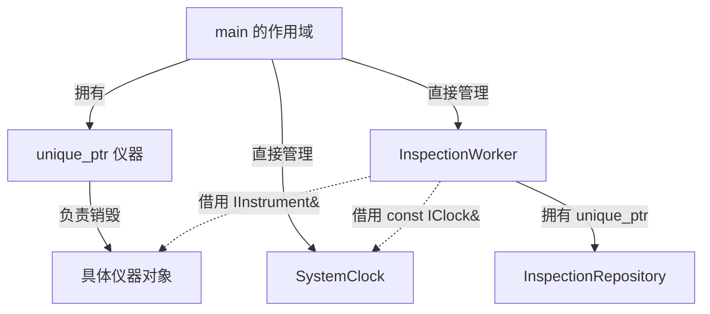

# 用工程思维理解 C++：阅读指南第三章的独立深入版

> 面向读者：知道基础语法，但看到真实项目里的类、引用、智能指针、回调、线程和异常，还无法理解它们为什么这样组合。
>
> 依据：2026-10-04 当前工程源码。本文是原阅读指南第三章的独立补充；按当前文件内容讲解，不依赖旧指南中可能已经变化的行号。
>
> 工程：`/home/ubuntu/桌面/BLE_Linux`。源码链接使用绝对路径。标有“源码节选”的代码对应实际实现，可能省略注释；标有“教学示例”的代码用于解释，不表示工程已经做了相应修改。

配套文档：[原工程阅读指南](/home/ubuntu/桌面/BLE_Linux/Doc/04_C++工程保姆级阅读指南.md)。建议把本篇作为第三章的深入学习材料，读完再回到原指南的逐文件路线。

你现在需要跨过的坎，是把一串语法读成一组工程决策。

例如看到 `const IClock& clock_`，只知道它是“常量引用”还不够。更有用的理解是：**业务对象借用一个由外部管理的时钟，通过统一接口读取时间；它不负责销毁时钟，也不决定使用真实还是测试时钟。**

看到 `std::unique_ptr<IInstrument>`，要继续读出：**当前这一层拥有仪器对象，可以选不同实现，并负责最终销毁；销毁前还需要让对象内部线程停止。**
意思i
这份讲解围绕实际问题展开：数据要不要复制，对象能活多久，谁有修改权，接口如何替换，异步结果如何回来，失败后还剩下什么。每个知识点都先讲问题，再讲代码选择和阅读方法。

## 目录

- [1. 阅读工程时先建立六个问题](#deep-1)
- [2. 从函数签名读出协作契约](#deep-2)
- [3. 对象、资源与生命周期：谁负责收尾](#deep-3)
- [4. 复制、移动、引用：如何选择数据关系](#deep-4)
- [5. 类型、容器与 const：如何表达业务约束](#deep-5)
- [6. 接口、多态与依赖注入：如何隔离变化](#deep-6)
- [7. lambda 与回调：如何连接模块和时间](#deep-7)
- [8. 线程同步：保护的是哪条业务关系](#deep-8)
- [9. 异常、RAII 和事务：失败后留下什么](#deep-9)
- [10. 头文件、编译、链接与模板：项目如何组成程序](#deep-10)
- [11. C 接口、字节与时间：外部数据如何进入工程](#deep-11)
- [12. 综合精读一：一个测量如何安全跨越线程](#deep-12)
- [13. 综合精读二：confirm 如何落实业务约束](#deep-13)
- [14. 可运行实验：把隐含行为看出来](#deep-14)
- [15. 项目阅读练习与解题过程](#deep-15)
- [16. 原第三章对照表与长期阅读方法](#deep-16)

<a id="deep-1"></a>
## 1. 阅读工程时先建立六个问题

### 1.1 从一句代码向两边看

基础语法学习常常把一行单独拿出来讲。读工程需要同时看上游和下游：这个对象从哪里来，经过哪些函数，还要被谁使用？

比如：

```cpp
repo_->save_point(task_->id, p);
```

表面上只是通过指针调用方法。工程上至少包含六个问题：

| 问题 | 在这里该追查什么 |
|---|---|
| 这个数据是什么？ | p 是已选定候选形成的 Point，尚需保存 |
| 谁拥有它？ | p 是 confirm 的局部对象；repo_ 由 worker 拥有 |
| 能活多久？ | p 在函数返回后销毁，数据库必须在此之前复制所需数据 |
| 谁允许修改？ | 业务线程修改任务；仓库通过 SQL 修改持久化记录 |
| 在哪条线程执行？ | 普通同步调用，仍在业务线程 |
| 失败后发生什么？ | StorageError 传播，上层进入故障处理；后面的点数推进不能照常执行 |

这六个问题比“这个符号是什么意思”更能帮你读懂项目。语法仍需要学，但每个语法都放进协作关系里理解。

### 1.2 三张图足以建立第一层工程认识

**数据包含图：**

```text
Task
├── 身份、状态、规则 Rule
└── vector<Point>
    └── Point
        ├── index / confirmed_ms
        └── Measurement：厚度、材料、候选编号、时间、连接代次
```

**对象管理图：**

```text
main 的作用域
├── clock、queue、health、display
├── unique_ptr → instrument 具体对象
├── unique_ptr → workstation 具体对象
└── worker
    ├── 借用前面的 clock/queue/health/display/instrument/workstation
    ├── 自己拥有 Config 副本和当前 Task
    └── 自己拥有 Repository（在业务线程内创建/销毁）
```

**执行交接图：**

```text
仪器线程：生成拥有数据的 Event
→ 调用 sink（仍在仪器线程）
→ Event 入队
→ 业务线程 pop
→ handle/confirm/repository 调用（仍在业务线程）
```

分别问“里面装什么”“谁负责销毁”“哪条线程执行”，不要把三张图合成一个模糊的“模块关系”。

### 1.3 一个类应当被读成“持续存在的工作上下文”

函数可以理解为一次动作；对象则保存多次动作之间必须延续的状态。

InspectionWorker 不能每次收到测量都只用一个孤立函数处理，因为它必须知道：当前有没有任务，START 是否确认，窗口何时开启，目前有哪些候选，已经保存了几个点。

因此它把状态保存在成员中，把允许发生的动作放在成员函数中。这就是你看到 `task_`、`phase_`、`window_ms_` 与 `begin/arm/confirm` 聚在同一个类里的原因。

不要只给它贴“面向对象”标签，要说出：**哪些状态需要延续，哪些规则必须由同一个管理者维护。**

<a id="deep-2"></a>
## 2. 从函数签名读出协作契约

源码参照：[types.hpp](/home/ubuntu/桌面/BLE_Linux/coating_inspection_host/include/inspection/types.hpp)、[repository.hpp](/home/ubuntu/桌面/BLE_Linux/coating_inspection_host/include/inspection/repository.hpp)、[instrument.hpp](/home/ubuntu/桌面/BLE_Linux/coating_inspection_host/include/inspection/instrument.hpp)。

### 2.1 先把一个签名读成一句完整的请求

源码声明：

```cpp
bool passes(const Rule& rule, const std::vector<Point>& points);
```

逐层读：

1. 返回 bool：给出通过/不通过结论。
2. Rule 和 points 是输入：判断依据和待判定点。
3. `const ...&`：借用现有对象，不复制整个规则和点列表，也不通过这些参数修改它们。
4. 没有 Repository、设备接口参数：这个函数不需要查数据库或操作设备。
5. 没有成员对象：它适合成为独立质量计算函数，容易用少量测试数据验证。

再看实现才能确认它实际上是否有其他副作用。**签名提供线索，不是对全部行为的证明。** 一个函数仍可能访问全局对象、记录日志或保留指针；这些需要读函数体。

### 2.2 按值与按引用，核心是“独立对象还是借用关系”

教学示例：

```cpp
void inspect(Rule rule);              // 接收一个独立参数对象
void inspect(const Rule& rule);       // 临时借用，只读使用
void revise(Rule& rule);              // 借用，并允许修改调用方对象
```

如果调用者有：

```cpp
Rule original;
inspect(original);
```

按值版本的 rule 是新的对象，函数修改它不会修改 original。引用版本只是给 original 起别名，修改权由 const 决定。

“按值总是差，引用总是快”不是工程结论。你要问函数需不需要保存独立数据、调用者以后是否还会修改原件、跨线程是否必须隔离。

### 2.3 本工程为什么 Config 按值、依赖对象按引用？

源码节选：

```cpp
InspectionWorker(Config cfg,
                 const IClock& clock,
                 BoundedQueue<Event>& queue,
                 BusinessHealth& health,
                 CandidateDisplay& display,
                 IInstrument& instrument,
                 IWorkstation& workstation);
```

这里每种参数对应不同责任：

| 参数 | 需要的关系 | 原因 |
|---|---|---|
| Config cfg | 独立配置副本 | worker 需要长期持有本次启动参数 |
| const IClock& | 借用时间服务，只读接口 | 时钟由 main 管理，可替换真实/测试实现 |
| queue& | 借用共同通信通道 | 要与所有事件生产者使用同一条队列 |
| health& | 借用共享健康证据 | 业务写，工位读，不能各复制一份 |
| display& | 借用跨线程候选展示对象 | 业务发布，工位读取同一个编号 |
| instrument& / workstation& | 借用外部拥有的设备对象 | worker使用操作接口，不负责最终对象销毁 |

如果把 BusinessHealth 按值复制，业务更新自己的副本，工位可能读另一份，工程关系会断开。其原子成员也使普通复制不适用；但语义上的“应共享同一个对象”比能否编译更根本。

### 2.4 `T&` 既可能是输入，也可能是输出

源码：

```cpp
bool pop(T& result, std::chrono::milliseconds wait);
```

result 是输出参数，函数把队头数据放进它；bool 告诉调用者“这次有没有取到”。wait 按值传入小型时长对象。

正确调用形状是：

```cpp
Event event;
if (queue.pop(event, std::chrono::milliseconds(20))) {
    handle(event);
}
```

如果返回 false，却仍把 event 当成本轮新事件处理，就破坏了这个契约。参数类型能看出修改权，但到底是输入、输出还是二者兼有，仍要看实现和命名。

### 2.5 返回值也表达所有权

| 签名形状 | 工程含义 | 进一步检查 |
|---|---|---|
| `Task get_task()` | 返回一个独立对象 | 可能有移动/返回值优化 |
| `const Task& get_task()` | 返回别人内部对象的借用视图 | 拥有者多久存活，之后会不会修改 |
| `Task* find_task()` | 可为空的指针，通常表示借用 | 谁销毁、为空时怎么处理；裸指针本身不规定所有权 |
| `unique_ptr<IInstrument> make_instrument(...)` | 返回独占所有权 | 基类是否有虚析构，后台线程如何停止 |
| `string current() const` | 返回编号副本 | 锁释放后副本仍可安全使用 |

不要从 `T*` 单独断言“一定借用”或“一定拥有”。要结合创建/销毁代码和接口说明。现代工程通常让 unique_ptr 清楚表达独占拥有，裸指针多用于观察对象或与 C 库交互。

### 2.6 bool 与 void 都不是万能“成功语义”

源码：

```cpp
virtual bool submit(Command) = 0;
```

true 只表示命令已进入工位等待队列。现场是否成功执行，稍后由 CommandDone 事件给出。

源码：

```cpp
void save_point(const std::string& id, const Point& p);
```

这里用“正常返回 / 抛异常”表示保存成功或失败，不需要再用 bool。返回 void 不表示它不会失败。

所以看到 bool，先问“成功到哪一步”；看到 void，先找“异常会去哪里”。

### 2.7 阅读签名的固定顺序

按下面顺序读，比一开始纠结所有符号更容易：

```text
动作名 → 返回的事实 → 输入数据 → 修改权限
→ 拥有还是借用 → 允许为空吗 → 谁等待谁 → 失败表达方式
```

练习把 `make_instrument(const Config&, const IClock&, EventSink)` 翻译为：根据配置组装一个仪器对象，借用时钟，保存事件出口，返回拥有该对象的独占指针。至于借用/回调会不会长期保留，需要到实现里验证；本工程确实会长期使用时钟和保存 sink。

<a id="deep-3"></a>
## 3. 对象、资源与生命周期：谁负责收尾

### 3.1 对象存在与资源存在不是同一件事

考虑：

```cpp
std::unique_ptr<IInstrument> instrument;
```

变量 instrument 本身可以存在，但还没指向任何仪器。以后赋值为 make_instrument 的结果，才获得具体对象。

再看实际对象：仪器对象已经构造，也不意味着后台线程已经启动；必须调用 start。仓库对象构造成功则通常意味着数据库已打开，但仪器构造阶段未必已经连接物理设备。

工程阅读要分三个时刻：

1. 对象自身建立。
2. 内部资源获得或运行开始。
3. 资源停止、释放，对象销毁。

这解释了为什么 start/stop 与构造/析构可以分开。

### 3.2 自动对象与动态对象，不要仅靠“栈/堆”解释全部

源码中的 main 大致有：

```cpp
SystemClock clock;
BoundedQueue<Event> queue(cfg.queue_capacity);
auto instrument = make_instrument(cfg, clock, sink);
```

clock 和 queue 的生命周期由作用域管理；instrument 这个 unique_ptr 变量也由作用域管理，它所拥有的具体设备对象通过动态分配建立。

但 queue 内部 deque、Config内部字符串等还可能自己动态分配内存。一个“局部对象”不等于内部所有数据都在栈上。

读工程最先关心的是生命周期控制权；实际存储位置在排查性能和内存问题时再往下分析。

### 3.3 构造函数必须把对象带到可使用的起点

源码节选：[worker.cpp](/home/ubuntu/桌面/BLE_Linux/coating_inspection_host/src/domain/worker.cpp)。

```cpp
InspectionWorker::InspectionWorker(Config cfg, const IClock& clock,
                                   BoundedQueue<Event>& queue,
                                   BusinessHealth& health,
                                   CandidateDisplay& display,
                                   IInstrument& instrument,
                                   IWorkstation& workstation)
    : cfg_(std::move(cfg)), clock_(clock), queue_(queue), health_(health),
      display_(display), instrument_(instrument), workstation_(workstation) {
}
```

初始化列表表达两个动作：cfg_ 获得自己的配置对象；其他成员绑定已有依赖。

如果写成函数体里 `clock_ = clock;`，不是“给引用重新绑定”。引用成员必须在初始化时绑定；绑定之后赋值（若类型允许）会操作被引用对象，不能改成引用另一个时钟。

构造后 worker 具备依赖，但尚未启动线程；repo_ 仍可为空。对象合法状态要结合使用阶段理解，而不是要求每个成员在构造后都已经有最终资源。

### 3.4 构造顺序来自声明，析构顺序反过来

教学示例：

```cpp
class Group {
    A first_;
    B second_;
public:
    Group() : second_(), first_() {}
};
```

尽管初始化列表把 second 写前面，实际还是先构造 first，再构造 second；析构顺序相反。基类在成员之前构造。

因此成员之间有依赖时，先检查类定义里的声明顺序，而不是只看构造函数列表。独立局部对象在正常离开作用域时也通常按构造完成的逆序销毁。

### 3.5 拥有关系和借用关系要画成不同的箭头



“worker 有一个 instrument_ 成员”并不意味着它拥有仪器。看成员类型 `IInstrument&`，再看 main 的拥有者，才能确定责任。

借用者不能自动延长被借对象寿命。把引用作为成员保存以后，拥有者必须保证后续所有借用操作期间对象仍存活。

### 3.6 unique_ptr 解决销毁权，没有自动解决所有业务收尾

unique_ptr 负责在自身销毁时调用所指对象的析构函数。它不会理解“线程要先停”“工位要撤销输出”“数据库要记录中止”。

这些必须由具体对象设计：

- BleInstrument/ReplayInstrument 的析构调用 stop。
- 工位对象析构调用 stop。
- InspectionWorker 析构 request_stop + join。
- 仓库析构关闭 SQLite。

因此完整关系是：**独占拥有 → 正确派生析构 → 业务停止/线程等待 → 成员资源释放。**

虚析构和stop/join都是这条链的部分，不能只靠一个unique_ptr就认为一切已经安全。

### 3.7 RAII 为什么是工程结构，远不只是“自动释放内存”

本工程资源不仅有内存，还有：互斥锁、SQLite语句、SQLite连接、事务状态、线程执行。

```text
lock_guard构造 → 获得锁 → 作用域离开 → 解锁
Statement构造 → prepare → 作用域离开 → finalize
Transaction构造 → BEGIN → commit或作用域离开回滚
```

RAII 把“完成每条退出路径的清理”变成“对象的统一析构职责”。有10个return和3种异常时，不必复制13份解锁代码。

但获得资源失败的构造函数，需要特别处理：**这个对象的构造没有完成，其自身析构函数不会执行。** 已经构造完成的成员仍会析构，手工获得的裸句柄则需要构造失败路径自己清理。仓库构造中的catch关闭数据库，就是这类边界。

### 3.8 为什么必须先join再销毁this和依赖？

源码：

```cpp
thread_ = std::thread([this] { run(); });
```

新线程保存this指针，它不会把worker整个复制过去，也不会替worker延长寿命。若worker已经销毁，线程仍访问task_，就是访问失效对象。

所以正常停止遵循：请求停止 → 线程真正结束 → join返回 → 才释放线程依赖的对象。

joinable表示存在可以join/detach的线程句柄，不表示“线程一定还在运行”；线程已经执行完但没join，仍可能joinable。

join只等待，不会替你发停止请求；request_stop只请求，不保证线程已经结束。两者需要配合。

### 3.9 默认复制为什么对资源对象可能危险？

数据类型 Task 可以复制，得到独立字符串和点列表。若一个类保存sqlite3*并负责close，直接复制指针只复制地址，不会复制数据库连接；两个析构可能关闭同一资源。

本工程仓库明确删除复制：

```cpp
InspectionRepository(const InspectionRepository&) = delete;
InspectionRepository& operator=(const InspectionRepository&) = delete;
```

这是让编译器阻止错误拥有关系。BluezReader还禁止移动，因为回调会保存对象相关地址。

原则不是“所有类都不能复制”，而是：**数据副本可以有多个，唯一资源的释放责任不能被无意复制。**

本工程内部Statement/Transaction主要靠局部使用维持生命周期；阅读任何这类RAII类时，仍应额外检查复制/移动是否被限制，不能仅因它有析构就假定复制安全。

<a id="deep-4"></a>
## 4. 复制、移动、引用：如何选择数据关系

### 4.1 先区分三个目标

| 目标 | 更接近的做法 | 本工程例子 |
|---|---|---|
| 以后独立使用，不受原件变化影响 | 保存值副本 | Task.rule、Point.value、Snapshot事件 |
| 只在当前操作中查看现有数据 | const引用 | passes、save_point参数 |
| 把资源/数据交给下一位拥有者 | 移动 | Event入队、unique_ptr返回/转交 |

这张表比“某写法有没有拷贝”更重要。正确的数据关系确定后，再优化复制成本。

### 4.2 拷贝语义为什么是安全功能？

源码：

```cpp
task.rule = rule->second;
p.value = candidate->second;
```

这两行有意保存独立数据。

如果Task.rule只引用配置中的Rule，配置对象变化或消失会影响正在进行的任务。保存Rule副本和数据库规则快照，能够固定这次检测的判断依据。

如果Point.value只引用candidates_中的测量，confirm接下来清空candidates_时，Point就失去了数据来源。复制测量之后，Point可以长期保留自己的值。

所以这里减少复制不是首要目标，**保存证据的独立性**才是。

### 4.3 引用节省复制，但引入关系负担

教学反例：

```cpp
const std::string& bad_name() {
    std::string local = "device";
    return local; // 错误：返回后local被销毁
}
```

返回引用不是“比返回string更高级”。它把调用者和某个对象的寿命绑在一起。被引用对象先死，引用就悬空。

正确替代是返回string值，让调用者获得自己的结果；编译器可能消除中间复制，或利用移动，不必为减少一次可能不存在的复制牺牲正确性。

### 4.4 `CandidateDisplay::current()` 为什么返回 string？

源码：[worker.cpp](/home/ubuntu/桌面/BLE_Linux/coating_inspection_host/src/domain/worker.cpp)。

```cpp
std::string CandidateDisplay::current() const {
    std::lock_guard<std::mutex> lock(mutex_);
    return current_;
}
```

锁内复制current_，返回的结果在锁释放后仍是调用者自己的字符串。另一个线程可以随后更新或清空current_，不会改掉已经拿到的编号。

如果改成返回 `const std::string&`，虽然锁住了“取得引用”这一瞬间，但返回后锁已释放，调用者读的是仍可能被另一线程改动的内部字符串。这可能造成数据竞争，也不再固定消息时刻的编号。

所以复制不仅管理寿命，也能隔离并发变化。不要在跨线程边界随意把值返回改成引用返回。

### 4.5 从两类特殊成员理解“复制”与“移动”

教学声明：

```cpp
struct Buffer {
    Buffer(const Buffer& other);             // 拷贝构造：建立新对象
    Buffer& operator=(const Buffer& other);  // 拷贝赋值：替换已有对象
    Buffer(Buffer&& other);                  // 移动构造：建立新对象
    Buffer& operator=(Buffer&& other);       // 移动赋值：替换已有对象
};
```

构造与赋值区别在于“目标对象已经存在吗”。

Event由string等成员组成，编译器可以生成相应复制/移动操作。复制Event会复制其成员；移动Event则根据每个成员自身规则执行移动。整数等成员通常只是复制数值，string等成员可能接管内部存储。

不是所有类型都自动拥有有用的移动操作。成员类型、用户声明的析构/特殊成员都会影响生成规则；读资源类时需要查看类定义，不能从出现std::move直接推断已高效移动。

### 4.6 理解 `std::move`，只需要一小步值类别知识

先看四个表达式：

| 表达式 | 初步理解 |
|---|---|
| `e` | 有名字、可以继续使用的现有对象表达式，通常是左值 |
| `std::move(e)` | 把它标记为可以被转移资源的表达式，属于将亡值 |
| `Event{}` | 创建新值的表达式，属于纯右值 |
| 函数参数里的 `Event&& value` | 形参类型是右值引用，但单独写value仍是左值表达式 |

后两种通常合称右值。暂时不必学完复杂重载规则，先记住：**有名字的变量表达式不会仅因为类型带&&就自动继续移动。**

`std::move`通常可看成一次类型转换，使后续构造/赋值优先考虑移动操作；真正是否移动，由接收者的类型与可用操作决定。

### 4.7 “用了move”不代表下面四件事

1. 不代表移动立刻发生；`std::move(e);`这一句单独执行，未必改变e。
2. 不代表源对象不存在；源对象仍存在，仍会析构。
3. 不代表源对象变空；状态取决于具体类型，不能假定所有成员清零。
4. 不代表线程之间发生了交接；std::move本身没有线程调度功能。

`const T`被std::move后通常得到const右值引用，而多数接管资源的移动操作需要修改源对象，所以常会退回拷贝或无法调用。不要给要转交的对象随意加const后还期待移动效果。

### 4.8 本工程 Event 入队的完整过程

源码中调用：

```cpp
sink_(std::move(e));
```

sink签名是 `bool(Event)`，main里的lambda也是按值参数：

```cpp
auto sink = [&](Event e) {
    // 省略快照编号绑定
    return queue.push(std::move(e));
};
```

queue.push再次按值接收：

```cpp
bool push(T value) {
    std::lock_guard<std::mutex> lock(mutex_);
    // 检查关闭与满载
    items_.push_back(std::move(value));
    return true;
}
```

从工程语义看，数据逐步转交：仪器局部Event → sink参数 → push参数 → 队列元素。

不要数“恰好移动了几次”作为第一目标：std::function包装、编译优化和具体成员实现会影响细节。先确认整个跨线程消息拥有数据，而非引用短命回调缓冲。

如果push返回false，消息已经按值进入它的参数，调用者不能假定自己原来的e仍保留完整内容以供无条件重试。本工程通过溢出标志进入故障处理；它没有设计成“失败后原对象不变”的队列接口。

### 4.9 出队为什么先move，再pop_front？

源码：

```cpp
result = std::move(items_.front());
items_.pop_front();
```

front返回队头对象的引用。先把其数据转给消费者result，随后pop_front销毁队头的剩余对象。

如果先pop_front，队头已经销毁，再访问原引用就错误。移动转交资源与销毁对象是不同的操作，所以必须按顺序做。

### 4.10 类型推导：auto有时会悄悄改变关系

源码：

```cpp
auto& m = e.measurement;
const auto& m = e.measurement;
```

第一种给e里的测量起可写别名，适合构造事件字段。第二种起只读别名，适合检查收到的事件。

若改成：

```cpp
auto m = e.measurement;
```

得到独立副本；填m不会填e.measurement。这是初学者常见的“代码能编译，却没改到正确对象”。

`auto candidate = candidates_.find(id)`得到迭代器对象，不是Measurement副本；`candidate->second`才是容器内的测量。

### 4.11 容器引用的有效期要跟着容器操作读

vector追加可能重新分配存储，旧元素指针/引用/迭代器可能失效；map插入通常不会让其他元素的引用失效，但删除该元素或clear会使相应引用失效。

源码confirm先：

```cpp
p.value = candidate->second;
```

然后才：

```cpp
candidates_.clear();
```

副本p已经拥有测量数据，不再依赖map节点。因此清空候选不会抹掉Point。读容器代码时，把“保存引用”和“随后可能改变容器”的位置连起来。

<a id="deep-5"></a>
## 5. 类型、容器与 const：如何表达业务约束

### 5.1 类型不是随便给数据贴个标签

工程需要区分：接收测量、可确认候选、已确认点、活动任务、现场执行记录。这些数据即使都能写成JSON，也承担不同约束。

`Point`把index、Measurement与confirmed_ms放在一起，表达“这条测量已被确认为某一点”。`Task`把规则、token、点列表组合起来，表达“这些点属于同一次检测”。

但类型目前不能自动证明所有业务事实：你可以手工构造index=0的Point；必须由confirm/save_point再检查。**类型提供结构，业务函数与数据库约束补足合法性。**

### 5.2 private 的实际价值：把状态修改集中在少数入口

假设所有线程都能写worker.task_.points：仪器线程收到值就追加，CLI线程确认也追加，工位线程到位变化时清空。即使每处加锁，仍可能难以维持正确业务顺序。

当前设计让task_/phase_/candidates_为private，并通过业务事件集中处理。外部模块只能提供事实或请求，不能直接推进检测步骤。

private本身不提供线程同步，但它限制哪些代码能修改状态，让“唯一业务所有者”更容易被维护。

### 5.3 不变量：读类时最值得寻找的东西

不变量可以理解为“对象在对外可观察的合法时刻应持续满足的关系”。本工程重要关系包括：

- Point序号应连续，不能越过required_points。
- 同一候选不能在同一任务中被重复确认。
- 未获得START确认，任务不能进入正常采点。
- 窗口只接纳开启之后、相同连接代次的测量。
- 质量结果和完成Outbox一起提交。

这些不一定由一个if完成，而是分布在worker、repository与SQL中。读代码时记录“这条规则在哪几层被维护”，比把每个条件背下来有用。

### 5.4 enum class 为什么有工程价值？

字符串状态容易写出 `"INSPECTNG"` 这种拼写错误；普通整数容易把MCU状态数字和业务阶段混用。

TaskState、InspectionPhase、McuState分别采用枚举类型，让编译器阻止部分跨域错误。显示/存储时再用phase_name或明确编码转换。

enum class减少误用，但不能替你决定哪条状态转移合法；例如把phase_直接设Completed仍可以编译，是否允许要由业务流程保证。

### 5.5 optional表达“没有任务”，不要伪造空任务

源码：

```cpp
std::optional<Task> task_;
```

没有当前任务是正常状态，不应靠id为空、token=0、points为空等多个字段猜测。optional用一个明确的“存在/不存在”维度表达它。

```cpp
return task_ &&
       (task_->state == TaskState::StartPending ||
        task_->state == TaskState::Inspecting);
```

左侧不存在时，右侧不求值。注意Task对象存在不等于active；Completed/Aborted任务也可以仍保留在optional中。

optional保存值对象，不是必须在堆上new一个Task。reset销毁内部Task，Task里的字符串与vector跟着释放。

### 5.6 各容器在工程里为什么被选中

| 结构 | 业务需要 | 阅读时盯什么 |
|---|---|---|
| vector<Point> | 保存顺序明确的确认点 | 数量和index是否一致，追加前后状态 |
| map<string, Measurement> | 按候选ID精确查找 | find/end、清空窗口、是否引用失效 |
| deque<Event> | FIFO消息传输 | 入队/出队顺序、容量与关闭协议 |
| array<uint16_t, 22> | 固定协议长度 | 地址与下标映射是否一致 |
| optional<Command> | 当前可能有一条等待ACK的命令 | pending与等待队列的区别 |

容器给出机械操作，业务意义来自使用规则。FIFO也不能让多线程产生的事件自动按物理采样时刻排序，所以代码仍检查接收时间。

### 5.7 const表达“通过这个入口的权限”，不保证全世界不变

```cpp
const Rule& rule;
```

它不允许通过rule修改对象，但同一个Rule如果还存在别的可写别名，仍可能被别人修改。const引用不自动生成快照，也不自动锁住其他线程。

```cpp
const IClock& clock_;
```

表示可通过const接口读时间。真实SystemClock返回值自然不断变化，const从不意味着“每次返回同一个数”。

### 5.8 const成员函数有边界

```cpp
bool active() const;
```

不能通过该const this直接修改普通成员，但如果类含一个指向外部可写对象的指针，const函数仍可能调用外部对象的可写操作。

`const unique_ptr<T>`固定的是指针拥有者的操作权限，并不自动把T变成const；`unique_ptr<const T>`才让所指对象通过该指针呈只读接口。

因此“这个函数带const，所以没有副作用”是不可靠的推断。工程里const是重要线索，需要配合实现检查。

### 5.9 mutable mutex为什么合理？

CandidateDisplay::current对外的含义是读取编号，逻辑值不变；为了安全读取，需要修改mutex的锁状态。

把mutex声明mutable，允许const函数加锁；current_字符串仍不是mutable。这里区分“对象业务值的修改”和“内部同步机制的变化”。

不能因此把业务task_也随意mutable，让所有const函数绕开修改规则。

### 5.10 同一个整数类型，不同单位仍会被错误混用

thickness_milli_um、wall_ms、mono_ms都可以是int64_t，但把wall_ms拿来比较采集窗口也能编译。

本工程通过字段名、时钟接口、注释和测试维护单位/时间域。若将来使用不同包装类型表达厚度与时间，编译器还能阻止更多跨单位操作；当前实现没有这套强类型单位封装。

所以读int64_t不能只问“够不够大”，还要问“单位是什么、能与哪个字段相减、是否跨进程有效”。

<a id="deep-6"></a>
## 6. 接口、多态与依赖注入：如何隔离变化

### 6.1 工程里的变化不是平均分布的

仪器可能来自真实BLE，也可能来自文件回放。业务规则却始终要求：先开启窗口，新值成为候选，明确确认以后保存点。

如果worker内部直接调用BlueZ，再随处写`if (simulation)`，测试分支会渗入所有业务步骤。每次设备实现变化，都可能牵动检测逻辑。

当前做法把变化集中在具体设备类，让worker依赖统一接口。

### 6.2 IInstrument规定“你能做什么”，隐藏“你怎么做”

源码节选：[instrument.hpp](/home/ubuntu/桌面/BLE_Linux/coating_inspection_host/include/inspection/instrument.hpp)。

```cpp
class IInstrument {
public:
    virtual ~IInstrument() = default;
    virtual void start() = 0;
    virtual void stop() = 0;
    virtual bool test_control(const Json&) = 0;
};
```

`virtual`允许通过基类入口调用实际对象的方法；`=0`要求具体实现提供该动作，使接口类成为抽象类。

但同样签名只是第一层契约。BLE与Replay必须对“在线”“测量事件”“停止后不再回调”等含义达成一致，业务才能互换使用。仅仅两个类都写了start，不代表语义上可替换。

### 6.3 工厂把选择具体实现的责任集中起来

源码形状：

```cpp
std::unique_ptr<IInstrument> make_instrument(const Config& c,
                                            const IClock& clock,
                                            EventSink sink) {
    if (c.instrument_type == "ble")
        return std::make_unique<BleInstrument>(c, clock, std::move(sink));
    return std::make_unique<ReplayInstrument>(c, clock, std::move(sink));
}
```

main问“根据配置给我一个仪器”；worker只看IInstrument；具体类可以放在instrument.cpp内部。

Config先完成后端校验，工厂再按已验证的配置选择。因此最后的else并不是承诺“任意错误配置都自动回退仿真”。

### 6.4 依赖注入其实就是“把工具从外部传进来”

worker不自己new SystemClock，也不自己硬编码创建BLE。main把clock、仪器、工位传给它。

这让worker的业务规则和设备装配分开。测试可以使用ManualClock或者模拟后端，生产可以使用真实对象。

没有神秘框架，这个工程的依赖注入就是构造参数和接口引用。

### 6.5 静态类型与动态类型分别决定什么？

```cpp
std::unique_ptr<IInstrument> instrument = make_instrument(...);
instrument->start();
```

静态类型IInstrument决定“编译时能调用哪些成员”，因此不能直接调用ReplayInstrument私有run。动态类型BleInstrument或ReplayInstrument决定虚函数实际执行哪个实现。

普通非virtual函数不按同样规则进行动态派发。override帮助编译器检查覆盖关系，避免参数不匹配而只是写了一个同名函数。

### 6.6 为什么基类析构必须是virtual？

unique_ptr<IInstrument>最终通过IInstrument指针销毁实际派生对象。虚析构让派生类析构链执行，清理其thread_/reader_等成员。

没有虚析构就通过这种基类指针delete派生对象，可能导致未定义行为，而不只是“漏一个日志”。这正是接口类里`virtual ~IInstrument() = default;`的工程理由。

`=default`使用编译器提供的相应实现；`=delete`禁止某项操作；`=0`声明纯虚函数。三者长得像，但职责完全不同。

### 6.7 不要通过值保存多态对象

如果把派生对象转成基类值，派生部分可能被切掉，称为对象切片。当前IInstrument是抽象类，无法这样建立基类对象；接口通过指针/引用保留实际对象身份。

教学上遇到非抽象基类时也要注意：`Base b = derived;`并没有保留完整derived。需要动态派发的对象通常通过Base&或Base指针使用。

### 6.8 接口不是到处都要加的一层

passes只是明确的规则计算，无需为它再设计一个继承树。IInstrument/IWorkstation/IClock有明确的多实现、测试替换和边界理由。

读工程时问“变化被隔离在哪里”，别把“类越多、接口越多”当作工程质量指标。

<a id="deep-7"></a>
## 7. lambda 与回调：如何连接模块和时间

### 7.1 普通调用与回调，是谁掌握调用时机的区别

普通调用：worker现在决定调用repo.save_point。

回调：BleInstrument先把处理函数交给BluezReader，之后通知到来时，BluezReader决定调用它。

业务把“收到测量后怎样处理”写在回调里；底层负责“何时收到测量”。这把设备收取与上层动作连接起来。

### 7.2 lambda是带着上下文的小对象

源码：

```cpp
auto sink = [&](Event e) {
    if (e.kind == EventKind::Snapshot)
        e.bound_candidate = display.current();
    return queue.push(std::move(e));
};
```

它不仅有函数体，还保存访问queue/display所需的捕获关系。可以概念性地想象成一个拥有调用运算符的对象：

```cpp
// 教学伪代码，不是lambda真实生成的标准布局
struct SinkLike {
    BoundedQueue<Event>& queue;
    CandidateDisplay& display;
    bool operator()(Event e) const {
        return queue.push(std::move(e));
    }
};
```

这种想象有助于理解寿命：保存lambda，就相当于保存它所携带的引用/值。

### 7.3 四种常见捕获，保存的是不同关系

| 写法 | 保存什么 | 风险或用途 |
|---|---|---|
| `[value]` | 当时的值副本 | 后续原变量变了，不同步更新这个副本 |
| `[&value]` | 对现有对象的借用 | 回调执行时原对象必须仍活着 |
| `[this]` | 当前对象指针 | 不复制当前对象，不延长对象寿命 |
| `[p = std::move(ptr)]` | 将独占拥有者移入闭包 | 闭包可能变成不可复制，影响包装接口 |

`[&]`只是默认引用捕获实际用到的局部变量，不是把作用域内所有变量都自动塞进去。

在C++17里，即使用`[=]`并访问成员，也不能理解成“复制了整个this对象”；this相关捕获仍需要专门确认。读回调时直接检查它引用哪些成员更清楚。

### 7.4 当前线程是谁，由调用点决定

```cpp
sink_(std::move(e));
```

如果仪器线程在执行这句，sink函数体就在仪器线程执行。它投递队列以后，另一个线程才在未来取消息。

```cpp
thread_ = std::thread([this] { run(); });
```

这里换线程的原因是std::thread，不是lambda。相同lambda如果直接写`f();`，就是当前线程执行。

阅读回调必须沿着“注册位置 → 实际调用位置”追踪，否则很容易想象出不存在的线程。

### 7.5 std::function解决“调用对象类型不同”的问题

源码：

```cpp
using EventSink = std::function<bool(Event)>;
```

它把具体lambda的匿名类型包装成统一可调用接口，仪器和工位只知道“给Event，拿bool”。

它可以复制包装器，但不会把捕获的引用自动变成深拷贝。三个模块各有sink副本，仍可以指向同一条queue和同一个display。

C++17的std::function要求存储的目标能满足可复制等要求；捕获unique_ptr的仅可移动lambda通常不能直接放进去。是否用std::function、模板或其他包装，也是一项接口取舍。

空std::function被调用会抛bad_function_call；本工程正常装配会传入有效sink，阅读时仍要检查来源，不能把默认空回调当可用。

### 7.6 一个典型悬空回调反例

```cpp
// 教学反例：不要这样实现
std::function<void()> make_callback() {
    std::string name = "local-device";
    return [&name] {
        std::cout << name;
    };
}
```

make_callback返回以后name销毁，回调里引用失效。改成值捕获`[name]`，回调拥有字符串副本，可以晚些执行。

但如果捕获的是mutex/设备等唯一资源，不能简单复制。要重新考虑拥有者寿命和停止协议，而不是机械地把所有`[&]`改成`[=]`。

### 7.7 为什么本工程main的引用捕获可以成立？

正常生命周期中，queue/display在创建sink之前已存在，主线程在设备和输入线程join之后才结束这些对象的生命周期。

因此设备保存sink期间，捕获依赖仍可用。这个结论来自创建/停止顺序，不来自lambda本身的任何保护机制。异常启动或部分资源建立失败还需要检查对应清理路径，不能把正常顺序推成所有异常场景绝对安全。

### 7.8 回调参数的借用，不能直接跨越时间

厂商回调：

```cpp
std::function<void(const thickness::Measurement&)> measurement;
```

它临时借用厂商解析结果。业务适配器在回调里把需要的数据复制成自己的Event，然后才能晚些由业务线程处理。

指针或引用作为函数参数，不意味着“可以一直保存”。在任何异步边界，检查是否创建了拥有数据的对象，是读工程的重要习惯。

### 7.9 停止协议是回调接口的一部分

当stop返回以后，上层必须能够知道不再有回调访问queue或this。本工程通过请求停止并join实现这一点。

如果stop只是发请求立刻返回，上层马上销毁队列，就可能出现最后一条迟到回调访问失效对象。

因此回调契约除了参数类型，还包括：在哪条线程、何时开始、何时保证停止、异常如何处理。

<a id="deep-8"></a>
## 8. 线程同步：保护的是哪条业务关系

### 8.1 并发工程的第一步不是“到处加锁”

先问这个状态能否由唯一线程维护。

本工程task_/phase_/candidates_只属于业务线程；其他线程提供事件。这样不用让仪器、CLI、工位同时修改任务。

真正共享的对象才需要同步：Event队列、健康戳、候选展示、设备命令/测试控制队列。

### 8.2 数据竞争是语言层面的错误，不只是“偶尔读到旧值”

若两条线程无同步地访问同一普通对象，至少一条写，可能形成数据竞争，导致未定义行为。不能认为“int写得很快”“大部分机器一次能写完”就安全。

普通bool停止标志同样需要正确同步。本工程使用atomic_bool，让请求停止与循环读取有明确的跨线程语义。

### 8.3 mutex保护的是一组操作，而不只是一个变量

队列push要完成：

```text
检查closed
→ 检查items.size
→ 放入一项
```

这三步必须在同一锁下。如果只分别保护size与push，中间另一个生产者也可能通过容量检查，导致超出限制。

所以把锁范围读成“一个不能被穿插的业务动作”。锁不自动理解容量规则，是代码把相关操作放在一起。

### 8.4 lock_guard与unique_lock在这里各有理由

push只需要从进入到退出一直持锁，lock_guard足够。

pop需要队列空时等待，在等待期间释放锁，让生产者可以进来；因此使用能配合condition_variable的unique_lock。

```cpp
std::unique_lock<std::mutex> lock(mutex_);
wake_.wait_for(lock, wait, [this] {
    return closed_ || !items_.empty() || overflow_.load();
});
```

这里有两种不同职责：mutex控制共享状态访问；condition_variable减少无数据时的忙等。通知本身不是消息存储，实际数据在items_里。

### 8.5 为什么要在醒来后再次检查条件？

可能虚假唤醒，也可能另一消费者先取走数据，或者此次是close/overflow唤醒而没有队列元素。

predicate负责判断能否继续等待；随后`if(items_.empty()) return false;`处理“被叫醒但没有数据”。

正确性建立在共享状态和谓词上，不建立在“每次notify都必定对应一条消息”上。

### 8.6 atomic不把多个字段变成一笔事务

假设有两个atomic：state、token。写线程先改state，再改token；读线程两次load之间仍可能看到新state和旧token。

每个字段单独原子，不等于整个对象是一致快照。如果业务必须看到一组相互对应的字段，就要设计锁、消息副本、版本协议等整体关系。

BusinessHealth由时间戳和enabled两个字段组成，本工程按照具体更新/读取流程使用它；不能从“两者都是atomic”推出任意组合读取都具有完整事务语义。

### 8.7 atomic的复合操作也要选对

教学示例：

```cpp
counter.store(counter.load() + 1); // 单次load/store原子，但可能丢更新
counter.fetch_add(1);             // 整体原子读改写
```

两个线程可能同时读到10再都写11，第一种最终少计一次。本工程overflow使用exchange(false)，一口气读旧值并清除，避免“先读后清”之间丢掉新的设置。

当前源码未指定特殊memory_order，采用默认原子操作顺序。第一轮先掌握共享状态契约，不需要为了理解业务自行改成relaxed。

### 8.8 CandidateDisplay的锁保护的是“显示与编号一致”

源码在同一把锁下：

```cpp
log("candidate", /* ... */);
current_ = m.candidate_id;
```

如果先让其他线程读取到新编号，候选日志还没出现，按钮可能绑定一个操作者尚未看见的值。当前组合顺序和锁让读者只能在完整publish以后拿到新current_。

它仍然不能消除物理按键到轮询快照之间的时间差；正确的保证范围是快照投递时绑定已展示编号。

### 8.9 业务锁与日志锁会形成锁顺序

publish持有display锁时进入log，log取得内部日志锁。读锁时还要考虑有没有另一条路径反过来“先拿日志锁，再等display锁”，否则可能死锁。

当前log自己的函数体不回调display；这有助于避免这条反向等待。但以后扩展日志回调时要重新分析。

不要在不了解锁顺序时，往锁内加任意外部函数调用。外部调用可能阻塞、重新进入本模块或获取另一把锁。

### 8.10 join建立的是“线程已不再使用资源”的证据

stop_requested.store(true)只是请求。run到合适位置观察标志以后才结束；如果正卡在有限D-Bus/串口等待或日志输出，停止可能延迟。

join返回以后才能保证这条线程已经结束，从而释放它引用的对象。join不解决所有共享状态设计，但它是生命周期边界的重要证据。

C++17的std::thread如果仍joinable就被析构，会调用terminate。对象的析构里保存一个thread成员，并不等于线程会自动安静退出。

### 8.11 不忙等的健康设计也是并发设计

业务线程正常完成一轮才推进health；工位线程看到新鲜戳才更新变化心跳。这里保护的是跨模块因果关系：“业务在推进”才允许现场继续认为主机健康。

如果通信线程每隔200ms无条件写心跳，数据库和业务已经停滞也可能被掩盖。线程仍运行与业务仍正确工作，是两个不同事实。

本节读完，试着为每个共享对象写出：谁写、谁读、谁同步、同步的一组操作是什么、停止时何时不再访问。

<a id="deep-9"></a>
## 9. 异常、RAII 和事务：失败后留下什么

源码参照：[repository.cpp](/home/ubuntu/桌面/BLE_Linux/coating_inspection_host/src/persistence/repository.cpp)、[commands.cpp](/home/ubuntu/桌面/BLE_Linux/coating_inspection_host/src/cli/commands.cpp)、[worker.cpp](/home/ubuntu/桌面/BLE_Linux/coating_inspection_host/src/domain/worker.cpp)。

### 9.1 读函数要同时画成功线和失败线

```cpp
repo_->save_point(task_->id, p);
task_->points.push_back(p);
log("point_saved", /* ... */);
```

正常线：保存数据库 → 追加内存 → 日志。

失败线：第一步抛StorageError，后面的追加/日志不会执行，异常沿调用栈寻找catch。

这是控制流的一部分，不是附加在函数外的说明。看到任何资源获取、分配、序列化和数据库调用，都要问失败会跳过哪些动作。

### 9.2 throw不是“返回一个错误字符串”

throw会离开当前正常路径。若异常传播并发生栈展开，已经完成构造的局部对象被逆序析构；找到匹配catch后，在那里处理。

本工程StorageError被当作严重存储故障，普通操作错误通常反馈cli_error。异常类型帮助上层采取不同策略。

catch只覆盖它对应的try大括号。`cli_words()`当前在CLI局部try之前，错误引号异常走外层事件catch，不能仅凭注释说“任何输入错误都不影响任务”。

### 9.3 RAII为什么能让异常路径清理资源？

教学流程：

```cpp
void operation() {
    Transaction tx(db);
    Statement s(db, "...");
    s.done();     // 假设抛异常
    tx.commit();
}
```

异常传播时先销毁s，finalize语句；再销毁tx，发现未提交则rollback。tx.commit不会被执行。

如果写成裸指针、每个分支手工清理，很容易遗漏。封装成作用域对象之后，清理职责不再依赖每个调用者记忆。

### 9.4 事务对象保存的是一个“还需要处理的承诺”

源码节选：

```cpp
class Transaction {
public:
    explicit Transaction(sqlite3* db) : db_(db) {
        // BEGIN IMMEDIATE，失败抛StorageError
    }
    ~Transaction() {
        if (!committed_)
            sqlite3_exec(db_, "ROLLBACK", nullptr, nullptr, nullptr);
    }
    void commit() {
        if (sqlite3_exec(db_, "COMMIT", nullptr, nullptr, nullptr) != SQLITE_OK)
            throw StorageError(sqlite3_errmsg(db_));
        committed_ = true;
    }
private:
    sqlite3* db_;
    bool committed_ = false;
};
```

committed_的意义是：这次事务是否已成功解除“退出时需回滚”的责任。

必须COMMIT成功后才设true。如果先设true，COMMIT失败时析构不会尝试回滚，责任链就断了。

### 9.5 mutex与数据库事务解决不同层次的问题

| 机制 | 保证范围 | 不自动保证 |
|---|---|---|
| mutex | 参与同一锁协议的线程，不会穿插共享操作 | 进程崩溃后的数据库一致性 |
| RAII | 正常离开作用域/栈展开时进行资源清理 | SIGKILL、_exit等强制退出也执行析构 |
| SQLite事务 | 同一数据库事务内修改一起提交或回滚 | 外部MCU动作也随数据库回滚 |
| 业务状态机 | 在业务条件下允许或拒绝动作 | 任意硬件异常都能原子撤回 |

质量保存与工位执行不能包进同一笔普通SQLite事务。数据库提交成功后，现场命令仍可能未知，因此需要独立actuation_log。

### 9.6 异常安全有三种常见要求

- **不抛保证：**操作承诺不让异常逸出，例如设计良好的清理接口。
- **基本保证：**失败后对象仍可清理、内部状态仍合法，但可能部分改变。
- **强保证：**失败后从可观察状态看像没执行过。

不要因为函数用了try/catch就直接说它具有强保证。要检查所有副作用和提交边界。

### 9.7 confirm为何不能被概括成“失败全部不变”？

save_point成功提交后，`task_->points.push_back(p)`仍可能因内存分配失败抛异常。此时数据库已经有点，内存列表还没成功追加。

这说明：“先落库再更新内存”避免了数据库失败时虚增点数，但不保证数据库与内存在所有失败位置同时不变。

上层会把异常转为故障处理；持久化点作为恢复依据保留。工程重点是不能继续正常确认并宣称一切一致，要明确进入恢复/中止路径。

这不是要求你立刻修工程，而是训练精确阅读：**把正确性结论限定在实际代码能保证的范围。**

### 9.8 final complete里的事务边界在哪里？

```text
读取创建时规则和确认点
→ 核对数量、顺序、质量
→ 更新inspection为COMPLETED
→ 插入完成Outbox
→ COMMIT
```

同一事务内结果与Outbox一起提交，失败回滚。

但最后一点的save_point是前一笔独立事务。所以before_final_commit崩溃时，点可以已经存在，完成结果尚未提交。恢复时中止未完成任务，保留点。

强保证是要针对某一操作的具体边界描述，不能扩展成“整个从测量到MCU输出的大流程全部原子”。

### 9.9 noexcept表达边界承诺，不会把错误消失掉

`void request_stop() noexcept`表明函数不应让异常传播给调用者。若noexcept函数有异常逃出，会调用terminate。

BlueZ的若干emit函数和C回调桥接内部显式catch，目的是防止C++异常穿过GLib调用边界。noexcept不是自动捕获机制，catch才在处理异常。

### 9.10 后台线程异常不能靠main的try自动捕获

main里有try，但另一条线程run中抛出的异常不会跨线程跳进main的catch。线程入口若让异常逃出，会terminate。

因此worker.run有自己的异常兜底；工位循环和回放循环也有各自catch；BlueZ回调桥接捕获应用回调异常。读取多线程代码时，给每条线程入口单独画异常边界。

### 9.11 析构通常不适合再抛新的异常

清理可能发生在已经处理一个异常的栈展开中；如果析构再让异常逃出，可能terminate。因此释放资源常用不抛方式或内部记录错误。

Transaction析构尝试rollback，但没有把sqlite3_exec返回码重新throw。这是“清理失败不能以第二个传播异常破坏退出”的取舍；业务仍需要正常操作失败时保留足够诊断。

### 9.12 强制退出和程序崩溃不是正常异常

`_exit`和SIGKILL不走正常C++析构。不能指望lock_guard/Transaction析构一定执行。

持久化恢复依赖SQLite事务和启动recover；现场保护依赖MCU变化心跳；正常退出才走shutdown/join。

不同失败类型由不同层接手，是可靠工程的重要组成部分。

<a id="deep-10"></a>
## 10. 头文件、编译、链接与模板：项目如何组成程序

源码参照：[CMakeLists.txt](/home/ubuntu/桌面/BLE_Linux/coating_inspection_host/CMakeLists.txt)、[support.hpp](/home/ubuntu/桌面/BLE_Linux/coating_inspection_host/include/inspection/support.hpp)、[bluez_reader.hpp](/home/ubuntu/桌面/BLE_Linux/coating_inspection_host/vendor/thickness/include/thickness/bluez_reader.hpp)。

### 10.1 为什么项目不是“把所有cpp按顺序执行”？

每个cpp及其包含的头文件形成一个编译单元，分别经过编译生成目标代码；链接器再把这些代码与库组合成可执行程序。

```text
main.cpp + include展开 → main目标代码
worker.cpp + include展开 → worker目标代码
repository.cpp + include展开 → repository目标代码
……
→ 链接项目库、SQLite、GLib、modbus等
→ inspection_service
→ 运行时从main开始，按调用/线程关系执行
```

目录顺序与源码行号不能决定不同文件运行顺序。调用链和线程入口才决定执行。

### 10.2 声明让编译器知道接口，定义提供实现

头文件：

```cpp
void confirm(const std::string&);
```

实现文件：

```cpp
void InspectionWorker::confirm(const std::string& id) {
    // ...
}
```

编译调用方时，声明足以检查“有没有这个函数、参数匹配吗”。链接时，还需要找到该函数定义。

“头文件找到了”只完成编译可见性的一部分，不表示实现库已被链接。

### 10.3 三类常见错误分别在哪一层？

| 错误表现 | 所在层 | 先看哪里 |
|---|---|---|
| 找不到hpp/类型不认识/参数不匹配 | 编译 | include路径、声明、命名空间、类型 |
| undefined reference | 链接 | 定义是否存在、cpp是否进目标、库是否链接、签名是否相同 |
| 运行时离线/协议错误/数据库异常 | 运行 | 配置、日志、设备与失败路径 |

例如新写一个cpp却没加入CMake target，可能头文件声明完全正确，最终仍链接失败。不能只搜索函数声明确认它“已经实现”。

### 10.4 include是文本可见性，不是对象创建

`#include "inspection/worker.hpp"`让当前编译单元看到类型与声明，不会自动创建worker，也不会启动线程。

头文件被多个cpp包含，会在各自编译单元里处理。`#pragma once`避免同一个编译单元反复展开同一个头；不意味着全程序只能有一个包含者。

### 10.5 为什么不要在普通头文件随意定义非inline函数？

如果多个cpp包含带普通外部函数定义的头，链接时可能出现多个定义。

类内定义的小成员函数通常隐式inline；inline允许符合规则的定义出现在多个编译单元，不意味着编译器一定把调用展开，也不等于“提高速度开关”。

本工程schema模板用`inline constexpr`变量，C++17允许这种头文件形式。理解它解决的是多编译单元定义问题，而不是读到inline就推断性能。

### 10.6 模板为什么把实现留在头文件？

源码：

```cpp
template<class T>
class BoundedQueue {
public:
    bool push(T value) { /* ... */ }
};
```

编译器看到`BoundedQueue<Event>`，需要用模板定义生成对应类型/方法；单元测试又使用`BoundedQueue<int>`。

常见模板设计要让使用处看到定义，因此实现放头文件。可以通过显式实例化等方式分离，但当前工程采用直接可见的形式。

T不是运行时变化的变量，编译后Event队列与int队列是不同具体类型；不是什么值都能塞进同一条队列。

### 10.7 命名空间体现不同语义领域

`thickness::Measurement`表示厂商格式测量；`inspection::Measurement`表示业务测量及归属证据。

两者字段可能相似，但后者多出candidate_id、instrument_id、时间、generation。适配层显式转换，有助于让业务不依赖厂商对象的临时寿命和原始接口。

`using Json = nlohmann::json;`只是类型别名，不创建一份新JSON格式，也不复制对象。

匿名命名空间让内部辅助实体具备当前编译单元的内部连接属性；例如内部Transport不作为其他cpp直接链接使用的公共接口。

### 10.8 Pimpl如何降低依赖暴露？

源码：

```cpp
class BluezReader {
    class Impl;
    std::unique_ptr<Impl> impl_;
public:
    ~BluezReader();
};
```

头文件只声明Impl存在，把GLib句柄和复杂实现放cpp，使用者不需要在头文件里知道全部内部字段。

unique_ptr允许成员指向尚未完整定义的Impl，但在实际删除它的地方需要完整类型。BluezReader析构定义放到cpp、Impl定义之后，满足这个要求。

这能减少公共头文件的依赖与暴露；不是线程模型，也不是第二个设备进程。

### 10.9 工程依赖要读成“层之间允许知道什么”

worker知道仪器接口和仓库接口；不需要知道每个D-Bus属性如何取出。instrument.cpp知道厂商类型并转换；业务types不保存GVariant*。

读include除了排查编译，也能观察耦合：一个业务头文件若必须暴露所有设备句柄，可能让变化扩散。当前项目部分头文件也有便利性的间接include，不能把现有依赖宣称为最小化设计。

<a id="deep-11"></a>
## 11. C 接口、字节与时间：外部数据如何进入工程

### 11.1 C库不认识你的业务对象

SQLite使用sqlite3*和sqlite3_stmt*；GLib使用GVariant*、GError*；libmodbus使用modbus_t*。

C++封装需要清楚规定：谁获得句柄、谁释放、哪种释放函数、能否跨线程用、失败如何转成上层错误。

因此“C++用了裸指针”并不一定等于错误。读它的作用：拥有资源的底层句柄、只借用的缓冲区，还是必须回传的用户上下文。

### 11.2 原始字节指针只是观察窗口

BLE通知形状：

```cpp
const std::uint8_t* data, std::size_t length
```

指针提供起点，length提供有效范围；指针本身不拥有这些字节，也不说明它们什么时候失效。

本工程在回调期间解析/复制，Event只保存自己的业务值，避免业务线程稍后访问已释放的GVariant数组。

`std::string_view`同样通常是视图，构造很轻，但不管理数据寿命。`material_name`返回的视图指向相应字符串字面量，适配层再构造string；不同场景中的string_view不能一律认为长期有效。

### 11.3 static_cast与reinterpret_cast不是“安全/不安全开关”

static_cast用于明确转换数值、枚举或满足规则的类型关系；它不会自动验证输入范围。把1000转uint8_t之前仍要做范围检查。

reinterpret_cast用于某些底层表示转换，例如把字节起点按char指针读取组名。它不会自动证明对齐、长度、对象寿命或业务格式合法。

读cast时追三个问题：来源可信吗，转换后会不会丢信息，访问范围是否合法？不是看见cast就以为编译器已经检查了协议。

### 11.4 signed、unsigned与比较的陷阱

容器size返回size_t；required_points是int。源码在已经确认规则点数合法后，将required_points转换为size_t比较。

负int如果直接转无符号，会变成一个很大的数。`size()-1`在size=0时也可能无符号下溢。

所以本工程先做配置范围校验、再在具体位置转换。显式cast让意图可见，但它不是范围校验的替代品。

### 11.5 位操作之所以存在，是外部协议规定了表示

工位32位字段拆成两个寄存器：

```cpp
high = static_cast<std::uint16_t>(value >> 16U);
low = static_cast<std::uint16_t>(value);
```

这段不是为了“炫位运算”，而是把一个业务身份编码成协议要求的9寄存器布局的一部分。

外部仪器最高位表示符号、低31位表示幅值；不能直接当作普通int32补码解释。物理协议字段、C++数值类型与业务含义是三个层次。

### 11.6 时间域是接口契约的一部分

单调时间用于窗口和期限；日历时间用于历史记录。给两个字段都取名timestamp就会隐藏差异。

`const IClock&`和mono_ms/wall_ms方法把这种差异暴露在接口里。ManualClock还可以验证“日历时间后退时，窗口判断不受影响”。

来自一次运行的mono_ms不能与另一次进程的值随意比较；同样int64_t并不能给出跨运行有效性。

### 11.7 类型校验与业务确认是不同证据

CRC成功表示字节校验通过；长度合法表示可以解字段；FE/NFE有效表示材料可解释；窗口时间/代次正确表示可归属；人工确认才表示操作者纳入本点；数据库提交才表示已保存。

工程通过多层转换逐步增加证据，不是一进来就把一条原始字节称为“可信检测结果”。

<a id="deep-12"></a>
## 12. 综合精读一：一个测量如何安全跨越线程

这一节把前面知识组合到同一条实际流程里。建议打开[instrument.cpp](/home/ubuntu/桌面/BLE_Linux/coating_inspection_host/src/instrument/instrument.cpp)、[main.cpp](/home/ubuntu/桌面/BLE_Linux/coating_inspection_host/app/main.cpp)、[support.hpp](/home/ubuntu/桌面/BLE_Linux/coating_inspection_host/include/inspection/support.hpp)、[worker.cpp](/home/ubuntu/桌面/BLE_Linux/coating_inspection_host/src/domain/worker.cpp)。

### 12.1 第一步：回调借来厂商数据

源码节选：

```cpp
void measurement(const thickness::Measurement& value) {
    if (!online_)
        return;
    Event e;
    e.kind = EventKind::Measurement;
    auto& m = e.measurement;
    m.candidate_id = uuid();
    m.instrument_id = cfg_.device_name;
    m.thickness_milli_um = value.milli_um;
    m.substrate = std::string(thickness::material_name(value.material));
    m.group = value.group;
    m.wall_ms = received_wall_;
    m.mono_ms = received_mono_;
    m.generation = generation_;
    m.local_sequence = ++sequence_;
    sink_(std::move(e));
}
```

不要先逐符号解释，先归纳责任：**把借用的厂商测量转换成业务拥有的Event。**

### 12.2 给每个对象标生命周期

| 对象 | 谁拥有 | 活多久 | 当前使用方式 |
|---|---|---|---|
| value所引用的厂商测量 | 厂商解析结果所在上下文 | 回调承诺的有效期间 | 只读借用，复制字段 |
| e | 当前仪器回调栈帧 | 当前函数期间，数据随后转交 | 拥有Event成员 |
| m | 不拥有，是e.measurement别名 | e及该成员存在期间 | 填写Event内部字段 |
| cfg_ | InstrumentEvents | 适配器生命周期 | 读取身份配置 |
| sink_ | InstrumentEvents保存包装器 | 适配器生命周期 | 调用外部通信入口 |
| received_mono_ | InstrumentEvents | 通知入口更新后使用 | 提供真实接收时间证据 |

`m.group = value.group`复制string，因此value稍后消失不影响e。`m.substrate`把string_view转换成拥有内容的string。所有权在这个边界真正建立。

### 12.3 第三步：同步调用sink，异步处理在后面

仪器线程调用sink；sink按值收到Event，对Snapshot才补编号，对Measurement直接入队。

queue.push持锁检查并存入自己的deque。返回后，仪器线程可以继续接收下一条通知。

业务线程未来pop时，得到自己的Event对象。**跨线程安全靠“拥有数据 + 队列同步”，不靠“回调参数是const引用”。**

### 12.4 第四步：业务临时借用Event内部测量

源码节选：

```cpp
const auto& m = e.measurement;
// 省略状态、时间、代次、材料等条件检查
candidates_.emplace(m.candidate_id, m);
phase_ = InspectionPhase::WaitConfirm;
display_.publish(*task_, m);
```

这里m借用业务正在处理的Event。map保存Measurement副本，display发布候选并保存编号。

handle返回后，外层Event可以销毁或被下一次pop赋值；map里的候选仍独立存在。display只共享编号，不共享Event指针。

### 12.5 第五步：再从候选复制到确认点

```cpp
p.value = candidate->second;
```

这次复制把“当前窗口临时候选”变成“待保存确认点的数据”。随后候选map可以清空。

数据生命周期依次是：

```text
厂商临时结果 → Event消息 → 当前窗口候选 → Point → SQLite持久化字段
```

每次转换都有具体目的，不是重复设计：分别解决厂商寿命、跨线程、人工选择、确认点保持、跨进程恢复。

### 12.6 思考三个错误修改

**修改一：Event保存 `const thickness::Measurement*`。** 消费时可能指向已销毁的解析结果，跨线程还借用了底层对象。

**修改二：写 `auto m = e.measurement` 后给m赋值。** 填的是副本，真正e.measurement可能仍是默认字段。

**修改三：Point保存候选引用，随后candidates_.clear。** Point依赖被删除的map元素，引用失效。

这些错误可能都与“减少复制”有关。先确保数据关系正确，再讨论性能。

<a id="deep-13"></a>
## 13. 综合精读二：confirm如何落实业务约束

### 13.1 从函数签名开始，不急着钻数据库

```cpp
void InspectionWorker::confirm(const std::string& id)
```

这是worker成员函数，借用候选编号作为输入；不返回值，失败可能抛异常。业务线程通过CLI事件或按钮快照调用它。

id的意义是“我要确认哪一条”，不是“我要把厚度设置成多少”。它把人的选择与具体候选数据关联起来。

### 13.2 前置条件限制动作权限

源码检查fatal、active、phase=WaitConfirm、工位快照可用、工件到位。

这是工程里的运行时权限：即使函数private并且调用合法，仍不能在任何时刻确认。编译器知道参数类型，不知道现场工件有没有移走。

### 13.3 迭代器先证明存在，再取数据

```cpp
auto candidate = candidates_.find(id);
if (candidate == candidates_.end())
    throw std::runtime_error("候选编号无效或不属于当前窗口");
```

candidate是map迭代器。end是没找到的标记，不能解引用；检查通过以后才能读second。

“字符串格式看起来像UUID”不证明它属于当前窗口。真正归属来自当前map是否存在该键。

### 13.4 局部Point先建立完整数据

```cpp
Point p;
p.index = static_cast<int>(task_->points.size()) + 1;
p.value = candidate->second;
p.confirmed_ms = clock_.wall_ms();
```

局部p拥有测量副本和确认时间。index由当前已确认数量推导，形成下一点。规模限制为1～5，使此处从size_t转int在正常业务范围内有依据。

“任何vector.size都能直接cast成int”不是一般结论，转换安全依赖范围。

### 13.5 先保存，后推进可见状态

```cpp
repo_->save_point(task_->id, p);
task_->points.push_back(p);
display_.clear();
candidates_.clear();
```

这里组合了四种知识：

- repo_指针访问拥有的仓库对象。
- save_point按引用临时借用p，内部同步执行并绑定SQL参数。
- points保存自己的Point副本。
- 清候选不会影响已拥有副本的Point。

先持久化再追加，防止保存失败时在内存假称点数已增加；后续内存失败仍要走故障路径，第9章已经区分。

### 13.6 完成条件是业务规则，不是容器默认行为

```cpp
if (task_->points.size() < static_cast<std::size_t>(task_->rule.required_points)) {
    phase_ = InspectionPhase::WaitArm;
    return;
}
```

vector只是保存点。它不会自动决定什么时候重新开窗，Task.rule规定数量，worker执行状态转移。

前几个点只回WaitArm，下一点必须再次arm。当前窗口候选被清空，因此同一次确认不会自动贡献第二点。

### 13.7 最后一点触发两个不同的外部责任

```cpp
task_->result = passes(task_->rule, task_->points) ? "PASS" : "FAIL";
repo_->complete(*task_, cfg_.station_id, clock_.wall_ms());
task_->state = TaskState::Completed;
phase_ = InspectionPhase::Completed;
issue(Opcode::ApplyResult, task_->result == "PASS" ? 1U : 2U);
```

责任一：质量结论及Outbox可靠提交。

责任二：请求工位执行结果并等待后续证据。issue不是阻塞等待MCU执行的普通函数；它签发、记录和入队。

这解释了为什么TaskState::Completed与现场UNKNOWN能同时出现：两种不同系统的事实分别记录，不能互相冒充。

### 13.8 对confirm做一张工程检查表

| 检查项 | 结论 |
|---|---|
| 数据身份 | id定位当前窗口候选 |
| 所有权 | Point复制候选，Task保存Point，数据库复制持久字段 |
| 修改权 | worker业务线程推进task/phase |
| 资源 | repo在同业务线程使用；无直接串口等待 |
| 正常顺序 | 校验→建立Point→save_point→内存推进→可能complete→issue |
| 错误传播 | 操作拒绝或存储/其他异常，经入口catch处理 |
| 原子边界 | 单点事务；最终结果+Outbox事务；现场执行独立 |
| 证据边界 | point_saved、inspection_completed、CommandDone各自证明不同阶段 |

以后阅读其他项目的复杂函数，也可以按这八项整理。

<a id="deep-14"></a>
## 14. 可运行实验：把隐含行为看出来

这些实验都是**独立教学程序**，不访问BLE、串口或工程数据库。每个可以单独保存为cpp，以C++17编译运行。文末会给通用命令。

### 14.1 实验A：副本与引用到底改了谁？

先预测最后original是150还是250，再运行。

<!-- cpp-run:A -->
```cpp
#include <cassert>
#include <iostream>

struct Measurement {
    int milli_um = 150000;
};

int main() {
    Measurement original;
    auto copied = original;
    auto& borrowed = original;

    copied.milli_um = 200000;
    borrowed.milli_um = 250000;

    assert(original.milli_um == 250000);
    assert(copied.milli_um == 200000);
    std::cout << "original=" << original.milli_um
              << ", copied=" << copied.milli_um << '\n';
}
```

结果：original=250000，copied=200000。copied是独立对象，borrowed不是另一个Measurement，只是original的别名。

回到工程：`auto& m = e.measurement`要填原Event；`p.value = candidate->second`要独立保存，两种关系都必要。

### 14.2 实验B：move本身与真正转交的区别

<!-- cpp-run:B -->
```cpp
#include <cassert>
#include <iostream>
#include <memory>
#include <utility>

int main() {
    auto source = std::make_unique<int>(150000);

    auto&& alias = std::move(source);
    assert(source);
    assert(&alias == &source);
    std::cout << "after binding: source still owns " << *source << '\n';

    auto target = std::move(source);
    assert(!source);
    assert(target && *target == 150000);
    std::cout << "after transfer: source=" << static_cast<bool>(source)
              << ", target=" << static_cast<bool>(target) << '\n';
}
```

第一步只建立引用，source仍拥有int。第二步构造另一个unique_ptr，移动构造接管拥有权，source变空。

source变空是unique_ptr的移动契约；不能把这个结果推广成“所有移动后的string/vector/业务对象都一定为空”。

### 14.3 实验C：异常离开作用域时，资源如何收尾？

这是观察析构顺序的教学模型，不是真实数据库事务。

<!-- cpp-run:C -->
```cpp
#include <iostream>
#include <stdexcept>
#include <string>
#include <utility>

struct ScopeResource {
    std::string name;
    explicit ScopeResource(std::string n) : name(std::move(n)) {
        std::cout << "enter " << name << '\n';
    }
    ~ScopeResource() {
        std::cout << "leave " << name << '\n';
    }
};

void operation() {
    ScopeResource transaction("transaction");
    ScopeResource statement("statement");
    throw std::runtime_error("write failed");
    std::cout << "this line is skipped\n";
}

int main() {
    try {
        operation();
    } catch (const std::exception& e) {
        std::cout << "caught: " << e.what() << '\n';
    }
}
```

结果顺序：enter transaction → enter statement → leave statement → leave transaction → caught。throw之后那条普通输出不执行。

回到工程：Statement先释放语句，Transaction再回滚未提交事务。实验不包括SIGKILL/_exit，不能用它推断强制退出也析构。

### 14.4 实验D：回调保存的是快照还是借用？

<!-- cpp-run:D -->
```cpp
#include <cassert>
#include <functional>
#include <iostream>

int main() {
    int generation = 1;
    std::function<int()> snapshot = [generation] { return generation; };
    std::function<int()> borrowed = [&generation] { return generation; };

    generation = 2;
    assert(snapshot() == 1);
    assert(borrowed() == 2);
    std::cout << "snapshot=" << snapshot()
              << ", borrowed=" << borrowed() << '\n';
}
```

snapshot保存旧值1，borrowed读取现有变量2。这里两种都安全，因为generation仍活着；如果把borrowed返回到外面，在generation销毁后调用，就会失效。

这也解释了：复制std::function不会自动深复制它所借用的对象。

### 14.5 实验E：模板生成具体类型，pop输出参数的契约

这个简化队列只讲模板/值转交，不是线程安全实现。

<!-- cpp-run:E -->
```cpp
#include <cassert>
#include <deque>
#include <iostream>
#include <string>
#include <utility>

struct Event {
    std::string text;
};

template<class T>
class Queue {
    std::deque<T> items_;
public:
    void push(T value) {
        items_.push_back(std::move(value));
    }
    bool pop(T& result) {
        if (items_.empty())
            return false;
        result = std::move(items_.front());
        items_.pop_front();
        return true;
    }
};

int main() {
    Queue<Event> messages;
    messages.push(Event{"confirm candidate-1"});
    Event received;
    assert(messages.pop(received));
    assert(received.text == "confirm candidate-1");
    assert(!messages.pop(received));
    std::cout << received.text << '\n';

    Queue<int> numbers;
    numbers.push(7);
    int n = 0;
    assert(numbers.pop(n) && n == 7);
}
```

第二次pop返回false，received仍可能保留上一次文本；这就是为什么调用者必须按bool判断有没有新消息。

Queue<Event>与Queue<int>是两个具体类型，不是同一个容器运行时随便换元素类型。

### 14.6 如何运行实验

把某个完整实验复制到独立临时文件，例如`/tmp/cpp-reading-example.cpp`，执行：

```sh
g++ -std=c++17 -Wall -Wextra -Wpedantic -pthread /tmp/cpp-reading-example.cpp -o /tmp/cpp-reading-example
/tmp/cpp-reading-example
```

只运行标有完整实验的代码。正文其他节选、伪代码和错误反例不要求独立编译，更不应该当作修改工程的补丁。

每次实验之后写两句话：我原来预测什么，实际结果说明了什么对象关系。否则只是看一次输出，知识仍可能停留在术语层面。

<a id="deep-15"></a>
## 15. 项目阅读练习与解题过程

这些题不是背定义，而是要求你沿源码建立结论。建议先写答案，再看分析。

### 15.1 题一：worker里哪些成员是“拥有”，哪些是“借用”？

打开[worker.hpp](/home/ubuntu/桌面/BLE_Linux/coating_inspection_host/include/inspection/worker.hpp)，给每个成员分类。

解题过程：

1. `Config cfg_`是值成员，worker拥有它自己的Config。
2. `const IClock& clock_`、队列/设备等引用成员借用外部对象。
3. `unique_ptr<InspectionRepository> repo_`拥有仓库，但可以暂为空。
4. `optional<Task> task_`在有值时拥有内部Task。
5. map/vector等值容器拥有内部元素，而非只记录外部数据地址。
6. std::thread成员管理线程句柄，但后台执行结束必须由停止/join协议保证。

不能只按“成员有个名字”判断拥有权，类型和生命周期代码必须一起看。

### 15.2 题二：若把CandidateDisplay::current改成返回引用，哪里开始不安全？

错误不必发生在return这一瞬间，锁内取得引用时对象还在。问题发生在返回后：锁释放，调用方继续读内部string，而其他线程可能修改它。

因此安全评估要覆盖整个后续使用期间，不只函数内部。值返回让调用方拿到锁内形成的快照。

### 15.3 题三：main把sink复制给三个模块后，是否出现三条独立队列？

没有。回调包装器有多个副本，但捕获关系指向main创建的同一条queue。复制一个“持有引用的对象”不等于复制被引用对象。

若真要每个模块独立队列，需要明确创建不同的BoundedQueue并重新设计业务消费通道。

### 15.4 题四：std::move(e)以后，为什么不能假定e.candidate_id还在？

首先Event的候选编号在e.measurement.candidate_id里；其次source移动后依然存在，但其中string的内容不能按原值依赖。调用方应该以转交完成后的拥有者为准。

对于整数，移动也许仍保留数值，但不能把局部观察推广为整个Event未变化。阅读代码要找“move之后是否还用源对象承担业务证据”。

### 15.5 题五：start调用返回后，可以销毁worker吗？

不能仅根据start返回。start创建后台线程后通常很快返回，线程还在使用this和成员。

要request_stop并join，确认线程结束，再释放对象。析构目前也做这一收尾，但理解这个协议比依赖“自动析构会处理”更重要。

### 15.6 题六：handle收到const Event&，是不是保证别的线程不会改Event？

const引用本身不保证。当前工程的安全来自更完整的结构：队列拥有事件，pop转交给业务局部对象，没有把该对象暴露给其他线程修改；handle只读借用。

“类型修饰”和“对象所有权/同步协议”一起建立结论，不能只选其中一个。

### 15.7 题七：为什么库回调不直接调用worker.confirm？

直接调用会把业务操作放到仪器线程，破坏唯一业务所有者；测量到来也不等于人工确认，更缺少正确候选选择/窗口状态。

当前仪器只投递Measurement事实，worker检查并展示，之后操作者的CLI或工位事件才确认。异步消息既维护线程归属，也维护业务角色。

### 15.8 题八：为什么Task里不保存sqlite3_stmt*？

Task是业务数据，应当可以复制、追溯、查询；语句句柄属于数据库资源，有连接和有效期约束。

把设备/数据库句柄混进数据模型，会让复制Task的意义模糊，还可能导致同一资源被多次释放或跨线程误用。当前Statement留在仓库实现内部，查询返回独立JSON。

### 15.9 题九：将save_point、内存push_back、APPLY_RESULT放一个mutex里，能做到全流程原子吗？

不能。锁只限制参与相同锁协议的线程，不让SQLite与MCU形成跨系统事务。进程可能在数据库提交后、发送命令前崩溃，或者命令执行后响应丢失。

必须分别记录质量、待传事件和现场执行，设计恢复和UNKNOWN语义。工程可靠性依赖正确事实建模，不只是更大的锁。

### 15.10 题十：为什么compile通过，链接仍会失败？

编译看到函数声明就能验证调用；如果对应cpp没进CMake目标或实现签名不一致，链接器找不到定义。

调查顺序：找声明 → 找定义 → 核对签名/命名空间 → 看CMake源码和链接库。不要在运行配置里寻找undefined reference的原因。

### 15.11 题十一：给task_加mutex，就能随便让其他线程修改phase吗？

不能。锁解决穿插访问，不自动解决合法业务转移。另一个线程可能安全持锁，却在START尚未确认时设Completed，这仍是逻辑错误。

还要维护统一动作入口和状态规则。并发安全与业务正确性分别需要证明。

### 15.12 题十二：一个函数“只读”为什么还可能阻塞？

current()为了安全读编号先取得mutex；query()虽不改业务记录，仍执行数据库读取并构造JSON；const函数还可能调用外部服务。

const表达修改权限，不表达执行耗时。读工程还要标出等待、锁、IO和分配位置。

<a id="deep-16"></a>
## 16. 原第三章对照表与长期阅读方法

### 16.1 原来的概念现在应该读成什么问题？

| 原第三章主题 | 工程问题 | 本文对应位置 |
|---|---|---|
| 命名空间 | 两个同名类型属于哪个语义领域？ | 第10、11章 |
| struct/class/private | 哪些数据需要共同维护，谁能改？ | 第1、5章 |
| 指针/引用/成员访问 | 是独立对象、借用，还是拥有资源的入口？ | 第2～4章 |
| const/mutable | 通过这个接口允许什么，哪些保证仍不成立？ | 第5、8章 |
| 构造/析构/初始化列表 | 对象何时合法，资源按什么顺序建立/清理？ | 第3、9章 |
| unique_ptr | 谁承担唯一释放责任，后台执行如何结束？ | 第3、6章 |
| virtual/override/final | 哪些实现可以替换，哪些语义必须一致？ | 第6章 |
| auto/容器/optional | 得到副本还是别名，容器关系对应什么业务？ | 第4、5章 |
| move | 数据/资源在何处转交，源对象后面还能承担什么？ | 第4、12、14章 |
| lambda/std::function | 保存哪些上下文，未来由谁在哪调用？ | 第7章 |
| RAII | 每条正常/异常退出路径如何统一收尾？ | 第3、9章 |
| throw/catch | 哪些动作被跳过，失败由哪层决定处理？ | 第9、13章 |
| mutex/atomic/condition_variable | 共享的复合关系是什么，谁同步谁？ | 第8章 |
| 时钟/单位/整数类型 | 比较发生在哪个时间域/单位，转换是否有依据？ | 第5、11章 |
| 位运算/大小端 | 业务字段如何变成外部规定的字节表示？ | 第11章 |
| 头文件/模板/Pimpl | 哪些定义在何处可见，哪些依赖向外暴露？ | 第10章 |

### 16.2 两种“看懂”之间的区别

看到：

```cpp
std::unique_ptr<InspectionRepository> repo_;
```

语法层理解：这是一个智能指针。

工程层理解：worker唯一拥有仓库；它在业务线程run中创建，所以main构造worker时可以为空；SQL连接只能在指定线程使用；run结束前reset让仓库在业务线程销毁；操作失败通过StorageError进入业务故障边界。

工程理解来自把类型、创建、使用、错误和销毁五处代码连起来，不是给一行补一个更长的定义。

### 16.3 不熟悉的类型，按五步搜索

```text
1. 类型定义：它持有哪些成员和资源？
2. 构造位置：参数从谁来，是否按值保存或保留引用？
3. 公开方法：允许外部做哪些动作？
4. 调用位置：由谁、在哪条线程、什么时候调用？
5. 停止/析构/错误：怎样结束，失败会保留什么？
```

例如搜IInstrument不能停在接口定义，继续搜make_instrument、BleInstrument/ReplayInstrument、start/stop和sink实际调用。

### 16.4 不熟悉的函数，做一张“动作卡片”

```text
函数名：
解决的业务问题：
输入及单位：
拥有/借用关系：
允许修改的对象：
执行线程：
前置条件：
正常返回证明什么：
等待/IO/分配点：
可能失败的步骤：
异常/错误被哪层处理：
成功后有哪些数据需要继续存活：
```

给begin、confirm、queue.pop、workstation.submit各写一张，会比只摘录函数体更有效。

### 16.5 在阅读时区分四类结论

| 结论类别 | 例子 | 如何验证 |
|---|---|---|
| 语言规则 | 引用不拥有对象；joinable线程析构会terminate | C++规则与小实验 |
| 类型提供的约束 | unique_ptr不可普通复制，enum class区分类别 | 类型定义/编译 |
| 项目设计约束 | Task只由业务线程修改 | 成员可见性、所有调用位置与线程入口 |
| 外部系统事实 | MCU实际输出、平台接受事件 | ACK、设备实测、平台回复 |

不要用一类证据替代另一类。例如单元测试通过不能证明真实GPIO时序；用了const不能证明没有数据竞争；保存PASS不能证明MCU已经执行PASS。

### 16.6 建议先学透四条关系，再向后扩展

第一条：**值与引用。** 能解释Task.rule与clock_为什么选不同形式。

第二条：**拥有与寿命。** 能解释unique_ptr、this捕获与join为什么需要一起看。

第三条：**调用与线程。** 能沿sink找到实际执行位置，分清普通函数和消息交接。

第四条：**失败与证据。** 能解释save_point/complete/CommandDone各自保证到哪里。

这四条读通以后，再深入重载解析、模板技巧和底层库细节。不要急着一次记住所有高级术语。

### 16.7 给自己的最终任务

不看本文，用自己的话讲下面两段代码各承担什么工程责任：

```cpp
repo_->save_point(task_->id, p);
task_->points.push_back(p);
```

```cpp
thread_ = std::thread([this] { run(); });
```

第一段至少讲出：同步业务线程、临时借用参数、数据库先提交、内存随后追加、失败控制流、不能宣称跨两种状态完全原子。

第二段至少讲出：新线程入口、this只借用当前对象、对象与依赖必须存活、停止标志与join不同、异常需要在线程入口处理。

能把这些关系说清，就已经开始用工程方式读C++了。以后每学一个新语法，都把它放回“数据、责任、寿命、权限、线程、失败”这六个问题里。

---

验证记录：2026-10-04，本文五个完整教学实验均使用 C++17、`-Wall -Wextra -Wpedantic -Werror` 编译成功，并实际运行通过；输出与讲解一致。目录锚点、源码文件链接及 shell 示例语法已检查。验证对象是本篇独立实验，不代表重新执行了整套 BLE_Linux 工程或实机验收。
