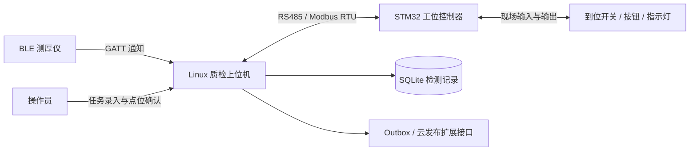

# 工业涂层质检与工位协同系统

基于 **C++17 / Linux** 的涂层厚度检测上位机，连接 BLE 测厚仪与 STM32 工位控制器，将测量采集、工件管理、多点判定、现场协同和数据追溯整合为一套检测流程。

操作员通过工件编号建立检测任务，按产品规则逐点测量并确认；上位机接收厚度与基材信息，保存每个点位的数据，完成 PASS / FAIL 判定，并通过 Modbus RTU 将结果发送至工位控制器。

## 项目背景与使用场景

涂层检测需要将仪器读数与工件、产品规则和测点对应起来，同时协调工位的到位信号、操作按钮和结果指示。项目围绕这一流程组织软件，让一次检测从任务创建到数据归档都有明确的状态与记录。

典型使用方式是：为产品设置检测点数、厚度区间和基材类型，录入工件编号，逐点测量并确认，最后查询该工件的检测结果与各点数据。同一工件可以多次检测，每次生成独立任务编号，保留完整历史。

| 系统角色 | 主要职责 |
| --- | --- |
| BLE 测厚仪 | 提供厚度读数、基材类型及仪器测量信息 |
| Linux 上位机 | 管理任务、筛选测量、执行质量判定、保存记录并发送工位命令 |
| STM32 工位控制器 | 按统一协议提供现场状态、按钮事件和命令执行反馈，控制现场输出 |
| 操作员 | 录入工件、选择产品规则、按实际测点操作并确认数据 |

## 阅读导航

- [核心功能](#核心功能)
- [系统架构与模块职责](#系统架构)
- [工位通信与命令确认](#工位通信与命令确认)
- [数据存储与追溯](#数据存储与追溯)
- [异常处理与运行恢复](#异常处理与运行恢复)
- [技术栈](#技术栈)
- [项目目录](#项目目录)
- [快速开始](#快速开始)
- [配置说明](#配置说明)
- [开发工具与测试](#开发工具与测试)
- [日志与服务部署](#日志与服务部署)
- [文档导航](#文档导航)

## 核心功能

- **BLE 仪器接入**：基于 BlueZ / GDBus 接收 GATT 通知，支持数据组帧、CRC 校验、协议解析和断线重连。
- **多点检测流程**：支持单工位、单仪器的 1～5 点检测，按采集窗口与候选编号完成逐点人工确认。
- **产品规则与质量判定**：通过 YAML 配置点位数量、厚度上下限和 FE / NFE 基材要求，保存任务对应的规则快照。
- **MCU 工位协同**：通过 RS485 / Modbus RTU 交互到位状态、按钮事件、检测命令和结果，支持命令确认、超时重试与应用心跳。
- **本地记录与追溯**：使用 SQLite 保存工件、检测任务、点位数据和最终结果，支持按工件查询及 JSON 事件导出。
- **云端扩展接口**：提供统一云发布接口和本地 Outbox，使用稳定事件编号与请求编号，为后续 OneNET 等平台接入提供基础。
- **演示与开发工具**：提供仪器数据回放、内存工位、独立 PTY 工位模拟器，以及自动演示、集成测试和长时间运行脚本。

## 系统架构



上位机采用事件驱动架构。仪器线程、工位线程和命令行输入线程将事件送入有界队列，由业务线程统一推进检测状态并操作数据库。工位通信独立处理轮询、命令发送、确认与心跳。

### 模块职责

| 模块 | 核心对象 / 入口 | 职责 |
| --- | --- | --- |
| 程序入口 | [`app/main.cpp`](coating_inspection_host/app/main.cpp) | 读取配置、组装对象、启动线程、处理信号与有序退出 |
| 检测业务 | `InspectionWorker` | 维护任务状态、采集窗口、候选数据、人工确认和结果提交 |
| 仪器适配 | `IInstrument`、`BleInstrument`、`ReplayInstrument` | 为 BLE 和回放后端提供统一测量与连接事件 |
| 工位协同 | `IWorkstation`、`WorkstationWorker` | 管理 Modbus 通信、状态快照、命令队列、确认和重传 |
| 协议编解码 | [`protocol.hpp`](coating_inspection_host/include/inspection/protocol.hpp) | 定义寄存器、命令、字段编码和业务确认条件 |
| 数据仓库 | `InspectionRepository` | 保存任务与点位、复核最终判定、管理 Outbox 与现场执行记录 |
| 命令行 | [`cli/commands.cpp`](coating_inspection_host/src/cli/commands.cpp) | 将操作命令转换为业务事件，提供查询和导出入口 |
| 云发布接口 | `ICloudPublisher` | 定义事件提交、请求标识和平台回复契约 |
| 基础设施 | `BoundedQueue`、`IClock`、`BusinessHealth` | 提供跨线程事件传递、时间来源与业务健康信息 |

### 线程与数据流

```text
BLE / 回放仪器线程 ── 测量与连接事件 ──┐
工位通信线程 ──────── 状态与命令反馈 ──┼─→ 有界事件队列 ─→ 业务线程 ─→ SQLite
命令行输入线程 ────── 操作命令 ────────┘                      │
                                                            └─→ 工位命令队列
```

业务线程拥有活动任务、候选数据和数据库连接，其他线程通过事件传递信息。业务循环更新健康时间戳，工位线程据此推进变化心跳，使现场控制器能够观察上位机的业务运行状态。

### 检测流程

```text
工件到位 → 建立任务 → 工位确认开始 → 开启点位采集
                                      ↓
                         接收测量 → 人工确认 → 点位落库
                                      ↓
                         完成全部点位 → 质量判定
                                      ↓
                         保存结果与事件 → 工位确认结果
```

每个采集窗口仅接收窗口开启后的有效测量，候选编号用于关联人工确认与具体数据。检测完成时，最终结果与 Outbox 事件在同一数据库事务中提交；工位命令单独记录确认状态，便于追踪业务结果与现场执行过程。

### 状态机

业务流程阶段与数据库中的任务状态分别管理：流程阶段描述当前应执行的操作，任务状态记录一次检测的持久化生命周期。

| 流程阶段 | 含义 |
| --- | --- |
| `IDLE` | 等待工件与开始条件 |
| `READY` | 工位具备建立任务的条件 |
| `START_PENDING` | 任务已创建，等待工位确认开始命令 |
| `WAIT_ARM` | 等待操作员开启当前点位的采集窗口 |
| `WAIT_NEW_MEASUREMENT` | 等待窗口开启后的新测量 |
| `WAIT_CONFIRM` | 展示候选测量，等待人工确认 |
| `FINALIZING` | 复核确认点并提交结果与完成事件 |
| `COMPLETED` | 检测结果已保存，现场命令按独立确认流程处理 |
| `ABORTED` | 检测已中止，保留此前确认的点位 |
| `FAULT` | 进入故障处理流程 |

数据库中的任务状态为 `START_PENDING`、`INSPECTING`、`COMPLETED`、`ABORTED`。质量结果使用 `PASS` / `FAIL`；中止原因单独保存，便于区分质量判定与流程中断。

### 测量归属与判定规则

- **按窗口接收**：只有采集窗口开启后、来自当前连接代次的有效测量进入候选集合。
- **按编号确认**：每条候选测量具有独立 `candidate_id`，操作员确认后保存为当前点位；相同厚度的不同测量仍保留各自身份。
- **逐点采集**：每完成一个点位，清除当前候选并等待开启下一个窗口。
- **逐点判定**：全部确认点都满足基材要求，且厚度位于包含上下边界的区间内，整体结果为 PASS；任一确认点不符合规则，整体结果为 FAIL。
- **整数厚度**：内部使用 `milli_um`，即千分之一微米的整数单位。例如 `150000` 表示 `150 μm`，便于一致地比较阈值和保存数据。
- **规则快照**：任务创建时保存规则版本及完整规则，历史结果可按当时的判定依据追溯。

## 工位通信与命令确认

上位机通过 libmodbus 管理串口，按周期读取工位快照，并发送心跳与完整业务命令。协议版本为 `0x0200`，32 位字段由两个 16 位寄存器组成，高字位于低地址。

| 通信操作 | 功能码 / 地址 | 用途 |
| --- | --- | --- |
| 工位状态快照 | FC04，`0x0000～0x0015` | 一次读取 22 个寄存器，获取状态、输入输出、健康信息、按钮事件和 ACK |
| 上位机心跳 | FC06，`0x0100` | 写入变化的 16 位心跳值 |
| 完整业务命令 | FC10，`0x0110～0x0118` | 一次写入 epoch、token、命令序号、操作码和参数，共 9 个寄存器 |

| 命令 | 编码 | 作用 |
| --- | --- | --- |
| `SYNC_SAFE` | 1 | 建立新的主站周期并同步工位状态 |
| `START` | 2 | 使用当前任务 token 开始检测 |
| `APPLY_RESULT` | 3 | 请求应用 PASS / FAIL 结果 |
| `ACK_INPUT_EVENT` | 4 | 确认已处理的按钮事件 |
| `RESET_FAULT` | 5 | 请求复位工位故障状态 |
| `ABORT` | 6 | 中止现场任务并撤销结果输出 |

每条命令由 `host_epoch`、`session_token` 和 `command_seq` 关联主站周期、检测任务及单次操作。主站核对 ACK 的周期与序号、接受状态，以及命令对应的现场状态和输出条件，完成业务确认。

同一时刻只等待一条业务命令确认；重传保留原命令身份，默认确认期限为 1000 ms，最多重传 2 次。现场执行记录保存 `PENDING`、`ACKNOWLEDGED`、`FAILED` 或 `UNKNOWN` 状态，供查询与问题定位。按钮操作通过锁存事件序号传递，并以 `ACK_INPUT_EVENT` 确认处理。

完整寄存器定义和交互要求见 [工位协议说明](coating_inspection_host/docs/PROTOCOL.md)，固件对接流程见 [MCU 开发交接文档](Doc/07_MCU开发交接文档.md)。

## 数据存储与追溯

数据库使用 SQLite，启用外键、WAL 和 FULL 同步模式。初始 SQL 结构在构建时嵌入程序，由数据仓库负责初始化和访问。

| 数据表 | 保存内容 |
| --- | --- |
| `inspection` | 检测编号、工件编号、产品、规则快照、任务状态、结果、起止时间与中止原因 |
| `measurement` | 点位序号、候选编号、整数厚度、基材、仪器标识、连接代次及接收与确认时间 |
| `outbox` | 完成事件、JSON 载荷、待传状态、请求编号及回复相关字段 |
| `actuation_log` | 工位命令内容、主站周期、命令序号、执行状态与确认信息 |
| `metadata` | 持久化的主站周期和任务 token 分配计数 |

每个确认点独立提交；完成检测时，仓库按已保存的规则与点位复核质量结果，再将结果与 `InspectionCompleted` 事件在同一事务中提交。即使同一工件复检，也会建立新的 `inspection_id`，历史记录可按 `workpiece_id` 汇总查询。

Outbox 事件包含 `schema_version`、`event_id`、工位与工件标识、产品规则、结果和各点数据。云发布接口使用稳定事件编号关联业务事件，使用 `request_id` 区分发送请求，并提供平台接受或拒绝的回复契约，便于扩展云端传输。

## 异常处理与运行恢复

| 场景 | 上位机处理方式 |
| --- | --- |
| 仪器断连或连接代次变化 | 中止活动检测，清除候选测量，保留已确认点 |
| 工件在检测中离开 | 中止当前任务，并在工位可用时发送撤销命令 |
| 点位采集或确认超时 | 结束当前检测并记录中止原因 |
| 工位断线或状态快照过期 | 中止活动任务，重新上线后进行同步 |
| MCU 重启 | 分配新的主站周期，重新同步状态 |
| 结果命令失败或执行状态未知 | 保留质量结果，记录现场执行状态并进入故障处理 |
| 事件队列溢出、存储异常或空间不足 | 停止新任务及业务健康心跳，记录故障原因 |
| 服务重启 | 将未完成任务标为中止，将未确认命令标为 UNKNOWN，保留历史结果与事件 |
| SIGINT / SIGTERM 或 `quit` | 保存中止状态、收尾工位命令并按顺序停止线程 |

服务启动后通过同步与人工复位建立新的检测上下文。已经保存的质量结果、点位数据和现场执行记录分别保留，便于恢复后查询与追溯。

## 技术栈

| 组成 | 技术与用途 |
| --- | --- |
| 上位机服务 | C++17、标准线程库、事件队列、检测状态机 |
| BLE 通信 | BlueZ、GDBus、GATT 通知 |
| 工位通信 | libmodbus、RS485、Modbus RTU |
| 数据存储 | SQLite、SQL 迁移、事务、Outbox |
| 配置与数据 | yaml-cpp、nlohmann/json |
| 构建与检查 | CMake、CTest、AddressSanitizer / UndefinedBehaviorSanitizer |
| 辅助工具 | Python 3、PTY 模拟器、演示与测试脚本 |
| 服务部署 | systemd、JSON 日志、journald |

## 项目目录

```text
BLE_Linux/
├── README.md                         # 项目介绍与快速开始
├── Doc/                              # 项目规划、源码阅读与 MCU 交接文档
└── coating_inspection_host/          # 涂层质检上位机
    ├── app/                          # 程序入口与对象组装
    ├── include/inspection/           # 公共接口与数据定义
    ├── src/
    │   ├── domain/                   # 检测业务与状态机
    │   ├── instrument/               # BLE 与回放仪器适配
    │   ├── workstation/              # 工位协议与 Modbus 主站
    │   ├── persistence/              # SQLite 存储与事务
    │   ├── cloud/                    # 云发布扩展接口
    │   ├── cli/                      # 命令行交互
    │   └── support/                  # 配置、时钟与基础工具
    ├── config/                       # 演示配置、硬件配置与数据库迁移
    ├── deploy/                       # systemd 服务模板
    ├── docs/                         # 架构、协议与验证记录
    ├── tests/                        # 单元、模拟器协议与集成测试
    ├── tools/                        # 自动演示、工位模拟与长时间运行工具
    ├── vendor/thickness/             # BLE 测厚仪接入组件
    └── CMakeLists.txt                # 构建入口
```

## 快速开始

以下命令在 Ubuntu 22.04 环境中执行。

### 1. 安装依赖

```bash
sudo apt install build-essential cmake pkg-config libglib2.0-dev libsqlite3-dev \
  libyaml-cpp-dev libmodbus-dev nlohmann-json3-dev python3
```

### 2. 编译项目

在仓库根目录执行：

```bash
cd coating_inspection_host
cmake -S . -B build -DCMAKE_BUILD_TYPE=Debug
cmake --build build -j4
```

### 3. 运行自动演示

```bash
python3 tools/demo.py --binary build/inspection_service --output reports/demo-first
```

演示使用回放仪器和 PTY 工位模拟器，自动完成五点采集、确认、质量判定与结果命令交互。输出目录保存 SQLite 数据库和 `summary.json`，可用于查看检测记录与事件数据。每次运行使用新的输出目录。

通过 `--result fail` 或 `--result aborted` 可演示不合格与中止流程，通过 `--backend mock` 可切换为内存工位。

### 4. 命令行交互

```bash
./build/inspection_service --config config/demo.yaml
```

常用命令：

| 命令 | 作用 |
| --- | --- |
| `status` | 查看仪器、工位和检测状态 |
| `start WORKPIECE-001 demo5` | 按 `demo5` 产品规则建立检测任务 |
| `arm` | 开启当前点位的采集窗口 |
| `confirm <candidate_id>` | 确认指定候选测量并保存点位 |
| `query WORKPIECE-001` | 查询工件检测记录 |
| `outbox` | 查看本地待传事件 |
| `export /tmp/inspection-events.json` | 导出事件数据 |
| `cancel` / `reset` / `quit` | 中止检测、复位故障状态或退出服务 |

以 `demo.yaml` 为例，等待出现 `sync_complete` 后输入：

```text
sim present 1
reset
```

等待 RESET 命令的 `command_done` 日志显示 `ACKNOWLEDGED`，再建立任务：

```text
start WORKPIECE-001 demo5
```

出现 `inspection_started` 后输入 `arm`，等待 `candidate` 日志，复制其中的候选编号并执行 `confirm <candidate_id>`。每次出现 `point_saved` 后，为下一个点重新执行 `arm` 和确认；五点完成后可查看 `inspection_completed` 和结果命令的 `command_done`，然后用 `query WORKPIECE-001` 查询记录。

完整交互步骤与模拟器操作见 [上位机使用说明](coating_inspection_host/README.md)。

### 5. 硬件配置

在 [`config/hardware.yaml`](coating_inspection_host/config/hardware.yaml) 中设置 BLE 设备名称、串口路径、从站地址和产品规则，然后启动：

```bash
./build/inspection_service --config config/hardware.yaml
```

默认工位通信参数为 **115200 baud、8E1、从站地址 1**。配置文件中的数据库与回放文件相对路径以配置文件所在目录为基准解析。MCU 对接使用 [工位协议说明](coating_inspection_host/docs/PROTOCOL.md) 中的寄存器、命令与确认机制。

### 6. 运行测试

```bash
ctest --test-dir build --output-on-failure
```

测试包含单元测试、工位模拟器协议测试和进程集成测试，覆盖测量解析、质量规则、数据持久化以及工位交互等流程。

## 配置说明

服务通过 `--config` 加载 YAML。[`demo.yaml`](coating_inspection_host/config/demo.yaml) 使用回放仪器与内存工位，[`hardware.yaml`](coating_inspection_host/config/hardware.yaml) 使用 BLE 仪器与 Modbus 工位；两种配置共用业务状态机和存储模块。

| 配置项 | 用途 | 示例配置值 |
| --- | --- | --- |
| `station_id` | 工位标识，写入完成事件 | `station01` |
| `queue_capacity` | 事件队列容量 | `128` |
| `measurement_timeout_ms` | 单个采集窗口的测量与确认期限 | `30000` |
| `instrument.type` | 仪器后端 | `ble` / `replay` |
| `instrument.device_name` | BLE 设备名称或仪器配置标识 | 按设备设置 |
| `instrument.replay_file` | 回放数据文件 | `replay.jsonl` |
| `workstation.type` | 工位后端 | `modbus` / `mock` |
| `workstation.device` | 串口或 PTY 路径 | `/dev/serial/by-id/...` |
| `workstation.poll_ms` | 工位轮询周期 | `100` |
| `workstation.heartbeat_ms` | 应用心跳周期 | `200` |
| `workstation.business_health_ms` | 业务健康期限 | `500` |
| `workstation.response_timeout_ms` | 单次串口响应期限 | `150` |
| `workstation.command_timeout_ms` | 业务命令确认期限 | `1000` |
| `workstation.max_retries` | 命令最大重传次数 | `2` |
| `database.path` | 数据库位置 | `../data/inspection.db` |
| `database.busy_timeout_ms` | 数据库锁等待期限 | `100` |
| `database.min_free_mb` | 数据库所在分区的最低可用空间，单位 MiB | `64` |
| `testing.allow_controls` | 演示与故障注入命令开关 | 演示配置为 `true`，硬件配置为 `false` |

产品规则按产品标识组织，以下为内置 `demo5` 演示规则：

```yaml
products:
  demo5:
    rule_version: demo-v1
    required_points: 5
    min_um: 100
    max_um: 200
    substrate: FE
```

`required_points` 支持 1～5，厚度阈值以微米配置，最多支持三位小数。`FE` 表示铁基，`NFE` 表示非铁基。增加产品时可在 `products` 下添加新的规则，再通过 `start 工件编号 产品标识` 选择。规则在启动时加载，并在任务创建时复制保存。

## 开发工具与测试

以下命令均在 `coating_inspection_host/` 中执行。

### 演示场景

```bash
# 五点合格流程
python3 tools/demo.py --binary build/inspection_service --output reports/demo-pass

# 五点不合格流程
python3 tools/demo.py --binary build/inspection_service --result fail --output reports/demo-fail

# 中止流程
python3 tools/demo.py --binary build/inspection_service --result aborted --output reports/demo-aborted
```

每个输出目录保留检测数据库与摘要，便于对照不同流程的任务、点位、结果和事件。

### 独立 PTY 工位模拟器

```bash
python3 tools/workstation_sim.py
```

模拟器启动后输出 `ready` 事件及 `/dev/pts/N` 设备路径。将该路径填写到工位配置并选择 `workstation.type: modbus`，即可使用上位机的 Modbus 主站与模拟器交互。复制配置时放在原 `config/` 目录内，可沿用相对数据路径。

模拟器通过标准输入接收 JSON 控制指令，例如：

```json
{"present":true}
{"button":"action"}
{"button":"reset"}
{"ack_delay_ms":500}
{"drop_ack":true}
{"reset_mcu":true}
```

`--scenario` 参数支持按 `at_ms` 时间执行 JSON 控制数组，用于编排可重复的联调场景。

### 自动测试与运行监测

| 测试 / 工具 | 关注内容 |
| --- | --- |
| `tests/unit.cpp` | 仪器帧解析、规则判断、协议编码及仓库行为 |
| `tests/simulator_contract.py` | 独立工位模拟器的协议和状态行为 |
| `tests/integration.py` | 服务进程、工位交互、异常流程与持久化记录 |
| `tools/soak.py` | 循环执行 PASS / FAIL / 中止任务，采集资源和数据库一致性信息 |

启用地址与未定义行为检查的构建方式：

```bash
cmake -S . -B build-sanitize -DCMAKE_BUILD_TYPE=Debug -DINSPECTION_SANITIZE=ON
cmake --build build-sanitize -j4
ctest --test-dir build-sanitize --output-on-failure
```

运行监测示例：

```bash
python3 tools/soak.py --binary build/inspection_service \
  --duration 3600 --interval 30 --output reports/soak-1h
```

`--duration` 指定总时长，`--interval` 指定任务周期，单位均为秒。输出 `report.json` 保存实际运行时长、任务计数、内存与线程样本、CPU 计数、数据库大小和错误信息。

## 日志与服务部署

日志按一行一个 JSON 对象输出，包含 `event`、中文 `message`、`wall_ms` 及事件相关字段，可按检测编号、候选编号或命令序号定位流程。

| 日志事件 | 含义 |
| --- | --- |
| `service_ready` | 服务完成配置与存储初始化 |
| `sync_complete` | 主站与工位完成同步 |
| `task_created` | 任务和规则快照已保存 |
| `inspection_started` | 工位已确认 START，可以开启采集 |
| `window_armed` | 当前点位采集窗口已开启 |
| `candidate` | 新候选测量已展示，包含 `candidate_id` 与厚度 |
| `point_saved` | 人工确认点已提交数据库 |
| `inspection_completed` | 质量结果与完成事件已提交 |
| `command_done` | 工位命令确认结果已记录 |
| `inspection_aborted` / `fatal` | 流程中止或系统故障 |
| `service_stopped` | 业务收尾完成 |

项目提供 [systemd 服务模板](coating_inspection_host/deploy/inspection.service.example)。部署时设置运行用户、二进制与配置文件的绝对路径，并为运行用户配置蓝牙访问、串口及数据目录权限。模板使用 `dialout` 附加组、失败自动重启和 journald 日志输出。

服务名采用 `coating-inspection.service` 时，可使用：

```bash
systemctl status coating-inspection.service
journalctl -u coating-inspection.service -f
```

数据目录用于保存 SQLite 数据库，`reports/` 用于保存演示和运行监测输出。构建产物、运行数据和报告目录由仓库 `.gitignore` 排除。

## 文档导航

| 文档 | 内容 |
| --- | --- |
| [上位机使用说明](coating_inspection_host/README.md) | 构建、配置、交互、模拟器与部署入口 |
| [架构与代码阅读指南](coating_inspection_host/docs/ARCHITECTURE.md) | 模块职责、线程协作与业务状态转换 |
| [工位协议说明](coating_inspection_host/docs/PROTOCOL.md) | 寄存器、命令、确认与通信时序 |
| [验证记录](coating_inspection_host/docs/VERIFICATION.md) | 构建、测试与运行记录 |
| [整体项目计划](Doc/01_整体项目计划说明书.md) | 系统目标、两端职责与交付规划 |
| [Linux 实施计划](Doc/02_Linux具体实施计划书.md) | 上位机模块与实施安排 |
| [MCU 实施计划](Doc/03_MCU具体实施计划书.md) | STM32 工位端设计与实施安排 |
| [C++ 工程阅读指南](Doc/04_C++工程保姆级阅读指南.md) | 工程结构、源码入口与完整调用链 |
| [工程思维理解 C++](Doc/05_工程思维理解C++_第三章深入版.md) | 结合项目理解 C++ 工程设计 |
| [关键类与对象精读](Doc/06_关键类对象源码逐个精读.md) | 核心对象、接口与资源管理 |
| [MCU 开发交接文档](Doc/07_MCU开发交接文档.md) | 上下位机协同流程与固件对接任务 |

## 组件来源

BLE 测厚仪接入组件基于 [Thickness_bluetooth_protocol](https://github.com/yz-0609/Thickness_bluetooth_protocol)，在其基础上集成仪器适配、整数厚度接口与诊断事件。固定版本及修改说明见 [组件来源记录](coating_inspection_host/vendor/thickness/PROVENANCE.md)。
